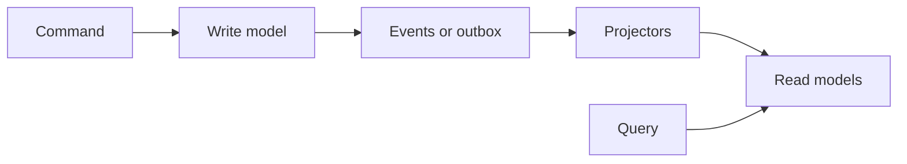

import { ConceptTemplate } from '@/features/kb/components/templates/ConceptTemplate'
import { Callout } from '@/features/kb/components/mdx/Callout'
import { ComparisonTable } from '@/features/kb/components/mdx/ComparisonTable'

export default function Layout({ children }) {
  return (
    <ConceptTemplate title="CQRS">
      {children}
    </ConceptTemplate>
  )
}

**CQRS** (Young, after Meyer’s CQS) splits the mutation path from the query path. Commands change state and return little. Queries return data and change nothing. The read model can be a denormalised projection, not the same tables the writer uses.

## 1. Deep Dive and Mechanics

**Why split.** A normalised write model protects invariants. A reporting screen wants joins, counters, and search. Forcing one schema to do both produces stored-procedure soup or an unscalable OLTP box.

**Sync.** After a command commits, projectors update read models (same DB transaction, outbox, or async events). Async means readers can be stale. The UI must tolerate that or wait on a notification.

**Not required.** Most CRUD apps should not run two databases. CQRS pays when read/write load, models, or teams diverge.

**With event sourcing.** A common pairing: the write side appends events; projections build SQL or search indexes. CQRS does not require event sourcing.

<Callout icon="warning" title="CQRS as default architecture">
Two stacks, two failure modes, and eventual consistency on a to-do list is malpractice. Start with one model; split when a screen or SLO forces it.
</Callout>

## 2. Mathematical / Theoretical Foundation

**CQS.** Meyer: a method is a command or a query, not both. CQRS lifts that to an architectural boundary (separate objects, often separate stores).

**Consistency.** Writes are typically strongly consistent within an aggregate. Reads are a function of the write history, possibly lagged. You choose a staleness bound, not “always latest,” unless you read through the write model.

**Load.** Read replicas are a weak CQRS (same schema). True CQRS changes the schema. Throughput scales by adding projectors and read stores independently of the write path.

<ComparisonTable
  headers={['Style', 'Stores', 'Staleness']}
  rows={[
    ['CRUD one model', 'One', 'None'],
    ['Read replica', 'Same schema, many copies', 'Replica lag'],
    ['CQRS projections', 'Different schemas', 'Projector lag'],
    ['CQRS plus event source', 'Log plus views', 'Projector lag'],
  ]}
/>

## 3. Real-World Implementation

```python
def handle_rename(cmd, writes, bus):
    writes.rename_account(cmd.id, cmd.name)  # invariant: unique per tenant
    bus.publish("AccountRenamed", {"id": cmd.id, "name": cmd.name})

def on_account_renamed(event, reads):
    reads.upsert_directory(event["id"], event["name"])  # denormalised for search
```

The directory table is not the source of truth for uniqueness.

## 4. Visualizations



## 5. Interview Prep

**Q: CQRS versus CQS?**
**A:** CQS is a method-level rule. CQRS is a system-level split of models and often stores.

**Q: How do you show a user their own write immediately?**
**A:** Read your write from the write model, wait for a version in the projection, or optimistic UI with a reconcile. Do not pretend async is instant.

**Q: When is this overkill?**
**A:** Admin CRUD, small domains, one team, one database that still meets the SLO.

## 6. Production Use Cases

- **High-read catalogues** with a strict write model for inventory.
- **Collaborative editors** with a command stream and many materialised views.
- **Analytics next to OLTP** without letting reports lock checkout tables.

<Callout icon="tip" title="Version the projections">
A projection is a cached function of events. Rebuild it when the schema of the view changes. Treat rebuild time as a design constraint.
</Callout>
