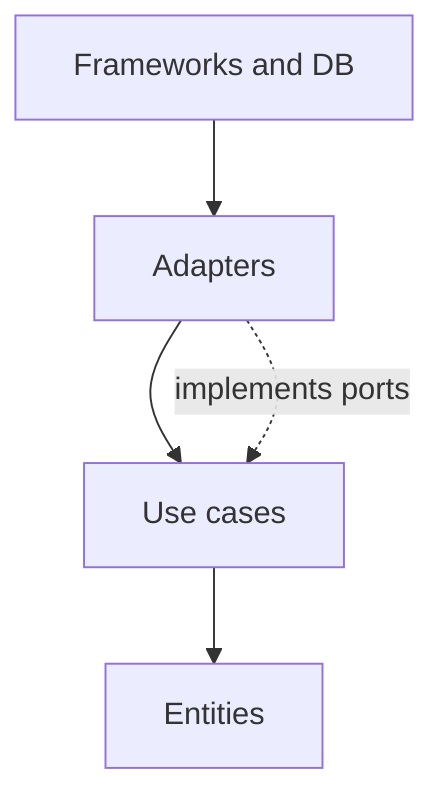

import { ConceptTemplate } from '@/features/kb/components/templates/ConceptTemplate'
import { Callout } from '@/features/kb/components/mdx/Callout'
import { ComparisonTable } from '@/features/kb/components/mdx/ComparisonTable'

export default function Layout({ children }) {
  return (
    <ConceptTemplate title="Clean Architecture">
      {children}
    </ConceptTemplate>
  )
}

**Clean Architecture** (Martin) is a dependency rule: source code dependencies point toward high-level policy. Entities and use cases do not import Express, Django, or a SQL dialect. Adapters at the edge implement interfaces the centre defines.

## 1. Deep Dive and Mechanics

**Rings.** Entities (enterprise rules). Use cases (application rules). Interface adapters (controllers, presenters, gateways). Frameworks and drivers (web, DB, devices). Names vary; the arrow does not.

**Dependency inversion.** The use case needs a `OrderRepository` port. The SQL adapter implements it. The centre compiles without the adapter. Tests replace the adapter with a fake.

**DTOs at boundaries.** Do not pass your ORM entity to the web layer as if it were a stable contract. Map at the edge so schema churn dies in the adapter.

**Related.** Hexagonal and onion are the same family. Clean Architecture is the pedagogical drawing many teams share.

<Callout icon="warning" title="Folder religion">
Four directories named entities and usecases with anaemic classes still coupled to the ORM is not Clean Architecture. The compile-time dependency graph is the test.
</Callout>

## 2. Mathematical / Theoretical Foundation

**Acyclic dependencies.** The package graph should be a DAG with policy at the sinks (or sources, depending on arrow convention). Cycles through a framework package violate the rule.

**Stability.** High-level modules should be stable (few reasons to change). The DIP says they own the interfaces. Volatility lives in adapters.

**Testability.** The centre’s cyclomatic complexity is exercised without I/O. That is the economic argument: cheap tests for expensive rules.

<ComparisonTable
  headers={['Style', 'Core idea', 'Typical miss']}
  rows={[
    ['Clean', 'Inward deps, use cases', 'Framework in the entity'],
    ['Hexagonal', 'Ports and adapters', 'Port that leaks SQL types'],
    ['Onion', 'Domain in the middle', 'Infrastructure referenced inward'],
    ['Layered n-tier', 'UI / logic / data', 'Layers that all know SQL'],
  ]}
/>

## 3. Real-World Implementation

```python
# use case — no web, no SQL imports
class PlaceOrder:
    def __init__(self, orders, clock):
        self.orders = orders
        self.clock = clock

    def execute(self, cmd):
        order = Order.create(cmd, self.clock.now())
        self.orders.save(order)
        return order.id
```

`orders` is a port. The FastAPI router and the Postgres adapter live in other packages.

## 4. Visualizations



## 5. Interview Prep

**Q: Why not let the use case call the ORM?**
**A:** Then every rule test needs a database, and a vendor change becomes a domain change. Invert so the domain defines persistence in its language.

**Q: Is Clean Architecture slow?**
**A:** Mapping costs nanoseconds relative to I/O. The cost is ceremony on tiny CRUD. Apply the full rings where rules are dense.

**Q: How does this relate to microservices?**
**A:** Orthogonal. You can have a clean monolith or a distributed ball of mud. Boundaries inside a process still matter.

## 6. Production Use Cases

- **Long-lived domains** (billing, clinical, trading) that will outlive the web framework.
- **Teams that must unit-test policy** without Docker-compose for every run.
- **Migrating off a legacy UI** while keeping use cases intact.

<Callout icon="tip" title="Draw the import graph">
One forbidden import from domain to a web package is worth more than a wiki page. Make it a lint rule.
</Callout>
