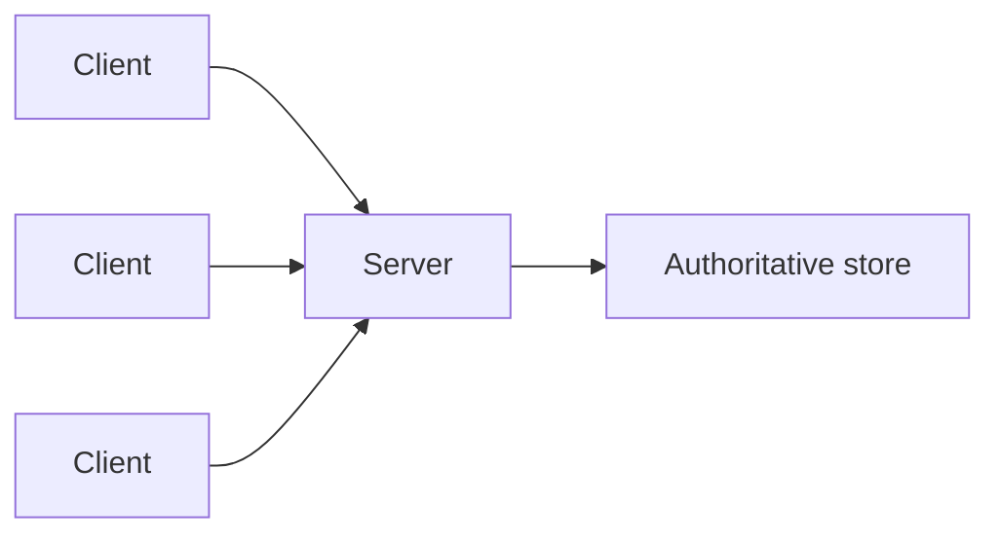

import { ConceptTemplate } from '@/features/kb/components/templates/ConceptTemplate'
import { Callout } from '@/features/kb/components/mdx/Callout'
import { ComparisonTable } from '@/features/kb/components/mdx/ComparisonTable'

export default function Layout({ children }) {
  return (
    <ConceptTemplate title="Client-Server">
      {children}
    </ConceptTemplate>
  )
}

**Client-server** splits a system into requesters and providers. The server owns data, authentication, and business rules. The client presents and caches. The web’s HTTP browsers and APIs are the familiar instance; the pattern is older than the web.

## 1. Deep Dive and Mechanics

**Roles.** Clients are many, often untrusted, often offline-ish. Servers are fewer, authoritative, scaled on the hot resource. Thin clients (browser) versus thick clients (desktop with local logic) move the line, not the roles.

**Protocol.** Request/response (HTTP), sometimes server-push (SSE, WebSocket) that still starts from a client connection. The server does not typically dial random clients on the public internet.

**State.** Session state on the server (sticky, shared store) versus JWT-like client-held tokens. Authority still lives on the server: a client-held token is a claim the server must verify.

**Evolution.** Multi-tier (client / app server / DB) is client-server stacked. Microservices are servers to each other — the pattern recurses.

<Callout icon="warning" title="Business rules only in the client">
A clever SPA that the server trusts is a public API for attackers. Validate on the server. The client is a cache of UI, not the ledger.
</Callout>

## 2. Mathematical / Theoretical Foundation

**Asymmetric resources.** One server multiplexes N clients. Capacity planning is about the server’s concurrency model (threads, event loop, connection limits) and the tail latency of shared stores.

**Trust boundary.** The socket is a hostile interface. Authentication, authorisation, and input validation are server theorems; the client is an untrusted prover.

**Failure.** Clients retry; servers must be idempotent on the unsafe methods you allow to retry. Partial failure is the common case on a network.

<ComparisonTable
  headers={['Style', 'Who is authority', 'Example']}
  rows={[
    ['Client-server', 'Server', 'HTTPS API'],
    ['Peer-to-peer', 'Peers share', 'BitTorrent, CRDTs'],
    ['Mainframe terminals', 'Host', 'Historical thin client'],
    ['Local-only app', 'The device', 'Offline notebook'],
  ]}
/>

## 3. Real-World Implementation

```http
POST /v1/orders HTTP/1.1
Host: api.example.com
Authorization: Bearer <token>
Content-Type: application/json

{"sku":"abc","qty":2}
```

The server authenticates the token, authorises the account, and commits. The client only initiated.

## 4. Visualizations



## 5. Interview Prep

**Q: Is GraphQL still client-server?**
**A:** Yes. The client still requests; the GraphQL process is a server (often a BFF) in front of more servers.

**Q: Where should validation live?**
**A:** Both: client for UX, server for safety. Never only the client.

**Q: How does this differ from P2P?**
**A:** P2P has no single authoritative host for the whole dataset. Client-server does (per resource owner).

## 6. Production Use Cases

- **Almost every SaaS API.**
- **Mobile apps** talking to a backend for identity and sync.
- **Internal tools** where a desktop client hits a service.

<Callout icon="tip" title="Design the server for hostile clients">
Rate-limit, authn, authz, and size limits are part of the architecture, not an afterthought for “when we are public.”
</Callout>
