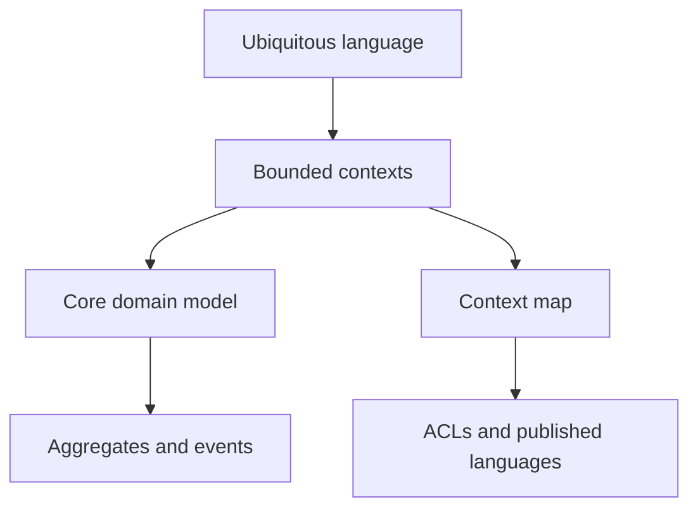

import { ConceptTemplate } from '@/features/kb/components/templates/ConceptTemplate'
import { Callout } from '@/features/kb/components/mdx/Callout'
import { ComparisonTable } from '@/features/kb/components/mdx/ComparisonTable'

export default function Layout({ children }) {
  return (
    <ConceptTemplate title="Domain-Driven Design">
      {children}
    </ConceptTemplate>
  )
}

**Domain-Driven Design (DDD)** (Evans) says the hard part is the domain, so the software’s centre should speak that language. Strategic DDD draws contexts and maps. Tactical DDD offers building blocks: entities, value objects, aggregates, domain events, repositories, domain services.

## 1. Deep Dive and Mechanics

**Ubiquitous language.** The same words in conversation, diagrams, tests, and code. If the code says `UserRecord` and the business says `Policyholder`, the model is already lying.

**Strategic design.** Bounded contexts, context maps, core versus supporting versus generic subdomains. Spend modelling effort on the core — the reason you are not a spreadsheet.

**Aggregates.** A cluster of entities with a root and a consistency boundary. Invariants are checked on the root. Transactions do not span aggregates; you use eventual consistency and events.

**Tactical caution.** Factory, repository, and aggregate are tools. Decorating every CRUD table with those names is DDD-lite cosplay.

<Callout icon="info" title="DDD is not a framework">
There is no required bus, no required event store. A well-named module in a monolith can be excellent DDD. Microservices without language work are just distributed CRUD.
</Callout>

## 2. Mathematical / Theoretical Foundation

**Model as homomorphism.** The domain model maps real-world distinctions that matter for decisions. Distinctions that do not change decisions are omitted (abstraction). Wrong distinctions are bugs that types cannot see.

**Invariant as predicate.** An aggregate is a state space plus a predicate I. Commands are partial functions that must land in I. That is why aggregates are small: I is hard to maintain across a huge graph.

**Bounded contexts as languages.** Two models can use the same English word with different predicates. Translation functions sit on the map edges.

<ComparisonTable
  headers={['Building block', 'Identity', 'Role']}
  rows={[
    ['Entity', 'Yes', 'Lifecycle, mutates'],
    ['Value object', 'No, by value', 'Measure, describe'],
    ['Aggregate', 'Root id', 'Consistency boundary'],
    ['Domain event', 'Fact id', 'Something that happened'],
  ]}
/>

## 3. Real-World Implementation

```python
class Money:
    def __init__(self, cents, currency):
        if cents < 0:
            raise ValueError("negative")
        self.cents, self.currency = cents, currency

    def add(self, other):
        if self.currency != other.currency:
            raise ValueError("fx required")
        return Money(self.cents + other.cents, self.currency)
```

Money is a value object. Two instances with the same cents and currency are interchangeable.

## 4. Visualizations



## 5. Interview Prep

**Q: When is DDD worth it?**
**A:** When business rules are the product (underwriting, trading, logistics). Not when you are wrapping a vendor SaaS with a thin UI.

**Q: Aggregate versus database transaction?**
**A:** The aggregate is the unit you keep immediately consistent. Cross-aggregate work is a process manager or a saga, not a bigger transaction.

**Q: Anemic domain model?**
**A:** Data bags plus a service layer that owns all rules. You lost the point of a model. Put the rules next to the data that must obey them.

## 6. Production Use Cases

- **Insurance and finance** cores that outlive UIs.
- **Marketplace** domains with distinct contexts (catalog, fulfillment, trust).
- **Modular monoliths** that want to split later without a rewrite.

<Callout icon="tip" title="Event-storm first">
A workshop that names events and commands will reveal contexts faster than a class diagram of tables.
</Callout>
