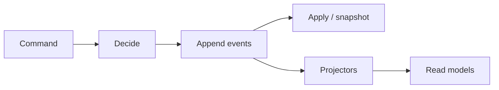

import { ConceptTemplate } from '@/features/kb/components/templates/ConceptTemplate'
import { Callout } from '@/features/kb/components/mdx/Callout'
import { ComparisonTable } from '@/features/kb/components/mdx/ComparisonTable'

export default function Layout({ children }) {
  return (
    <ConceptTemplate title="Event Sourcing">
      {children}
    </ConceptTemplate>
  )
}

**Event sourcing** stores an ordered log of domain events as the source of truth. A bank balance is not a single integer in a table; it is the fold of deposits and withdrawals. You can rebuild, audit, and project new read models from the same log.

## 1. Deep Dive and Mechanics

**Append-only.** Commands validate against current state, then append events. You do not update or delete past events; you emit compensating facts.

**Rehydration.** Load events for an aggregate, or a snapshot plus the tail, and apply them to get current state before deciding the next command.

**Projections.** Subscribers build SQL, search, or caches. They are disposable. The log is not.

**Hard parts.** Versioning event schemas, idempotent handlers, erasure via crypto-shredding, and queries. You do not query the log ad hoc — you project.

<Callout icon="warning" title="Event sourcing is not logging">
Application logs are telemetry. Domain events are the business facts you are willing to replay forever. Mixing them produces an unreadable legal record.
</Callout>

## 2. Mathematical / Theoretical Foundation

**Fold.** State after n events is f applied to the initial state and each event in order. f should be deterministic. Snapshots are cached prefixes of the fold.

**Order.** Many projections assume a total order per stream. Across streams you have happened-before only via recorded causal links. A global order is something you must build, not assume.

**Idempotence.** At-least-once delivery means applying the same event twice equals once. Use event ids as keys.

<ComparisonTable
  headers={['Store', 'Truth', 'Query style']}
  rows={[
    ['CRUD row', 'Latest state', 'SQL on tables'],
    ['Event sourced', 'The log', 'Fold plus projections'],
    ['Audit table plus row', 'Latest plus trail', 'Hybrid, easy to drift'],
    ['Change data capture', 'DB log of rows', 'Technical, not domain'],
  ]}
/>

## 3. Real-World Implementation

```python
def decide(state, cmd):
    if cmd.type == "Open":
        if state is not None:
            raise ValueError("exists")
        return [{"type": "Opened", "id": cmd.id}]
    if cmd.type == "Credit":
        return [{"type": "Credited", "amount": cmd.amount}]
    raise ValueError("unknown")

def apply(state, event):
    if event["type"] == "Opened":
        return {"id": event["id"], "balance": 0}
    if event["type"] == "Credited":
        next_state = dict(state)
        next_state["balance"] = state["balance"] + event["amount"]
        return next_state
    return state
```

## 4. Visualizations



## 5. Interview Prep

**Q: Event sourcing versus event-driven architecture?**
**A:** EDA is about communicating with events. Event sourcing is about persisting state as events. You can have either without the other.

**Q: How do you handle GDPR delete?**
**A:** Encrypt personal payloads with per-subject keys and destroy the key (crypto-shred). Do not pretend you can edit history silently in a regulated log.

**Q: When do you snapshot?**
**A:** When fold time exceeds your command SLO. Snapshot every N events or after quiet periods.

## 6. Production Use Cases

- **Ledgers and audit-heavy cores** where “how did we get here?” is the product.
- **Collaborative domains** that already think in facts.
- **CQRS write sides** that need many disposable read models.

<Callout icon="tip" title="Version events like APIs">
Add fields, do not rename in place. Upcasters keep old bytes loadable. A broken fold is an outage of history.
</Callout>
