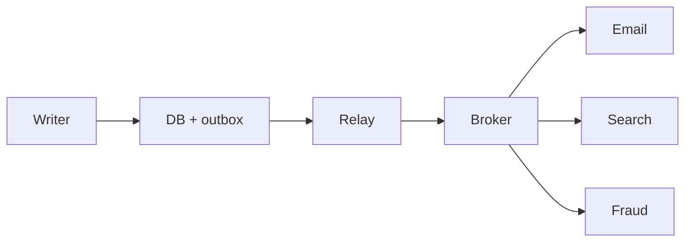

import { ConceptTemplate } from '@/features/kb/components/templates/ConceptTemplate'
import { Callout } from '@/features/kb/components/mdx/Callout'
import { ComparisonTable } from '@/features/kb/components/mdx/ComparisonTable'

export default function Layout({ children }) {
  return (
    <ConceptTemplate title="Event-Driven Architecture">
      {children}
    </ConceptTemplate>
  )
}

**Event-driven architecture (EDA)** uses events as the integration currency. A service publishes “OrderPlaced.” Search, email, and fraud subscribe. The producer does not import those subscribers. Time and failure become part of the design.

## 1. Deep Dive and Mechanics

**Notification versus document versus event-carried state.** A tiny id that forces a callback is a notification. A rich payload lets consumers work offline. Choose explicitly; mixing them creates chatty, brittle consumers.

**Broker.** Kafka, NATS, SQS, or an in-process bus. Brokers give durability, fan-out, and replay. They do not give a transaction across your SQL write and the publish — use an outbox.

**Delivery.** At-least-once is the honest default. Consumers must be idempotent. Ordering is per partition or per key, not global.

**Choreography versus orchestration.** Choreography: each service reacts. Orchestration: a process manager tells steps. Choreography does not scale socially when the flow is a 12-step legal process.

<Callout icon="error" title="Dual write">
Commit to SQL, then publish, and a crash in between loses the event. Outbox or change-data-capture, not hope.
</Callout>

## 2. Mathematical / Theoretical Foundation

**Temporal coupling.** Request/response couples availability: both sides up. Events couple on schema and eventual consistency, not on simultaneous uptime.

**Happened-before.** Without a shared clock, causality is what you record (ids, versions). Wall clocks lie across machines.

**Backpressure.** Produce rate versus consume rate. Unbounded queues are a disk-shaped denial of service. Lag is a first-class SLO.

<ComparisonTable
  headers={['Style', 'Coupling', 'Failure mode']}
  rows={[
    ['Sync RPC', 'Availability and API', 'Cascading timeouts'],
    ['Async events', 'Schema and lag', 'Silent dropped facts'],
    ['Orchestrated saga', 'Central process', 'Orchestrator hotspot'],
    ['Shared DB', 'Schema and locks', 'Team lock-in'],
  ]}
/>

## 3. Real-World Implementation

```python
# Transactional outbox in the same SQL commit as the write
def place_order(db, order):
    db.execute("INSERT INTO orders ...", order)
    db.execute(
        "INSERT INTO outbox(topic, payload) VALUES (?, ?)",
        ("OrderPlaced", order.to_json()),
    )
    db.commit()
```

A relay publishes outbox rows and marks them sent.

## 4. Visualizations



## 5. Interview Prep

**Q: When is EDA the wrong tool?**
**A:** When the user must see a strongly consistent answer in the same request, or when the team cannot operate a broker and idempotent consumers yet.

**Q: Event versus command?**
**A:** A command names an intent someone is expected to fulfill (PlaceOrder). An event names a fact that already happened (OrderPlaced). Do not subscribe to commands as if they were facts.

**Q: How do you debug a lost update?**
**A:** Correlation ids, partition keys, consumer lag, and the outbox table. Distributed traces that do not include the broker hop are incomplete.

## 6. Production Use Cases

- **Fan-out after checkout** (mail, points, analytics).
- **Integration between bounded contexts** without a shared database.
- **Streaming pipelines** that treat business facts as a log.

<Callout icon="tip" title="Document the topology">
An implicit subscriber graph is an unowned architecture. Publish a context map of topics, owners, and compatibility rules.
</Callout>
