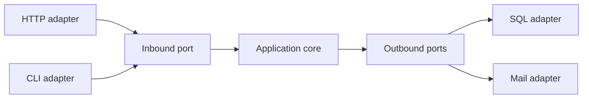

import { ConceptTemplate } from '@/features/kb/components/templates/ConceptTemplate'
import { Callout } from '@/features/kb/components/mdx/Callout'
import { ComparisonTable } from '@/features/kb/components/mdx/ComparisonTable'

export default function Layout({ children }) {
  return (
    <ConceptTemplate title="Hexagonal Architecture">
      {children}
    </ConceptTemplate>
  )
}

**Hexagonal architecture** (Cockburn), also called ports and adapters, draws the app as a hexagon so no side is “the top.” Driving adapters (HTTP, CLI, tests) call inbound ports. Driven adapters (SQL, mail, other APIs) implement outbound ports. The hexagon is the application.

## 1. Deep Dive and Mechanics

**Inbound port.** An interface the outside world uses: `CheckoutUseCase`. A REST controller is a driving adapter that translates HTTP into that call.

**Outbound port.** An interface the app needs: `PaymentsPort`. Stripe or a fake implements it. The core never imports Stripe.

**Swap.** Tests drive the hexagon through the same inbound ports production uses. That is the point — not a cute diagram.

**Family.** Onion and Clean Architecture redraw the same rule with concentric circles. Hexagonal emphasises symmetry of adapters.

<Callout icon="info" title="The hexagon is not six things">
Six sides are a drawing trick so people stop thinking UI-on-top / DB-on-bottom. You can have two adapters or twenty.
</Callout>

## 2. Mathematical / Theoretical Foundation

**Dependency inversion.** High-level policy defines abstractions. Low-level details conform. The compile-time graph must not have core packages importing adapter packages.

**Test substitution.** If every outbound port has a fake, the state space of a use case is exercisable in memory. That is a reduction of the I/O-heavy system to a deterministic function plus fakes.

**Anti-corruption.** An adapter is also a translation layer. External models stop at the port.

<ComparisonTable
  headers={['Piece', 'Defined by', 'Example']}
  rows={[
    ['Inbound port', 'Application', 'PlaceOrder'],
    ['Driving adapter', 'Delivery', 'HTTP handler, CLI'],
    ['Outbound port', 'Application', 'ChargeCard'],
    ['Driven adapter', 'Infrastructure', 'Stripe client, SQL'],
  ]}
/>

## 3. Real-World Implementation

```typescript
interface ChargeCard {
  charge(customerId: string, cents: number): Promise<string>
}

class Checkout {
  constructor(private payments: ChargeCard) {}
  async run(customerId: string, cents: number) {
    return this.payments.charge(customerId, cents)
  }
}
```

The HTTP layer constructs `Checkout` with a Stripe adapter or a fake.

## 4. Visualizations



## 5. Interview Prep

**Q: Hexagonal versus layered?**
**A:** Layered often lets the domain depend on the data layer. Hexagonal forbids that: persistence is an adapter behind a port the domain owns.

**Q: Do I need a port for every library call?**
**A:** Port the things you might swap or fake (IO, vendors, clocks in tests). Do not wrap `Math` for purity points.

**Q: Is this microservices?**
**A:** No. It is an inside-the-process boundary. Each service can be hexagonal.

## 6. Production Use Cases

- **Apps that will change delivery** (add a queue consumer next to HTTP).
- **Vendor-heavy cores** (payments, email, identity) that need fakes.
- **Long-lived monoliths** keeping the domain testable.

<Callout icon="tip" title="Start with the test adapter">
If you cannot drive the use case from a unit test through the inbound port, the hexagon is still theoretical.
</Callout>
