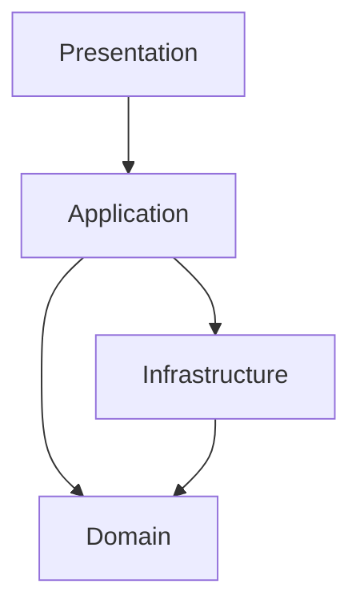

import { ConceptTemplate } from '@/features/kb/components/templates/ConceptTemplate'
import { Callout } from '@/features/kb/components/mdx/Callout'
import { ComparisonTable } from '@/features/kb/components/mdx/ComparisonTable'

export default function Layout({ children }) {
  return (
    <ConceptTemplate title="Layered Architecture">
      {children}
    </ConceptTemplate>
  )
}

**Layered architecture** (n-tier) stacks the system so a layer uses the one below and is used by the one above. Presentation does not talk to SQL if you are strict. It is the default shape of countless business apps — and the default way they slowly become a ball of mud.

## 1. Deep Dive and Mechanics

**Common four.** Presentation (UI/API). Application (use-case orchestration). Domain (rules). Infrastructure / persistence. Three-tier (UI, logic, data) is the same idea coarser.

**Strict versus relaxed.** Strict: only adjacent layers. Relaxed: presentation may skip to a query service. Relaxed is how CQRS read paths stay sane; it is also how layers evaporate.

**Anemic risk.** Controllers call services that call repositories that move DTOs. The domain layer is structs. You have folders, not a model.

**Distribution.** Layers in one process are not the same as a network tier. Putting each layer on its own host is usually a latency tax, not an architecture win.

<Callout icon="warning" title="The business logic in the UI and the stored procedure">
When both ends grow rules, the middle layer is a pass-through. Pick a home for each invariant and delete the duplicates.
</Callout>

## 2. Mathematical / Theoretical Foundation

**Unidirectional dependencies.** The package graph should be a path: P → A → D → I, or P → A → D and I implementing interfaces from D (that last variant is already hexagonal). Cycles (domain importing web) collapse the model.

**Change amplification.** A column change that leaks through every layer is shotgun surgery. Layers should hide decisions, not repeat them as identical DTOs four times without a reason.

**Cohesion.** A layer is a poor cohesion boundary (everything “is persistence”). Vertical slices (feature modules) often change together better; many teams layer inside a slice.

<ComparisonTable
  headers={['Variant', 'Dependency rule', 'Typical use']}
  rows={[
    ['Strict n-tier', 'Only downward', 'Simple CRUD'],
    ['Relaxed + query skip', 'Reads bypass domain', 'Report screens'],
    ['Layered + DIP', 'Domain owns ports', 'Clean / hexagonal'],
    ['Networked tiers', 'RPC per layer', 'Usually too chatty'],
  ]}
/>

## 3. Real-World Implementation

```text
src/
  presentation/  http handlers, view models
  application/   place_order.py
  domain/        order.py, money.py
  infrastructure/postgres_orders.py, smtp.py
```

A lint rule: domain may not import presentation or infrastructure.

## 4. Visualizations



The last arrow is “implements domain ports,” not “domain imports SQL.”

## 5. Interview Prep

**Q: Why do layered apps rot?**
**A:** Layers are technical, but change is by feature. People punch holes, duplicate rules, and skip tests in the “thin” service layer.

**Q: Layers versus modules?**
**A:** Modules (bounded contexts) are the first cut. Layers can exist inside a module. Layer-first, context-never is how you get a distributed monolith later.

**Q: Is three-tier obsolete?**
**A:** As a teaching sketch, no. As “put the UI, app servers, and DB on three VLANs and call it done,” yes.

## 6. Production Use Cases

- **Straightforward business apps** where a clear stack helps onboarding.
- **Teaching codebases** before introducing ports and adapters.
- **Legacy** where you restore layer rules as a first refactor.

<Callout icon="tip" title="Slice vertically when features hurt">
If every story touches all four folders, keep the layers but group by feature on the disk so the change set is local.
</Callout>
