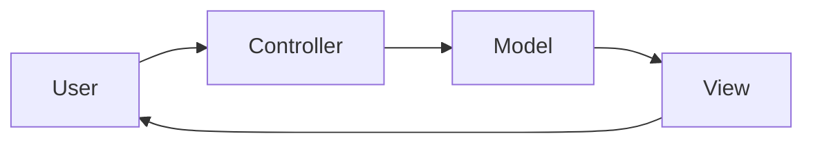

import { ConceptTemplate } from '@/features/kb/components/templates/ConceptTemplate'
import { Callout } from '@/features/kb/components/mdx/Callout'
import { ComparisonTable } from '@/features/kb/components/mdx/ComparisonTable'

export default function Layout({ children }) {
  return (
    <ConceptTemplate title="MVC">
      {children}
    </ConceptTemplate>
  )
}

**Model-View-Controller** (Reenskaug, Smalltalk) separates the domain state (Model), the rendering (View), and the interpretation of user gestures (Controller). Web frameworks borrowed the names; many “MVC” apps are really Model-Template-Controller with a fat controller.

## 1. Deep Dive and Mechanics

**Classic Smalltalk.** The view observes the model. The controller maps input to model commands. Multiple views can share one model. That observer link is the point.

**Web MVC.** An HTTP request hits a controller. The controller loads a model and picks a template. There is often no live observer — the “view” is a one-shot render. Fine, but do not pretend it is Smalltalk.

**Fat controller.** Business rules in the action method. The model is an ORM row. You have a naming convention, not MVC.

**Cousins.** MVP and MVVM re-home the glue for GUI toolkits and data binding. The shared idea is: the model does not draw widgets.

<Callout icon="info" title="MVC is a UI pattern">
It does not design your services or your database. Nesting MVC inside a messy domain still leaves a messy domain.
</Callout>

## 2. Mathematical / Theoretical Foundation

**Observer.** Views subscribe to model change. Update cost is O(subscribers) per mutation if naive; toolkits batch. Cycles (view updates model updates view) need re-entrancy rules.

**Information hiding.** The model hides invariants. The view hides pixels. The controller hides the input device. Each can change if the interfaces hold.

**Request as command.** In web MVC a request is a command DTO. Idempotence and authz belong in the model or application service, not only in the controller.

<ComparisonTable
  headers={['Pattern', 'Glue', 'Typical home']}
  rows={[
    ['MVC', 'Controller maps input', 'Web, classic GUI'],
    ['MVP', 'Presenter updates view', 'Humble view, tests'],
    ['MVVM', 'Bindings + view-model', 'XAML, reactive UI'],
    ['Fat template', 'Logic in the view', 'Unmaintainable'],
  ]}
/>

## 3. Real-World Implementation

```ruby
# Rails-style: keep the action thin
class OrdersController < ApplicationController
  def create
    order = PlaceOrder.new.call(order_params)
    redirect_to order
  end
end
```

`PlaceOrder` is the model/application side. The controller only translates HTTP.

## 4. Visualizations



## 5. Interview Prep

**Q: Where do you put validation?**
**A:** Shape checks can sit at the edge. Invariants belong in the model. Duplicating both in the controller is how they drift.

**Q: Is React MVC?**
**A:** React is a view library. People layer Flux/Redux (unidirectional) or MVC-like containers. Do not force the 1979 triangle onto hooks.

**Q: Why did MVC become “the web default”?**
**A:** It mapped cleanly to request, domain, template. The mismatch is the missing observer and the temptation to dump rules in controllers.

## 6. Production Use Cases

- **Server-rendered CRUD** with thin controllers.
- **Desktop GUI** that still uses the original observer split.
- **Teaching** the first separation of concerns in a UI.

<Callout icon="tip" title="If the controller needs a transaction script novel">
Extract an application service. MVC names will not save a 400-line action.
</Callout>
