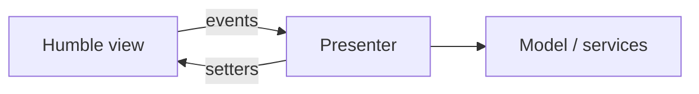

import { ConceptTemplate } from '@/features/kb/components/templates/ConceptTemplate'
import { Callout } from '@/features/kb/components/mdx/Callout'
import { ComparisonTable } from '@/features/kb/components/mdx/ComparisonTable'

export default function Layout({ children }) {
  return (
    <ConceptTemplate title="MVP">
      {children}
    </ConceptTemplate>
  )
}

**Model-View-Presenter** pushes UI behaviour into a Presenter. The View is humble: it shows data and forwards events. The Presenter loads the Model, formats strings, and calls view methods. Tests replace the view with a fake.

## 1. Deep Dive and Mechanics

**Passive view.** The view has setters (`setTitle`, `showError`) and emits clicks. Almost no if-statements. The presenter is easy to test.

**Supervising controller.** A milder MVP where the view still binds some simple fields and the presenter handles the rest. Less boilerplate, leakier tests.

**Lifetime.** The presenter is created with the screen and torn down with it. It must not outlive the view without weak refs, or you leak.

**Versus MVC.** The controller in web MVC often owns routing. The presenter owns presentation logic for one screen. Versus MVVM, MVP uses explicit calls instead of a binding engine.

<Callout icon="info" title="Humble Object">
Fowler’s Humble Object pattern is the same move: put the awkward framework bit in a thin shell and test the presenter.
</Callout>

## 2. Mathematical / Theoretical Foundation

**Test seam.** The view interface is a port. The presenter is a pure-enough function of model state plus events. You shrink the untestable surface to widget wiring.

**Coupling.** Presenter depends on a view interface, not a concrete Window class. That inversion is what makes headless tests possible.

**State machine.** Many screens are explicit states (loading, ready, error). The presenter owns the transitions; the view only renders the current state.

<ComparisonTable
  headers={['Pattern', 'Who updates the view', 'Test story']}
  rows={[
    ['MVP passive', 'Presenter calls methods', 'Fake view, easy'],
    ['MVVM', 'Bindings', 'Need a binding host'],
    ['MVC observer', 'View listens to model', 'Toolkit-heavy'],
    ['Code-behind', 'The form itself', 'UI tests only'],
  ]}
/>

## 3. Real-World Implementation

```kotlin
interface LoginView {
    fun showError(message: String)
    fun goHome()
}

class LoginPresenter(private val view: LoginView, private val auth: Auth) {
    fun onSubmit(user: String, pass: String) {
        if (user.isBlank()) {
            view.showError("user required")
            return
        }
        if (auth.login(user, pass)) view.goHome() else view.showError("denied")
    }
}
```

A unit test implements `LoginView` with recorded calls.

## 4. Visualizations



## 5. Interview Prep

**Q: MVP versus MVVM?**
**A:** MVP is explicit and toolkit-agnostic. MVVM shines when the platform has rich bindings (WPF, Android data binding). Both beat logic in the Activity or Form.

**Q: Where does navigation live?**
**A:** Often a router port the presenter calls, so tests can assert “navigated home” without a real navigator.

**Q: Is MVP dead on the web?**
**A:** The name is rarer; the idea is every “container versus presentational” split and every testable hook-free presenter module.

## 6. Production Use Cases

- **Android / desktop** screens that must be tested on a CI agent without emulators.
- **Legacy WinForms** rescue: extract presenters, leave the form humble.
- **Complex wizards** with rules that would rot in code-behind.

<Callout icon="tip" title="Keep the view interface boring">
If the view interface starts containing business types and rules, the presenter has leaked. Strings, flags, and lists of view models only.
</Callout>
