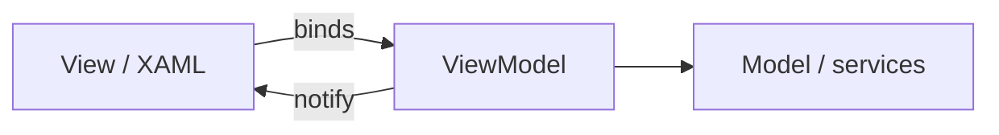

import { ConceptTemplate } from '@/features/kb/components/templates/ConceptTemplate'
import { Callout } from '@/features/kb/components/mdx/Callout'
import { ComparisonTable } from '@/features/kb/components/mdx/ComparisonTable'

export default function Layout({ children }) {
  return (
    <ConceptTemplate title="MVVM">
      {children}
    </ConceptTemplate>
  )
}

**Model-View-ViewModel** (Microsoft, WPF) inserts a ViewModel between the view and the model. The ViewModel holds presentation state (`isBusy`, formatted fields) and commands. The View binds to those properties. Designers can skin the view without rewriting C#.

## 1. Deep Dive and Mechanics

**Bindings.** One-way or two-way. A text box writes into `name`; a button binds to `saveCommand`. The ViewModel implements change notification (INotifyPropertyChanged or a reactive stream).

**Commands.** An object with `execute` and `canExecute` so the view can disable itself. Do not put the save logic in the click handler.

**Leak risk.** Views holding ViewModels and ViewModels holding views (for dialogs) create leaks. Use navigation services and weak events.

**Web cousins.** Angular-style two-way binding, Vue, and some React form libraries are philosophically MVVM even when they skip the name.

<Callout icon="warning" title="ViewModel as a second model">
Copying the entire domain into a ViewModel without a reason doubles every field. Map what the screen needs; keep invariants in the model.
</Callout>

## 2. Mathematical / Theoretical Foundation

**Dataflow.** Bindings are edges in a directed (sometimes cyclic) graph. Two-way bindings plus converters can loop; toolkits suppress re-entry. Prefer unidirectional flow when the graph gets hard.

**State projection.** The ViewModel is a function of model state plus transient UI state. Treat it as a projection you can snapshot in tests.

**Command pattern.** `canExecute` is a predicate over that state. The view is a renderer of the predicate, not the owner of the rule.

<ComparisonTable
  headers={['Pattern', 'View knowledge', 'Glue']}
  rows={[
    ['MVVM', 'Bindings to VM', 'Declarative'],
    ['MVP', 'Interface methods', 'Imperative'],
    ['MVC', 'Observer / render', 'Controller'],
    ['Code-behind', 'Everything', 'Event handlers'],
  ]}
/>

## 3. Real-World Implementation

```csharp
public sealed class LoginViewModel : ObservableObject
{
    public string User { get => _user; set => SetProperty(ref _user, value); }
    public IRelayCommand Submit { get; }

    public LoginViewModel(IAuth auth)
    {
        Submit = new RelayCommand(async () =>
        {
            await auth.LoginAsync(User, Password);
        });
    }
}
```

The XAML binds `Text` to `User` and `Command` to `Submit`.

## 4. Visualizations



## 5. Interview Prep

**Q: Why not bind the view straight to the domain model?**
**A:** Formatting, busy flags, and validation messages are presentation. Polluting the domain with `isBusy` couples it to a screen.

**Q: How do you unit-test a ViewModel?**
**A:** Construct it with fakes, invoke commands, assert property changes. No visual tree required.

**Q: MVVM on mobile?**
**A:** First-class on Xamarin/MAUI, Android with data binding, and many iOS VIPER/MVVM hybrids. Watch memory and main-thread rules.

## 6. Production Use Cases

- **WPF / MAUI / WinUI** line-of-business apps.
- **Reactive mobile** screens with a clear testable VM.
- **Design/dev split** where a designer owns the markup.

<Callout icon="tip" title="Keep I/O out of property setters">
Setters that hit the network make bindings unpredictable. Commands and explicit load methods are the right trigger.
</Callout>
