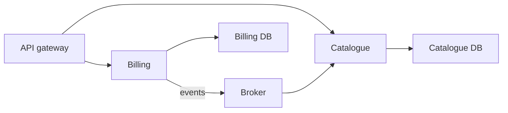

import { ConceptTemplate } from '@/features/kb/components/templates/ConceptTemplate'
import { Callout } from '@/features/kb/components/mdx/Callout'
import { ComparisonTable } from '@/features/kb/components/mdx/ComparisonTable'

export default function Layout({ children }) {
  return (
    <ConceptTemplate title="Microservices">
      {children}
    </ConceptTemplate>
  )
}

**Microservices** structure a system as independently deployable services, each owning its data and a business capability. The win is team autonomy and isolated failure. The bill is a distributed system: partial failure, eventual consistency, and operational load.

## 1. Deep Dive and Mechanics

**Independence.** You can deploy billing without rebuilding the catalogue. That requires a versioned contract and no shared database. A shared schema is a distributed monolith.

**Size.** Micro is a distraction. A service is as small as you can operate and as large as one team and one model. A two-person company with 40 repos is fragmented, not mature.

**Communication.** Sync HTTP or gRPC for request paths. Async events for fan-out. Timeouts, retries, idempotency, and circuit breakers are part of the architecture.

**Data.** Database per service. Cross-service queries become APIs or projections. Distributed transactions become sagas.

<Callout icon="warning" title="Distributed monolith">
Separate processes that must deploy in lockstep and share tables give you the pain of distribution without the autonomy. Name that failure mode in interviews.
</Callout>

## 2. Mathematical / Theoretical Foundation

**Fallacies of distributed computing.** The network is not reliable, latency is not zero, bandwidth is not infinite, the topology changes, and transport is not free. Microservices make those fallacies daily.

**Consistency.** You choose per workflow. Checkout might need a strong aggregate; the recommendation tray can be stale.

**Conway.** Service boundaries that fight team boundaries generate coordination cost. The architecture either matches the org or the org will match the architecture.

<ComparisonTable
  headers={['Shape', 'Deploy', 'Failure isolation']}
  rows={[
    ['Monolith', 'One unit', 'Process-wide'],
    ['Modular monolith', 'One unit, hard modules', 'Process-wide, better design'],
    ['Microservices', 'Per service', 'Per service if data is owned'],
    ['Distributed monolith', 'Lockstep many', 'Worst of both'],
  ]}
/>

## 3. Real-World Implementation

```yaml
openapi: 3.0.3
info:
  title: Billing
  version: "2.0.0"
paths:
  /v2/invoices/{id}:
    get:
      responses:
        "200":
          description: invoice
```

A breaking change gets a new route or a new version. The path parameter stays in the contract file, not as a shared table.

## 4. Visualizations



## 5. Interview Prep

**Q: When do you start with microservices?**
**A:** Rarely. Start modular. Split when a module has an independent rate of change, a separate SLO, or a team that is blocked on a shared release train.

**Q: How do you do a transaction across services?**
**A:** You usually do not. Use a saga or process manager with compensations. If you need a single ACID boundary, keep it in one service.

**Q: What do you observe?**
**A:** RED or USE metrics per service, consumer lag, and distributed traces with a request id that survives hops.

## 6. Production Use Cases

- **Large orgs** with many teams and independent release cadences.
- **Uneven scale** (a PDF farm that must not take down login).
- **Polyglot** needs that cannot share one runtime.

<Callout icon="tip" title="Own the contract">
A service without a published, tested contract is a function call with extra latency. Pact or schema checks belong in CI.
</Callout>
