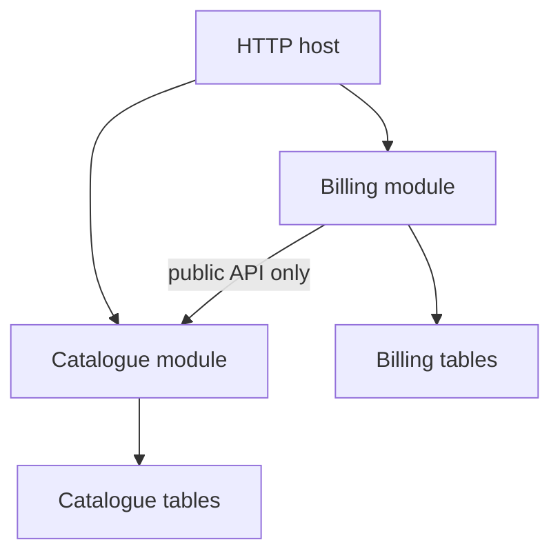

import { ConceptTemplate } from '@/features/kb/components/templates/ConceptTemplate'
import { Callout } from '@/features/kb/components/mdx/Callout'
import { ComparisonTable } from '@/features/kb/components/mdx/ComparisonTable'

export default function Layout({ children }) {
  return (
    <ConceptTemplate title="Modular Monolith">
      {children}
    </ConceptTemplate>
  )
}

A **modular monolith** is a single process and a single release train with modules that cannot reach into each other’s internals. You get one database transaction when you truly need it, one deploy, and a design that can later become services along existing seams.

## 1. Deep Dive and Mechanics

**Modules.** Each bounded context is a package (or Java module, or .NET project) with a public API. Other modules import only that API. Shared kernels are tiny and explicit.

**Enforcement.** Folder convention is not a boundary. Use compilers, module systems, ArchUnit, or custom import linters. Without enforcement, the monolith re-melts.

**Data.** Prefer schema-per-module or table prefixes plus no foreign keys across modules. Cross-module work goes through the API or an in-process event bus.

**Extraction.** When a module needs its own scale or team, you already have the cut line. Until then you did not run Kubernetes to hide a missing package boundary.

<Callout icon="info" title="Monolith is a deploy shape">
Modular is a design shape. You can have a modular monolith or a modular set of services. You can also have an immodular everything.
</Callout>

## 2. Mathematical / Theoretical Foundation

**Allowed graph.** Modules form a DAG of public APIs. Cycles are the first smell (except a tiny shared kernel). Acyclic graphs extract cleanly.

**Transaction scope.** In-process modules can share a transaction — a real advantage. Use it for one consistency boundary, not as an excuse for a global schema.

**Option value.** You pay a little modularity tax now to keep the extract option cheap. That is the same option-value story as good design generally.

<ComparisonTable
  headers={['Shape', 'Process', 'Boundary hardness']}
  rows={[
    ['Ball of mud', 'One', 'None'],
    ['Modular monolith', 'One', 'Compile / lint enforced'],
    ['Microservices', 'Many', 'Network and data owned'],
    ['Distributed monolith', 'Many', 'Soft, shared DB'],
  ]}
/>

## 3. Real-World Implementation

```javascript
// eslint rule of thumb: billing may not import catalogue internals
// billing/index.js exports only public commands
export { issueInvoice } from './api.js'
```

```text
# arch test (conceptual)
forbid: catalogue/internal/** <- billing/**
allow:  catalogue/api.js      <- billing/**
```

## 4. Visualizations



## 5. Interview Prep

**Q: Why not go straight to microservices?**
**A:** You do not yet know the real seams, and you cannot operate 20 production systems. A modular monolith learns the domain cheaper.

**Q: How do you keep modules honest?**
**A:** Automated architecture tests in CI, code owners per module, and no shared ORM session used as a junk drawer.

**Q: Can modules share a database?**
**A:** The instance can be shared; the tables and transactions should not become a back door. Treat cross-module SQL as a broken boundary.

## 6. Production Use Cases

- **Startups and mid-size products** that still fit one deploy.
- **Regulated apps** that want simple ops and a clean model.
- **Migration waypoint** from a mud ball toward services.

<Callout icon="tip" title="Name the public API">
If you cannot list the functions another module may call, you do not have a module. You have a folder.
</Callout>
