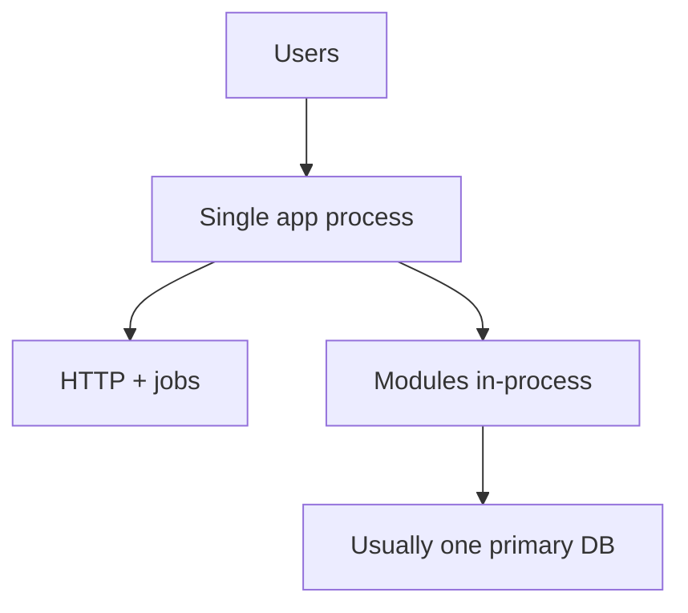

import { ConceptTemplate } from '@/features/kb/components/templates/ConceptTemplate'
import { Callout } from '@/features/kb/components/mdx/Callout'
import { ComparisonTable } from '@/features/kb/components/mdx/ComparisonTable'

export default function Layout({ children }) {
  return (
    <ConceptTemplate title="Monolith">
      {children}
    </ConceptTemplate>
  )
}

A **monolith** ships as one artifact: one binary, one web app, one deploy. All features share a process, a memory space, and usually a database. That is not an insult. It is a deploy topology. Design quality is orthogonal.

## 1. Deep Dive and Mechanics

**Why it works.** One set of logs, one transaction, one local function call instead of a network hop. Cognitive load for ops is low. Refactors that span features are a compile, not a coordinated release.

**Why it hurts.** A memory leak or a hot loop in PDF generation takes down login. Teams block on one release train. The codebase can become a mud ball if modules are not enforced.

**Kinds.** Modular monolith (good internals). Distributed monolith (many processes, one brain). Legacy monolith (no tests, no seams). Do not treat them as the same animal.

**Scale.** Vertical scale and careful caching go further than Twitter-era folklore. Split when a part of the system has a different SLO, scale, or team, not because a blog post said so.

<Callout icon="warning" title="Monolith versus mud">
People say monolith when they mean untestable shared state. Fix the design. Splitting a mud ball across the network produces a distributed mud ball.
</Callout>

## 2. Mathematical / Theoretical Foundation

**Failure domain.** The process is a single fault container. Availability of feature A is coupled to feature B unless you isolate with extra processes (which is the first step toward services).

**Communication cost.** In-process calls are nanoseconds and reliable relative to RPC. That changes the viable granularity of modules.

**Release coupling.** Let T be the integration time of the slowest team. Everyone ships at T. Microservices aim to decouple T. A modular monolith can still have internal trains (feature flags) to loosen social coupling.

<ComparisonTable
  headers={['Concern', 'Monolith', 'Microservices']}
  rows={[
    ['Deploy', 'One', 'Many'],
    ['Txn across features', 'Easy', 'Hard'],
    ['Isolate a bad loop', 'Hard', 'Easier'],
    ['Ops surface', 'Small', 'Large'],
  ]}
/>

## 3. Real-World Implementation

```text
# One pipeline, one artifact
build: docker build -t app:$GIT_SHA .
test:  go test ./...
push:  deploy app:$GIT_SHA to the single service
```

Feature flags decide who sees what. The deploy topology stays one.

## 4. Visualizations



## 5. Interview Prep

**Q: Is a monolith outdated?**
**A:** No. Many of the best products are monoliths or modular monoliths. Outdated is an unowned, untested blob — in any topology.

**Q: How do you scale a monolith?**
**A:** Replicas behind a load balancer, a real cache, and move the hottest isolated workload first (workers, image farm). Measure before you carve.

**Q: When is it time to split?**
**A:** Independent scale, independent failure, or organisational lock on the release train — and a seam that already exists.

## 6. Production Use Cases

- **Most CRUD products** under a few teams.
- **Internal tools** where ops simplicity wins.
- **Early-stage startups** still discovering the domain.

<Callout icon="tip" title="Invest in modularity first">
The cheapest future split is a package boundary you already enforce. Do that while you still enjoy one deploy.
</Callout>
