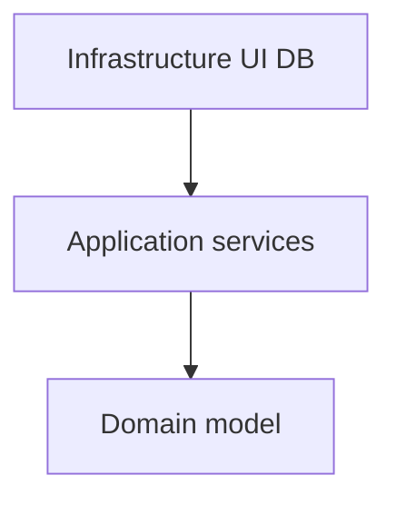

import { ConceptTemplate } from '@/features/kb/components/templates/ConceptTemplate'
import { Callout } from '@/features/kb/components/mdx/Callout'
import { ComparisonTable } from '@/features/kb/components/mdx/ComparisonTable'

export default function Layout({ children }) {
  return (
    <ConceptTemplate title="Onion Architecture">
      {children}
    </ConceptTemplate>
  )
}

**Onion architecture** (Palermo) draws the system as concentric rings. The domain model is the innermost. Application services wrap it. Adapters (UI, persistence, email) sit on the outer ring. Inner rings know nothing of outer rings.

## 1. Deep Dive and Mechanics

**Centre.** Entities and domain services express rules in domain language. No ORM attributes required. No HttpContext.

**Application ring.** Use cases orchestrate entities and declare repository interfaces. This ring still has no SQL.

**Outer ring.** EF Core, Rails ActiveRecord, Express, SMTP. These implement the interfaces. Composition root (DI container) wires the onion at boot.

**Difference in branding.** Hexagonal talks ports. Clean talks use cases and the dependency rule. Onion talks rings. A reviewer who asks you to contrast them wants this paragraph, not three new frameworks.

<Callout icon="info" title="Same family">
If your domain package compiles without a web or SQL reference, you are in the onion / hex / clean club. The rest is vocabulary.
</Callout>

## 2. Mathematical / Theoretical Foundation

**Inward arrows.** For packages D (domain), A (application), I (infra): I → A → D. Any D → I edge is a defect.

**Stability.** Inner rings change for domain reasons only. Outer rings change when vendors and protocols change. That separation is Parnas information hiding applied to an application.

**Test cone.** You can test D and A with fakes for I. The number of integration tests you still need drops to the adapters.

<ComparisonTable
  headers={['Name', 'Picture', 'Emphasis']}
  rows={[
    ['Onion', 'Rings', 'Domain centre, .NET history'],
    ['Hexagonal', 'Ports', 'Swap adapters'],
    ['Clean', 'Use cases', 'Policy versus details'],
    ['Traditional layers', 'Stack', 'Often domain depends on DB'],
  ]}
/>

## 3. Real-World Implementation

```csharp
// Domain ring — no Microsoft.EntityFrameworkCore
public interface IOrderRepository
{
    Task Save(Order order);
}

// Infrastructure ring
public sealed class SqlOrderRepository : IOrderRepository
{
    public Task Save(Order order) => _db.Save(order);
}
```

The domain defines `IOrderRepository`. SQL lives outside.

## 4. Visualizations



## 5. Interview Prep

**Q: Onion versus n-tier?**
**A:** N-tier often lets the UI call the data layer and lets the domain depend on the ORM. Onion forbids both. The domain owns the abstractions.

**Q: Where is the composition root?**
**A:** The outer ring — the process entry point. Domain assemblies should not new-up infrastructure.

**Q: Does onion require a particular folder tree?**
**A:** No. It requires a dependency graph. Folders help humans; compilers and tests prove it.

## 6. Production Use Cases

- **.NET line-of-business** systems that popularised the name.
- **Any long-lived core** that will change UI or persistence.
- **Teaching DIP** with a picture people remember.

<Callout icon="tip" title="Ban the ORM in the domain project">
A project reference is the real ring. If the domain csproj references EF, the onion is decorative.
</Callout>
