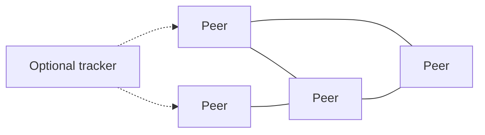

import { ConceptTemplate } from '@/features/kb/components/templates/ConceptTemplate'
import { Callout } from '@/features/kb/components/mdx/Callout'
import { ComparisonTable } from '@/features/kb/components/mdx/ComparisonTable'

export default function Layout({ children }) {
  return (
    <ConceptTemplate title="Peer-to-Peer">
      {children}
    </ConceptTemplate>
  )
}

**Peer-to-peer (P2P)** systems give nodes similar roles. Each peer can request and serve. There is no required central host for the data plane (though many real systems keep a rendezvous or tracker). BitTorrent, early Skype overlays, and many CRDT collab tools live here.

## 1. Deep Dive and Mechanics

**Discovery.** How do you find peers? Trackers, DHTs (Kademlia), multicast, or an introduction server. Pure magic discovery on the modern internet is blocked by NAT.

**Data.** Replication and chunking (BitTorrent pieces). Conflict: last-write-wins, CRDTs, or human merge. There is no single SQL primary unless you elect one.

**Trust.** Any peer may be malicious. You need content hashes, signatures, incentives, or a permissioned membership list. Open P2P without authentication is an abuse magnet.

**Hybrids.** Most “P2P” products are hybrid: a cloud for identity and signalling, peers for the heavy bytes (WebRTC).

<Callout icon="warning" title="NAT and reality">
Home NATs and symmetric firewalls make true connectivity a research project. Budget STUN, TURN, and a signalling channel or your demo dies on hotel Wi-Fi.
</Callout>

## 2. Mathematical / Theoretical Foundation

**Overlay graphs.** Peers form a graph. Routing (DHT) gives expected log n hops under uniform hashing. Churn (join/leave) is the main adversary of the analysis.

**CAP at the edge.** Without a primary, you choose availability and partition tolerance; consistency becomes eventual or mergeable (CRDTs).

**Incentives.** Free riders (BitTorrent tit-for-tat) are a game-theoretic problem, not an afterthought.

<ComparisonTable
  headers={['Style', 'Authority', 'Typical use']}
  rows={[
    ['Client-server', 'The server', 'SaaS'],
    ['Pure P2P', 'None / protocol', 'File swarms'],
    ['Hybrid P2P', 'Cloud for control', 'WebRTC calls'],
    ['Permissioned mesh', 'Membership list', 'Internal fabrics'],
  ]}
/>

## 3. Real-World Implementation

```text
# Content addressing: the name is the hash
piece_id = sha256(chunk)
# A peer who sends the wrong bytes fails the hash and is dropped
```

You trust the hash, not the peer’s IP.

## 4. Visualizations



## 5. Interview Prep

**Q: Why not P2P for a bank ledger?**
**A:** Authority, audit, and regulation want a clearly responsible operator. Permissioned consensus is a different design than open swarms.

**Q: How do you prevent poison data?**
**A:** Hash-addressed chunks, signatures from a publisher key, and clients that refuse mismatches.

**Q: Is blockchain P2P?**
**A:** The gossip layer is P2P. Consensus and incentives are extra machinery. Do not equate the two in an interview.

## 6. Production Use Cases

- **Content distribution** where bandwidth from peers beats a CDN bill.
- **Real-time media** (WebRTC) with a small signalling server.
- **Local-first apps** that sync via a mesh or a relay when needed.

<Callout icon="tip" title="Design for peers going away">
Churn is normal. Replication factor and repair, not a wish that laptops stay open, keep the object alive.
</Callout>
