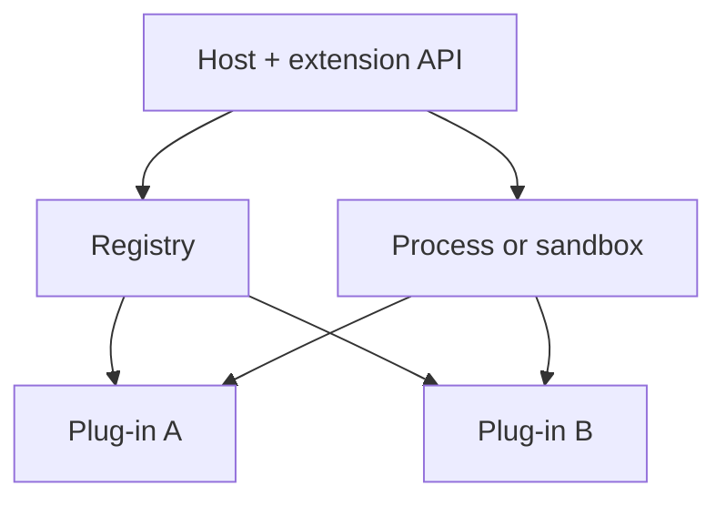

import { ConceptTemplate } from '@/features/kb/components/templates/ConceptTemplate'
import { Callout } from '@/features/kb/components/mdx/Callout'
import { ComparisonTable } from '@/features/kb/components/mdx/ComparisonTable'

export default function Layout({ children }) {
  return (
    <ConceptTemplate title="Plug-in Architecture">
      {children}
    </ConceptTemplate>
  )
}

A **plug-in architecture** splits a host application from optional modules that implement published extension points. The host owns lifecycle, security, and the stable API. Plug-ins own features. Eclipse, VS Code, browsers, and webpack live on this pattern.

## 1. Deep Dive and Mechanics

**Extension points.** Interfaces or manifests: “here is a command,” “here is a file icon.” The host discovers them (directory, registry, marketplace) and activates on demand.

**Isolation.** In-process plug-ins crash or lock the host. Out-of-process (VS Code extension host) trades performance for blast-radius control. Web extensions use separate processes and permissions.

**Versioning.** The host API is a compatibility contract. Breaking it splits the ecosystem. Semantic versioning and deprecation windows are the product.

**Security.** Third-party code is untrusted. Permissions, signing, and store review are architecture, not policy PDFs.

<Callout icon="warning" title="The kitchen-sink host">
If every feature is a plug-in but the host still imports them all at compile time, you have modules with extra ceremony. True plug-ins are unknown at build time.
</Callout>

## 2. Mathematical / Theoretical Foundation

**Open-closed.** The host is closed to modification, open to extension through abstract points. That is the GoF open-closed principle at system scale.

**Discovery.** A registry maps capability names to implementations. Activation is lazy to keep start-up O(needed), not O(installed).

**Compatibility.** Treat the API as a partially ordered set of versions. Plug-in P requires host ≥ X and less than Y. The solver is a constraint problem (npm-like) when dependencies nest.

<ComparisonTable
  headers={['Isolation', 'Crash impact', 'Example']}
  rows={[
    ['In-process DLL', 'Can kill host', 'Legacy IDE plugins'],
    ['Separate process', 'Host survives', 'VS Code extensions'],
    ['Sandbox / WASM', 'Tight syscall box', 'Some browsers, Figma'],
    ['Compile-time modules', 'Same process', 'Not really plug-ins'],
  ]}
/>

## 3. Real-World Implementation

```json
{
  "name": "acme-lint",
  "engines": { "vscode": "^1.80.0" },
  "activationEvents": ["onLanguage:python"],
  "contributes": {
    "commands": [{ "command": "acme.lint", "title": "Lint" }]
  }
}
```

The host reads the manifest, does not import the extension until an activation event.

## 4. Visualizations



## 5. Interview Prep

**Q: Plug-in versus microservice?**
**A:** Plug-ins extend one product’s UX and process. Services split deployable backends. A VS Code extension is not a microservice.

**Q: How do you keep the core small?**
**A:** Only mechanisms in the host (commands, tree views, settings). Policy and product features go to first-party plug-ins that use the same API as third parties.

**Q: What is the hardest part?**
**A:** API stability and security. Cute extension points that leak internals will haunt you for a decade.

## 6. Production Use Cases

- **IDEs and design tools** with marketplaces.
- **Browsers** and their extension ecosystems.
- **Enterprise products** that partners customise without forks.

<Callout icon="tip" title="Dogfood the public API">
If first-party features skip the extension API, the API will rot and third parties will suffer. Build your own features as plug-ins.
</Callout>
