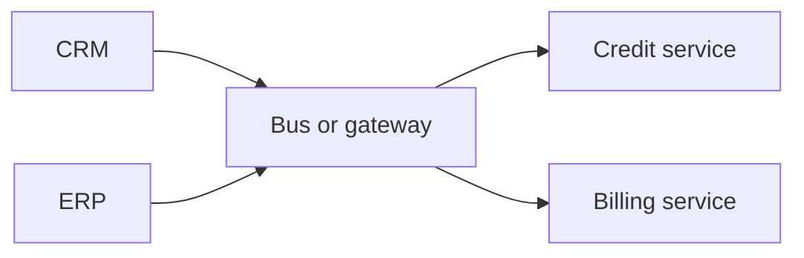

import { ConceptTemplate } from '@/features/kb/components/templates/ConceptTemplate'
import { Callout } from '@/features/kb/components/mdx/Callout'
import { ComparisonTable } from '@/features/kb/components/mdx/ComparisonTable'

export default function Layout({ children }) {
  return (
    <ConceptTemplate title="SOA">
      {children}
    </ConceptTemplate>
  )
}

**Service-Oriented Architecture (SOA)** structures the enterprise as services that expose business operations through standard contracts (historically SOAP, WSDL, an ESB). Microservices inherited the “service” idea and rejected the central bus and the giant shared models.

## 1. Deep Dive and Mechanics

**Service as a business capability.** “Get credit score,” not “run this stored procedure.” Consumers should not know the implementation. That part is still good advice.

**ESB era.** An enterprise service bus mediated, transformed, and orchestrated. It became a bottleneck and a smart pipe. Modern taste: dumb pipes, smart endpoints.

**Governance.** Registries, canonical data models, and central architecture boards. Useful against chaos; deadly when the canonical model becomes a company-wide Customer god object.

**Grain.** SOA services were often large (a whole department). Microservices pushed the grain down and the autonomy up. The continuum is size and governance, not a religious war.

<Callout icon="info" title="SOA is not SOAP">
SOAP was a common SOA transport. You can do SOA with REST or messaging. You can also do SOAP without any service orientation worth the name.
</Callout>

## 2. Mathematical / Theoretical Foundation

**Contract as interface.** A service is a type: operations, schemas, SLAs. Compatibility is a versioning problem on that type. Breaking the WSDL or OpenAPI is a breaking change of the enterprise graph.

**Orchestration versus choreography.** Central orchestration (BPEL-style) is a single point of control and failure. Choreography distributes the state machine — harder to see, easier to scale.

**Canonical model cost.** A global schema is an attempt at one homomorphism for the whole company. Bounded contexts say that homomorphism does not exist. SOA programmes that ignored this paid in mapping layers forever.

<ComparisonTable
  headers={['Idea', 'Classic SOA', 'Microservices']}
  rows={[
    ['Grain', 'Coarse, departmental', 'Finer, team-sized'],
    ['Integration', 'ESB, smart pipes', 'Dumb broker, APIs'],
    ['Data', 'Often shared or canonical', 'Database per service'],
    ['Governance', 'Central, heavy', 'Federated, automated'],
  ]}
/>

## 3. Real-World Implementation

```xml
<!-- Conceptual WSDL operation — the contract is the product -->
<operation name="GetCreditScore">
  <input message="tns:ScoreRequest"/>
  <output message="tns:ScoreResponse"/>
</operation>
```

Today the same contract is more often OpenAPI or a gRPC proto. The governance question remains: who may change it.

## 4. Visualizations



## 5. Interview Prep

**Q: SOA versus microservices?**
**A:** Shared goals (reuse, business services). Different defaults on size, data ownership, and the ESB. Say “microservices are SOA without the smart bus and with stricter data isolation” and then nuance it.

**Q: What failed in 2000s SOA?**
**A:** Canonical models, vendor ESBs as the brain, and services that were still just wrappers on a shared database.

**Q: Is an API gateway an ESB?**
**A:** A gateway is a dumb edge (auth, routing, rate limits). If it grows transformations and orchestrations for every product, you are rebuilding an ESB.

## 6. Production Use Cases

- **Enterprises** still running a service inventory and a gateway.
- **B2B integrations** that need coarse, stable operations.
- **Migration** from ESB-centric estates toward thinner endpoints.

<Callout icon="tip" title="Keep pipes dumb">
Put business rules in services with tests and owners. A bus that “just maps one more field” becomes unowned software.
</Callout>
