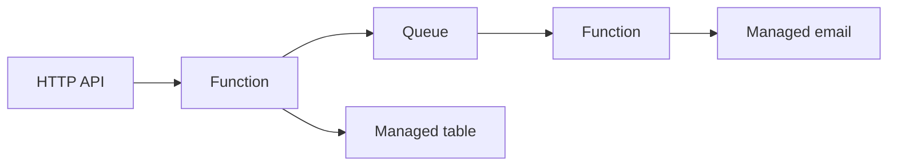

import { ConceptTemplate } from '@/features/kb/components/templates/ConceptTemplate'
import { Callout } from '@/features/kb/components/mdx/Callout'
import { ComparisonTable } from '@/features/kb/components/mdx/ComparisonTable'

export default function Layout({ children }) {
  return (
    <ConceptTemplate title="Serverless Architecture">
      {children}
    </ConceptTemplate>
  )
}

**Serverless** means the team does not provision or patch the long-lived host. Functions-as-a-Service (Lambda, Cloud Functions), plus managed queues, stores, and API gateways, compose an application. Servers still exist. They are someone else’s scaling problem — and someone else’s constraints.

## 1. Deep Dive and Mechanics

**FaaS lifecycle.** A trigger (HTTP, queue, schedule) invokes a handler. The platform may cold-start a new isolate. You pay per invocation and duration, not for a 24/7 VM (until you buy provisioned concurrency).

**Statelessness.** Local disk and in-memory caches are ephemeral. State lives in managed stores. Connection pools and huge in-process caches fight the model.

**Composition.** Gateways, queues, step functions, and BaaS (Auth, Firestore). The architecture is a graph of managed services. IAM and least privilege become the module system.

**Limits.** Timeouts, payload sizes, cold starts, vendor APIs, and local-dev fidelity. Long-running or sticky-connection workloads (game servers) are a poor fit.

<Callout icon="warning" title="Distributed monolith on a credit card">
Thirty functions that must deploy together and share a hidden database are still a monolith — with colder starts and a larger IAM surface.
</Callout>

## 2. Mathematical / Theoretical Foundation

**Utilization.** Classic servers pay for peak capacity. Serverless approximates pay-for-used, which wins when load is spiky and idle is large. At high, steady utilization, reserved instances often win on cost.

**Cold start as latency tail.** The p99 includes provision + init. Provisioned concurrency trades money for a shorter tail.

**Orchestration.** Step-function state machines are explicit sagas. The cost is per state transition; chatty designs hurt both money and traceability.

<ComparisonTable
  headers={['Compute', 'Ops burden', 'Fits']}
  rows={[
    ['FaaS', 'Low, many limits', 'Spiky, event-shaped'],
    ['Containers / K8s', 'High', 'Steady, complex process'],
    ['PaaS long-lived', 'Medium', 'Web apps with sessions'],
    ['Always-on VM', 'You patch it', 'Special networking'],
  ]}
/>

## 3. Real-World Implementation

```javascript
exports.handler = async (event) => {
  const id = event.pathParameters.id
  const item = await table.get(id)
  if (!item) return { statusCode: 404, body: "missing" }
  return { statusCode: 200, body: JSON.stringify(item) }
}
```

Keep the handler thin; put rules in a testable module the handler calls.

## 4. Visualizations



## 5. Interview Prep

**Q: Serverless versus PaaS?**
**A:** PaaS still runs a long-lived app process you think in. FaaS bills and scales per invocation and pushes you to stateless handlers.

**Q: How do you handle a 15-minute timeout?**
**A:** Break the work into chunks, persist progress, and continue via a queue or a state machine. Do not hide a batch job in a web handler.

**Q: What about vendor lock-in?**
**A:** Real. Isolate business rules from the trigger SDK. Accept that IAM, queues, and tables will still bind you — that is the product you bought.

## 6. Production Use Cases

- **APIs with spiky traffic** (campaigns, webhooks).
- **Glue** between SaaS events (file arrived, notify, ETL a slice).
- **Cron replacements** that should not occupy a VM all month.

<Callout icon="tip" title="Watch the bill dimensions">
Invocations, duration, provisioned concurrency, and chatty downstream APIs. A retry storm is both an incident and an invoice.
</Callout>
