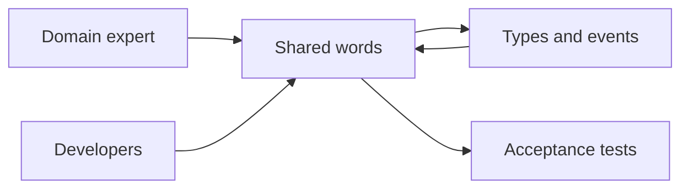

import { ConceptTemplate } from '@/features/kb/components/templates/ConceptTemplate'
import { Callout } from '@/features/kb/components/mdx/Callout'
import { ComparisonTable } from '@/features/kb/components/mdx/ComparisonTable'

export default function Layout({ children }) {
  return (
    <ConceptTemplate title="Ubiquitous Language">
      {children}
    </ConceptTemplate>
  )
}

A **ubiquitous language** is the dialect of a bounded context, used by domain experts and developers together. If the expert says “bind” and the code says `attachPolicyToUser`, every meeting is a translation tax and every bug hides in the dictionary.

## 1. Deep Dive and Mechanics

**One context, one glossary.** Words are local. “Customer” in billing is not “Customer” in support. Do not force a company-wide thesaurus that lies.

**Live in the code.** Class, method, and event names are the language. Comments that translate the code back to business words mean the code lost.

**Tests as examples.** Acceptance tests should read like the expert’s sentences. That is living documentation, not a cute extra.

**Maintenance.** When the business coins a term, rename. When two terms mean one thing, pick one and kill the synonym. When one term means two things, you found a context boundary.

<Callout icon="warning" title="Developer slang leaking out">
Calling a policyholder a user because the auth table says user trains the business to speak framework. Push the language the other way.
</Callout>

## 2. Mathematical / Theoretical Foundation

**Shared meaning.** Communication succeeds when speaker and listener assign the same referent. A ubiquitous language maximises that overlap inside a context. Across contexts you need an explicit map, not a bigger glossary.

**Model = language.** Distinctions you cannot name you cannot implement consistently. Naming a new term is often the design act (a new value object).

**Drift.** Synonyms and overloaded words increase entropy. Refactoring names is not cosmetic; it restores the homomorphism between talk and types.

<ComparisonTable
  headers={['Practice', 'Effect', 'Failure']}
  rows={[
    ['Shared glossary per context', 'Fast talk, clear code', 'Stale wiki'],
    ['Names in code match talk', 'No translation', 'ORM table names win'],
    ['Company-wide dictionary', 'Looks aligned', 'False synonyms'],
    ['Jargon per team', 'Local speed', 'Integration bugs'],
  ]}
/>

## 3. Real-World Implementation

```gherkin
Feature: Bind cover
  Scenario: Binder issues after underwriting accepts
    Given a submission in status Accepted
    When the underwriter issues the binder
    Then the submission status is Bound
    And a BinderIssued event is recorded
```

If the code says `status = "CLOSED"` you have already broken the language.

## 4. Visualizations



## 5. Interview Prep

**Q: Ubiquitous language versus a data dictionary?**
**A:** A data dictionary lists columns. A ubiquitous language names decisions and rules. It is spoken, tested, and encoded, not only filed.

**Q: What if experts disagree on a word?**
**A:** That is a modelling signal. Split contexts or pick a term and write the other as a translation on the context map.

**Q: How do you introduce this to a CRUD team?**
**A:** Start with the hottest module. Rename in a PR with the expert on the review. Do not boil the ocean.

## 6. Production Use Cases

- **Insurance, trading, logistics** where wrong words become wrong money.
- **Event-sourced systems** whose event names are the legal record.
- **Onboarding** new engineers who should read tests as the domain book.

<Callout icon="tip" title="Put the glossary in the repo">
A markdown file next to the module, reviewed like code, beats a Confluence page last edited during the reorg.
</Callout>
