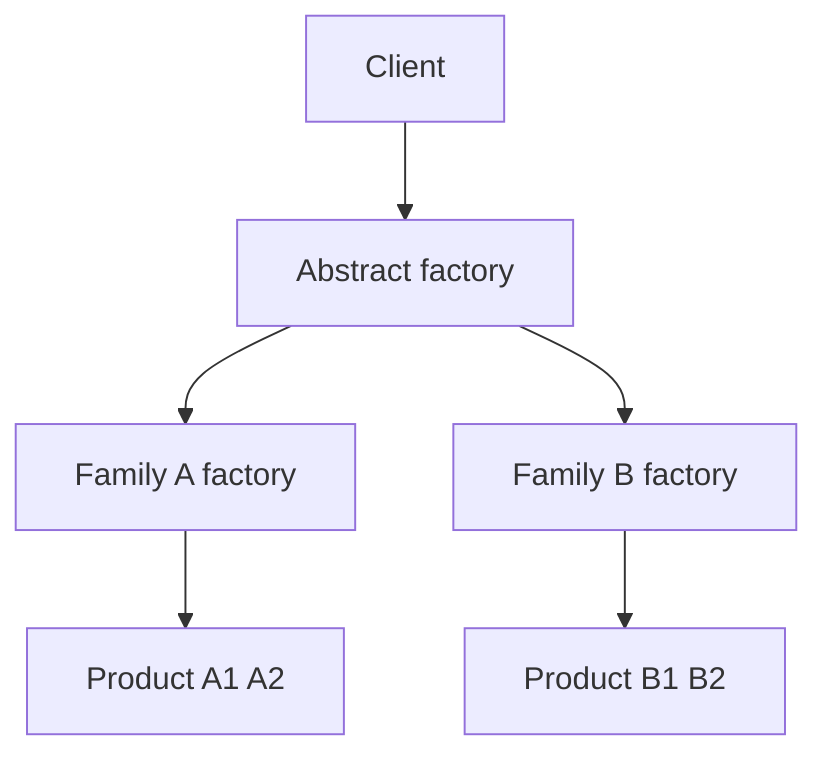

import { ConceptTemplate } from '@/features/kb/components/templates/ConceptTemplate'
import { Callout } from '@/features/kb/components/mdx/Callout'
import { ComparisonTable } from '@/features/kb/components/mdx/ComparisonTable'

export default function Layout({ children }) {
  return (
    <ConceptTemplate title="Abstract Factory">
      {children}
    </ConceptTemplate>
  )
}

**Abstract Factory** (GoF) supplies an interface for creating a set of related products (Button, Scrollbar, Checkbox) so a client can stay on the Light theme or the Dark theme without `new`ing concrete widgets. The family stays consistent because one factory instance created all of them.

## 1. Deep Dive and Mechanics

**Factory of factories.** Each concrete factory (`WinFactory`, `OsxFactory`) implements `createButton` and `createMenu`. The app holds the abstract factory, not the product classes.

**Families.** The point is combinatorial consistency. A Windows button on a macOS menu is the bug this pattern prevents.

**Composition root.** You pick the factory once at startup (from config, from OS detection). The rest of the app depends on abstractions.

**Versus Factory Method.** Factory Method defers one product to a subclass. Abstract Factory defers a whole family, usually via an object you inject, not via subclassing the client.

<Callout icon="info" title="Do not factory everything">
One `new` in a use case is not a crime. Abstract Factory earns its keep when products must match and the family will grow.
</Callout>

## 2. Mathematical / Theoretical Foundation

**Type family.** Think of a factory as an index: for variant V, you get product types P1(V), P2(V), … that are designed to interoperate. The abstract factory is the interface of that index.

**Open-closed.** Adding a product means a new method on every factory (painful). Adding a family means a new factory class (the intended extension axis). If you extend both axes often, you want a different design (dependency injection of each product).

**Substitution.** Clients type against abstract products. Liskov still applies: a DarkButton must honour the Button contract.

<ComparisonTable
  headers={['Pattern', 'Creates', 'Extension axis']}
  rows={[
    ['Abstract Factory', 'A matching family', 'New family'],
    ['Factory Method', 'One product', 'New creator subclass'],
    ['Builder', 'One complex object', 'New construction recipe'],
    ['DI container', 'Whatever is bound', 'New bindings'],
  ]}
/>

## 3. Real-World Implementation

```python
class UiFactory:
    def button(self):
        raise NotImplementedError

class DarkFactory(UiFactory):
    def button(self):
        return DarkButton()

def toolbar(factory):
    return factory.button()  # never DarkButton() here
```

Swap `DarkFactory` for `LightFactory` at the edge.

## 4. Visualizations



## 5. Interview Prep

**Q: Abstract Factory versus Factory Method?**
**A:** Factory Method is “subclass decides one `createX`.” Abstract Factory is “an object can create a consistent set.” They compose: a factory method can return an abstract factory.

**Q: Where have you seen this in the wild?**
**A:** UI toolkits, database drivers (`java.sql.Connection` families), and cloud SDKs that vend matching clients for a region or credential style.

**Q: What is the usual smell?**
**A:** A god factory that creates unrelated objects. That is a service locator in a funny hat.

## 6. Production Use Cases

- **Look-and-feel** or brand skins that must not mix.
- **Multi-platform** clients (desktop, mobile) sharing app code.
- **Vendor families** (all AWS versus all GCP adapters chosen together).

<Callout icon="tip" title="Bind the factory once">
If every function looks up the factory globally, you have hidden coupling. Inject it.
</Callout>
