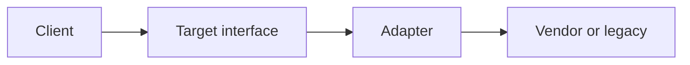

import { ConceptTemplate } from '@/features/kb/components/templates/ConceptTemplate'
import { Callout } from '@/features/kb/components/mdx/Callout'
import { ComparisonTable } from '@/features/kb/components/mdx/ComparisonTable'

export default function Layout({ children }) {
  return (
    <ConceptTemplate title="Adapter">
      {children}
    </ConceptTemplate>
  )
}

**Adapter** (GoF) converts the interface you have into the interface you need. The client talks to `PaymentPort`. The Stripe SDK talks Stripe. The adapter sits in between so neither side changes.

## 1. Deep Dive and Mechanics

**Object adapter.** Composition: holds the adaptee, implements the target. Preferred in languages without multiple inheritance.

**Class adapter.** Inherits both target and adaptee (rarer; C++-style). Tight and brittle.

**Two-way.** Sometimes you adapt in both directions at a bounded-context edge (anti-corruption layer is Adapter at domain scale).

**Not a facade.** Facade simplifies a subsystem for a typical client. Adapter makes an existing type look like another type. Decorators add behaviour; adapters change shape.

<Callout icon="info" title="The adapter is allowed to be ugly">
Mapping, retries, and weird enums belong here. Do not let that ugliness leak into the domain to “save a class.”
</Callout>

## 2. Mathematical / Theoretical Foundation

**Interface morphism.** Target T and adaptee A are types. An adapter is a function (or object) that implements T by calling A. It is a homomorphism of operations when the semantics match; when they do not, the adapter is also a policy (and should be named as such).

**Impedance.** Field names, error models, and sync versus async are the real work. The pattern is the place those mismatches go.

**Stability.** Clients depend on T. A can churn behind the adapter. That is information hiding.

<ComparisonTable
  headers={['Pattern', 'Intent', 'Changes']}
  rows={[
    ['Adapter', 'Make A look like T', 'Shape'],
    ['Facade', 'Simplify a subsystem', 'Surface area'],
    ['Decorator', 'Add behaviour to T', 'Responsibility'],
    ['Proxy', 'Control access to T', 'Lifecycle / location'],
  ]}
/>

## 3. Real-World Implementation

```python
class PaymentPort:
    def charge(self, cents, currency):
        raise NotImplementedError

class StripeAdapter(PaymentPort):
    def __init__(self, stripe):
        self.stripe = stripe

    def charge(self, cents, currency):
        return self.stripe.PaymentIntent.create(amount=cents, currency=currency)["id"]
```

The use case depends on `PaymentPort`, never on Stripe types.

## 4. Visualizations



## 5. Interview Prep

**Q: Adapter versus anti-corruption layer?**
**A:** ACL is the DDD name for a cluster of adapters plus translators at a context boundary. Same idea, larger grain.

**Q: When is wrapping dishonest?**
**A:** When the adaptee cannot actually honour the target’s invariants (exactly-once, sync semantics). Do not paper over that with a cheerful method name.

**Q: Class versus object adapter?**
**A:** Prefer object adapters. You can adapt sealed vendor classes and you can swap the adaptee in tests.

## 6. Production Use Cases

- **Third-party SDKs** behind a port.
- **Legacy SOAP** behind a modern app interface.
- **Test doubles** that share the same target as the production adapter.

<Callout icon="tip" title="Test the mapping">
Adapter tests are not glamorous. They catch the off-by-one currency and the error-code translation that production will see first.
</Callout>
