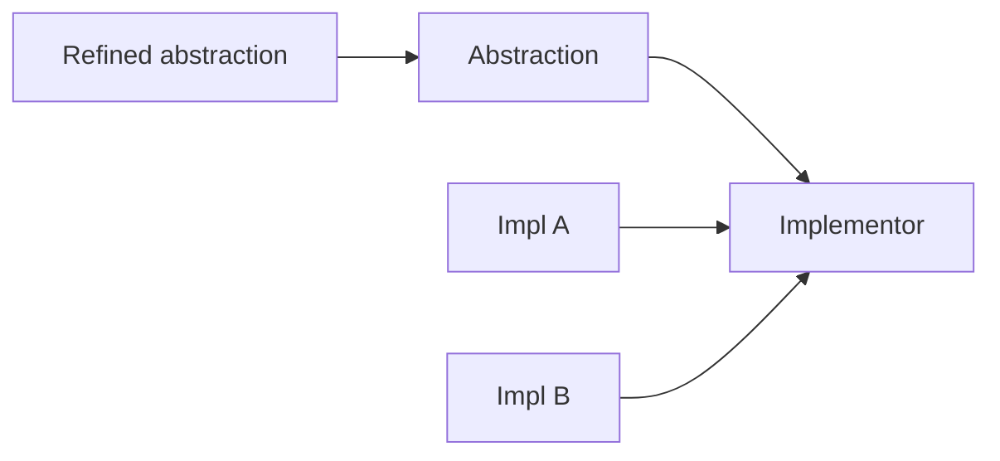

import { ConceptTemplate } from '@/features/kb/components/templates/ConceptTemplate'
import { Callout } from '@/features/kb/components/mdx/Callout'
import { ComparisonTable } from '@/features/kb/components/mdx/ComparisonTable'

export default function Layout({ children }) {
  return (
    <ConceptTemplate title="Bridge">
      {children}
    </ConceptTemplate>
  )
}

**Bridge** (GoF) decouples an abstraction (Shape, Remote) from its implementation (Renderer, Device) by composition. You avoid a cartesian explosion of subclasses (CircleOpenGL, CircleVulkan, SquareOpenGL, …).

## 1. Deep Dive and Mechanics

**Two hierarchies.** Abstraction holds a reference to Implementor and forwards primitive work. Refined abstractions (a refined Remote with extra buttons) add high-level operations. Concrete implementors do the platform work.

**Not Adapter.** Adapter makes an existing type fit after the fact. Bridge is planned up front so both sides can grow.

**Runtime swap.** You can hand a Circle a new Renderer without changing Circle’s type. That is the independence.

**GUI and drivers.** Window versus WindowImp was the textbook. Today: notification channels, storage drivers, and graphics backends.

<Callout icon="info" title="If you only have one implementor">
A bridge is speculative. YAGNI applies. Introduce the split when the second implementation is real.
</Callout>

## 2. Mathematical / Theoretical Foundation

**Cartesian product.** Let A be abstraction variants and I be implementations. Inheritance encoding needs about |A| × |I| classes. Bridge needs |A| + |I| plus one link. That is the complexity argument.

**Orthogonal axes.** The pattern works when the two reasons to change are actually independent. If they always move together, one hierarchy is simpler.

**Delegation.** Semantics live in the abstraction; primitives live in the implementor. Getting that split wrong just moves the explosion.

<ComparisonTable
  headers={['Pattern', 'When', 'Relation']}
  rows={[
    ['Bridge', 'Two axes of change, planned', 'Composition'],
    ['Adapter', 'Make an existing type fit', 'After the fact'],
    ['Strategy', 'Swap an algorithm', 'Same abstraction'],
    ['Subclass explosion', 'Forgot the split', 'A × I classes'],
  ]}
/>

## 3. Real-World Implementation

```python
class Renderer:
    def draw_circle(self, x, y, r):
        raise NotImplementedError

class Shape:
    def __init__(self, renderer):
        self.renderer = renderer

class Circle(Shape):
    def draw(self):
        self.renderer.draw_circle(self.x, self.y, self.r)
```

A `VulkanRenderer` and an `SvgRenderer` do not require new Circle subclasses.

## 4. Visualizations



## 5. Interview Prep

**Q: Bridge versus Strategy?**
**A:** Strategy swaps an algorithm behind one abstraction. Bridge splits two full hierarchies that both grow. The diagrams look similar; the intent differs.

**Q: Bridge versus Abstract Factory?**
**A:** A factory may create a matching implementor for an abstraction. They pair well; they are not the same pattern.

**Q: Give a production example.**
**A:** A `Document` abstraction that can persist via S3 or disk, while `PdfDocument` and `SheetDocument` stay independent of storage.

## 6. Production Use Cases

- **Graphics and game engines** (scene types × backends).
- **Device drivers** (high-level device × protocol).
- **Multi-cloud storage** behind one document model.

<Callout icon="tip" title="Name both sides">
If you cannot name the abstraction axis and the implementation axis in one sentence each, you may not need a Bridge.
</Callout>
