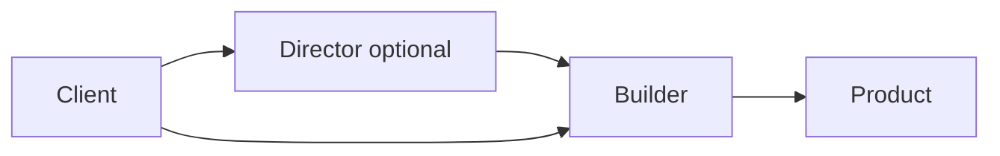

import { ConceptTemplate } from '@/features/kb/components/templates/ConceptTemplate'
import { Callout } from '@/features/kb/components/mdx/Callout'
import { ComparisonTable } from '@/features/kb/components/mdx/ComparisonTable'

export default function Layout({ children }) {
  return (
    <ConceptTemplate title="Builder">
      {children}
    </ConceptTemplate>
  )
}

**Builder** (GoF) moves construction out of the product. A Director (optional) calls builder steps (`setCrust`, `addTopping`). The Builder assembles and returns the Product. Telescoping constructors and boolean piles go away.

## 1. Deep Dive and Mechanics

**Fluent builders.** `new RequestBuilder().url(...).header(...).build()` is the Java/JS idiom. `build()` validates required fields and returns an immutable product.

**GoF builder.** An abstract builder plus concrete builders (HTML versus text documents) and a director that knows the recipe. Same pattern, more types.

**When.** Many optional parts, invariants that only hold at the end, or several representations of the same construction process.

**Not a factory.** Factories decide a type in one shot. Builders accumulate a recipe. You can combine them (a factory returns a builder).

<Callout icon="warning" title="Mutable product leaking from build">
If `build()` returns an object whose fields the builder still holds and mutates, callers get aliasing bugs. Copy or freeze on build.
</Callout>

## 2. Mathematical / Theoretical Foundation

**Partial objects.** Construction is a path through a space of incomplete states. The builder is a state machine; `build()` is defined only on accepting states (required fields present, invariants true).

**Telescoping constructors.** n optional parameters create 2^n constructor overloads if you try to be type-safe that way. A builder is linear in the number of steps.

**Immutability.** Prefer products that are immutable after `build()`. The builder absorbs mutation during assembly.

<ComparisonTable
  headers={['Approach', 'Readability', 'Invariant check']}
  rows={[
    ['Telescoping ctor', 'Poor', 'At each overload'],
    ['Builder', 'Good', 'At build'],
    ['Factory method', 'Good for few args', 'At create'],
    ['Optional bags / maps', 'Loose', 'Easy to miss keys'],
  ]}
/>

## 3. Real-World Implementation

```python
class PizzaBuilder:
    def __init__(self):
        self._toppings = []
        self._crust = None

    def crust(self, name):
        self._crust = name
        return self

    def topping(self, name):
        self._toppings.append(name)
        return self

    def build(self):
        if not self._crust:
            raise ValueError("crust required")
        return Pizza(self._crust, tuple(self._toppings))
```

## 4. Visualizations



## 5. Interview Prep

**Q: Builder versus Factory Method?**
**A:** Factory: one call, one product, little configuration. Builder: many steps, optional parts, or several representations.

**Q: Do you need a Director?**
**A:** Only when several clients share a construction recipe. Fluent builders often skip it.

**Q: How do you handle required fields in a type-safe way?**
**A:** Staged builders (each step returns a new type) or a final `build` that type-checkers cannot skip. Runtime checks are the common compromise.

## 6. Production Use Cases

- **HTTP clients and query builders.**
- **Test data** (object mothers / fluent fixtures).
- **Document or SQL generation** with multiple output formats.

<Callout icon="tip" title="Validate once at build">
Scattered setters that each try to keep the product legal will fight. Allow a messy builder; make a strict product.
</Callout>
