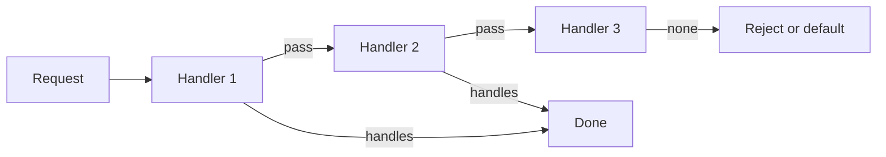

import { ConceptTemplate } from '@/features/kb/components/templates/ConceptTemplate'
import { Callout } from '@/features/kb/components/mdx/Callout'
import { ComparisonTable } from '@/features/kb/components/mdx/ComparisonTable'

export default function Layout({ children }) {
  return (
    <ConceptTemplate title="Chain of Responsibility">
      {children}
    </ConceptTemplate>
  )
}

**Chain of Responsibility** (GoF) decouples a sender from receivers by lining up handlers. Each handler either processes the request or forwards it. Helpful for middleware, logging filters, GUI event bubbling, and support-tier routing.

## 1. Deep Dive and Mechanics

**Handler API.** `handle(request)` plus a `next` link (or a list the dispatcher walks). Order is part of the meaning: auth before business, cheap rejects before expensive ones.

**Stop versus continue.** Classic CoR stops at the first success. Middleware often always calls `next` unless it short-circuits (HTTP pipelines). Say which rule you use.

**Default handler.** A terminal node that rejects or logs “unhandled” beats a silent drop.

**Dynamic chains.** You can rebuild the chain per request (feature flags). Keep it acyclic.

<Callout icon="warning" title="Lost requests">
If nobody handles and nobody errors, you have a production mystery. The tail of the chain must be explicit.
</Callout>

## 2. Mathematical / Theoretical Foundation

**Linear search.** Expected cost is the sum of handler costs until a hit. Put high-probability, cheap handlers first when the first-match rule applies.

**Partial functions.** Each handler is a partial function on the request space. The chain is their override (first defined wins) or their composition (middleware).

**Cycles.** A next pointer cycle is non-termination. Graph of handlers must be a path or a DAG.

<ComparisonTable
  headers={['Style', 'Who runs', 'Example']}
  rows={[
    ['First match', 'One handler', 'Support tiers'],
    ['Middleware', 'All until short-circuit', 'HTTP stacks'],
    ['Event bubble', 'Until consumed', 'UI events'],
    ['God switch', 'One function', 'What you replace'],
  ]}
/>

## 3. Real-World Implementation

```python
class Handler:
    def __init__(self, nxt=None):
        self.nxt = nxt

    def handle(self, req):
        if self.nxt:
            return self.nxt.handle(req)
        raise ValueError("unhandled")

class Auth(Handler):
    def handle(self, req):
        if not req.user:
            raise PermissionError("auth")
        return super().handle(req)
```

Wire `Auth(Business(None))`.

## 4. Visualizations



## 5. Interview Prep

**Q: CoR versus Switch or if-else?**
**A:** The chain is open to new handlers without editing a central statement. You pay indirection and ordering bugs.

**Q: How is this different from Decorator?**
**A:** Decorators wrap to add behaviour and usually call through. CoR is about who is responsible; many handlers never see the request.

**Q: Where do you see it daily?**
**A:** Servlet filters, Express middleware, exception handler pipelines, and logging appenders.

## 6. Production Use Cases

- **HTTP auth, tenancy, and rate-limit** stages.
- **Approval workflows** (manager, finance, compliance).
- **Parsers** that try encodings or formats in order.

<Callout icon="tip" title="Log the handler that won">
When the chain is long, observability is the difference between a pattern and a maze. Record which node handled the request.
</Callout>
