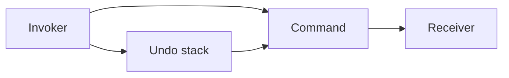

import { ConceptTemplate } from '@/features/kb/components/templates/ConceptTemplate'
import { Callout } from '@/features/kb/components/mdx/Callout'
import { ComparisonTable } from '@/features/kb/components/mdx/ComparisonTable'

export default function Layout({ children }) {
  return (
    <ConceptTemplate title="Command">
      {children}
    </ConceptTemplate>
  )
}

**Command** (GoF) encapsulates a method call as an object: receiver, action, and arguments. Menus, buttons, job queues, and undo stacks invoke commands without knowing how the work is done.

## 1. Deep Dive and Mechanics

**Pieces.** Command (`execute`, sometimes `undo`), Receiver (the real worker), Invoker (button, queue worker), Client (wires them).

**Undo.** Store enough state in the command (or a memento) to reverse `execute`. Macro commands compose a list and undo in reverse.

**Async and queues.** A message on a bus is a serialized command. Idempotency keys belong on the object. That is the same pattern at distributed scale.

**Not CQRS.** CQRS reuses the word “command” for a write intent. The GoF command is the object-with-execute trick. They can meet (a CQRS handler runs a GoF-like command), but do not conflate them in an interview.

<Callout icon="info" title="Lambdas are tiny commands">
A function object is a command without the ceremony. Add a type when you need undo, metadata, or a queue schema.
</Callout>

## 2. Mathematical / Theoretical Foundation

**Reification.** You promote an operation to a first-class value. Then you can store, compose, and replay it. That is the same move as turning statements into an AST.

**History as a list.** An editor’s undo stack is a sequence of inverse commands. Branching (redo after a new edit) drops the redo tail — a stack discipline.

**Idempotence.** Distributed commands need `execute` ∘ `execute` = `execute` for the same id, or you get double charges.

<ComparisonTable
  headers={['Use', 'Command buys you', 'Without it']}
  rows={[
    ['GUI actions', 'Decouple widgets', 'Click handlers everywhere'],
    ['Undo', 'A reverse operation', 'Ad hoc snapshots'],
    ['Job queue', 'A serializable intent', 'Hidden side effects'],
    ['Macro', 'Composite of commands', 'Recorded keystrokes only'],
  ]}
/>

## 3. Real-World Implementation

```python
class Command:
    def execute(self):
        raise NotImplementedError
    def undo(self):
        raise NotImplementedError

class InsertText(Command):
    def __init__(self, doc, pos, text):
        self.doc, self.pos, self.text = doc, pos, text

    def execute(self):
        self.doc.insert(self.pos, self.text)

    def undo(self):
        self.doc.delete(self.pos, len(self.text))
```

The editor invoker pushes `InsertText` onto an undo stack after `execute`.

## 4. Visualizations



## 5. Interview Prep

**Q: Command versus Strategy?**
**A:** Strategy is “how to do a step, swappable.” Command is “a thing to do later, with undo and history.” Strategies usually have no undo stack.

**Q: How do you serialize a command?**
**A:** A type name plus args (JSON). Version the schema. Never serialize a live receiver pointer and hope.

**Q: Where does validation live?**
**A:** Prefer a `canExecute` or a validator before queueing. A poison command that always fails should dead-letter, not crash the worker in a loop.

## 6. Production Use Cases

- **Editors and IDEs** with undo/redo.
- **Background job systems** (the message is the command).
- **Transactional outbox** payloads that name an intent.

<Callout icon="tip" title="Keep commands boring">
No hidden I/O in constructors. `execute` should be the only moment side effects happen, so retries and undo stay understandable.
</Callout>
