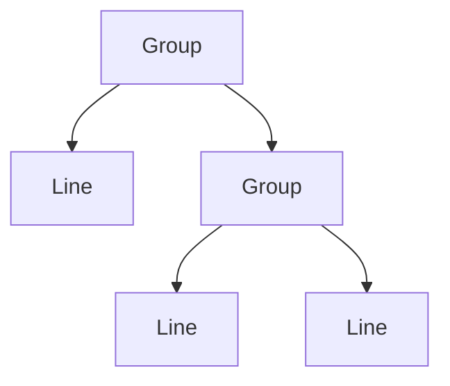

import { ConceptTemplate } from '@/features/kb/components/templates/ConceptTemplate'
import { Callout } from '@/features/kb/components/mdx/Callout'
import { ComparisonTable } from '@/features/kb/components/mdx/ComparisonTable'

export default function Layout({ children }) {
  return (
    <ConceptTemplate title="Composite">
      {children}
    </ConceptTemplate>
  )
}

**Composite** (GoF) models part-whole hierarchies. A `Graphic` can be a `Line` or a `Group` of graphics. Clients call `draw()` without asking which. File systems, UI view trees, and org charts are composites.

## 1. Deep Dive and Mechanics

**Component.** Common operations (`draw`, `area`, `price`). Leaves implement them. Composites implement them by iterating children, then maybe adding their own work.

**Child management.** `add` / `remove` can live on the Component (transparent, leaves throw) or only on Composite (safe, clients must cast or know). Pick one and document it.

**Cycles.** A tree, not a graph. Adding a node as its own descendant is a stack overflow waiting to happen.

**Uniformity cost.** Operations that only make sense on leaves (open a file) get awkward on folders. Visitor sometimes helps.

<Callout icon="warning" title="The god component interface">
If every possible operation is on the base type, leaves fill with empty methods. Split interfaces or use Visitor when the operation set grows.
</Callout>

## 2. Mathematical / Theoretical Foundation

**Tree fold.** `price(node)` is a fold: leaf value, or sum (or another monoid) of children. The pattern is recursive data plus a uniform algebra.

**Transparency versus safety.** Transparent Composite violates Interface Segregation for leaves (they cannot add children). Safe Composite breaks uniformity (clients branch). There is no free lunch — only a choice.

**Complexity.** A walk is O(n) in nodes. Deep trees risk stack overflow; prefer an explicit stack for huge FS walks.

<ComparisonTable
  headers={['Design', 'Client code', 'Leaf safety']}
  rows={[
    ['Transparent Composite', 'Always the same', 'add on a leaf fails'],
    ['Safe Composite', 'Must know the type', 'Leaves stay clean'],
    ['Flat list', 'No recursion', 'No hierarchy'],
    ['Visitor on a tree', 'New ops without fat base', 'More types'],
  ]}
/>

## 3. Real-World Implementation

```python
class Graphic:
    def draw(self):
        raise NotImplementedError

class Line(Graphic):
    def draw(self):
        stroke_line(self.a, self.b)

class Group(Graphic):
    def __init__(self):
        self.children = []

    def draw(self):
        for g in self.children:
            g.draw()
```

`scene.draw()` does not care whether `scene` is a line or a group.

## 4. Visualizations



## 5. Interview Prep

**Q: Composite versus Decorator?**
**A:** Decorator is a chain (usually one child) that adds behaviour. Composite is a tree that aggregates. A UI widget tree is composite; a scrolling wrapper is a decorator.

**Q: How do you prevent cycles?**
**A:** On add, walk parents or keep a parent pointer and reject if the new parent is already a descendant.

**Q: Is a React element tree a Composite?**
**A:** Philosophically yes: components nest and `render` is the uniform operation. The library owns the walk.

## 6. Production Use Cases

- **Scene graphs and document object models.**
- **Pricing** (bundle of bundles).
- **Menu and permission trees.**

<Callout icon="tip" title="Keep the walk iterative for huge trees">
Recursion is clear; production file walkers hit pathologically deep directories. Know when to switch.
</Callout>
