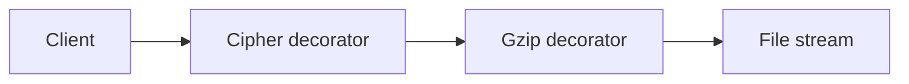

import { ConceptTemplate } from '@/features/kb/components/templates/ConceptTemplate'
import { Callout } from '@/features/kb/components/mdx/Callout'
import { ComparisonTable } from '@/features/kb/components/mdx/ComparisonTable'

export default function Layout({ children }) {
  return (
    <ConceptTemplate title="Decorator">
      {children}
    </ConceptTemplate>
  )
}

**Decorator** (GoF) attaches additional responsibilities to an object dynamically. A `Stream` can be wrapped by `Buffered`, then `Gzip`, then `Cipher`, each implementing the same `Stream` interface and delegating to the inner one.

## 1. Deep Dive and Mechanics

**Same interface.** The wrapper is substitutable for the wrappee. Clients hold the outer reference and never know how many layers exist.

**Stacking.** Order matters (compress then encrypt is not encrypt then compress). Construction is usually at the composition root.

**Versus inheritance.** `BufferedEncryptedFileStream` as a subclass explosion dies the moment you need another combination. Decorators compose linearly.

**Language sugar.** Python decorators and JS HOFs are related: they wrap callables. The GoF object decorator wraps instances with a shared interface.

<Callout icon="warning" title="Identity and equality">
Wrapping breaks object identity. If something must be `==` to the core instance, a decorator will surprise you. Prefer wrapping at the port, not around entities with identity.
</Callout>

## 2. Mathematical / Theoretical Foundation

**Function composition.** Each decorator is a function f: T → T on the behaviour of the interface. Stacking is f ∘ g ∘ h. Associative, not commutative.

**Open-closed.** You add behaviour by new wrappers, not by editing the core class. The core stays closed.

**Overhead.** Each layer is a virtual call. Deep stacks (twenty AOP wrappers) cost and confuse traces. Keep the stack intentional.

<ComparisonTable
  headers={['Pattern', 'Structure', 'Intent']}
  rows={[
    ['Decorator', 'Chain of same type', 'Add behaviour'],
    ['Adapter', 'New type', 'Change interface'],
    ['Proxy', 'Same type', 'Control access'],
    ['Composite', 'Tree', 'Part-whole'],
  ]}
/>

## 3. Real-World Implementation

```python
class Stream:
    def write(self, data):
        raise NotImplementedError

class GzipStream(Stream):
    def __init__(self, inner):
        self.inner = inner

    def write(self, data):
        self.inner.write(gzip_bytes(data))
```

`CipherStream(GzipStream(FileStream(path)))` is a stack, not a new subclass.

## 4. Visualizations



## 5. Interview Prep

**Q: Decorator versus Proxy?**
**A:** Both wrap and implement the same interface. Proxy controls access (lazy load, remote, auth). Decorator adds features the client wants. A caching proxy sits on the line.

**Q: Decorator versus subclassing?**
**A:** Subclassing is compile-time and single-axis. Decorators are runtime and combinable. Use subclassing for true is-a variation, not for optional features.

**Q: Where do you see it in Java I/O?**
**A:** `InputStream` wrappers (`BufferedInputStream`, `GZIPInputStream`) are the textbook library.

## 6. Production Use Cases

- **I/O and middleware** (metrics, retries, auth around a port).
- **UI** (scroll, border, theme around a widget).
- **Feature flags** that wrap an implementation with a no-op or a canary.

<Callout icon="tip" title="Decorate interfaces, not concrete bags">
If the type has fifty methods, a honest decorator is a lot of forwarding. Keep the interface small or generate the forwarder.
</Callout>
