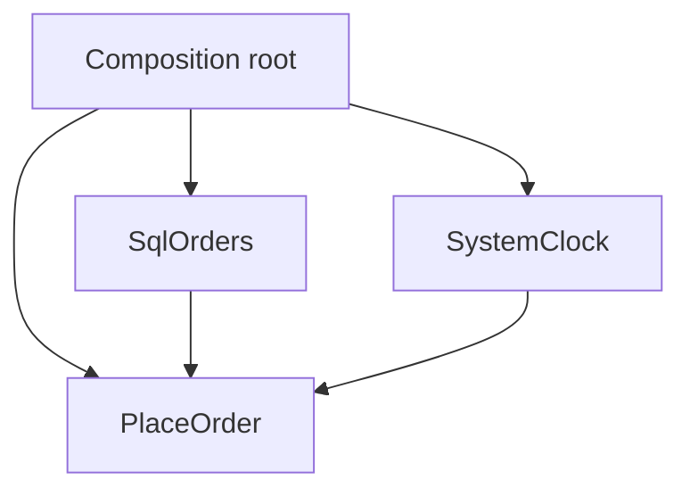

import { ConceptTemplate } from '@/features/kb/components/templates/ConceptTemplate'
import { Callout } from '@/features/kb/components/mdx/Callout'
import { ComparisonTable } from '@/features/kb/components/mdx/ComparisonTable'

export default function Layout({ children }) {
  return (
    <ConceptTemplate title="Dependency Injection">
      {children}
    </ConceptTemplate>
  )
}

**Dependency Injection (DI)** is how you apply the Dependency Inversion Principle in code. A class does not `new` its database or SMTP client. It receives them (constructor, setter, or method argument). Tests pass fakes. Production passes real adapters. A container is optional.

## 1. Deep Dive and Mechanics

**Constructor injection.** Preferred: the object is never half-wired. Required collaborators are obvious. This is the default in well-factored services.

**Setter / property injection.** Optional collaborators or frameworks that need a no-arg constructor. Easy to forget a set and NPE in production.

**Composition root.** The process entry point (or a small DI module) builds the graph. Domain classes do not call the container (service location). That call hides dependencies again.

**Lifetimes.** Singleton, scoped (per request), transient. Capturing a scoped object in a singleton is a leak and a data cross-talk bug.

<Callout icon="warning" title="Service locator">
`container.resolve(X)` inside business code is not DI. It is a hidden global. You cannot see X in the constructor, so you cannot see what to fake.
</Callout>

## 2. Mathematical / Theoretical Foundation

**DIP.** High-level modules depend on abstractions. DI is the wiring that makes that compile: the abstraction is a constructor argument, the concrete type is bound at the root.

**Graph.** The object graph should be a DAG of lifetimes that nest (request scope inside the process). Cycles need lazy or event-based breaks.

**Substitutability.** Tests rely on Liskov: the fake must honour the port. A fake that cannot fail is a dishonest test.

<ComparisonTable
  headers={['Style', 'Visibility', 'Risk']}
  rows={[
    ['Constructor injection', 'Highest', 'Fat constructors (split the class)'],
    ['Setter injection', 'Medium', 'Unset deps'],
    ['Service locator', 'Low', 'Hidden graph'],
    ['Hard-coded new', 'None', 'Untestable I/O'],
  ]}
/>

## 3. Real-World Implementation

```typescript
class PlaceOrder {
  constructor(private readonly orders: OrderPort, private readonly clock: Clock) {}

  run(cmd: PlaceOrderCmd) {
    return this.orders.save(Order.create(cmd, this.clock.now()))
  }
}

// composition root
const app = new PlaceOrder(new SqlOrders(db), new SystemClock())
```

The test constructs `PlaceOrder` with an in-memory `OrderPort` and a frozen clock.

## 4. Visualizations



## 5. Interview Prep

**Q: DI versus a container?**
**A:** DI is the design. A container (Spring, Guice, tsyringe) automates wiring. You can inject by hand in a small app and still be doing DI.

**Q: How many constructor args is too many?**
**A:** A smell, not a law. Many args often mean the class has several reasons to change. Split before you invent a parameter object that is just a bag of the same deps.

**Q: Is `new` always wrong?**
**A:** No. `new` value objects and small helpers is fine. Inject the things that reach I/O, time, randomness, or other modules you will swap.

## 6. Production Use Cases

- **Every testable service** with I/O at the edge.
- **Framework apps** (Spring, ASP.NET, Nest) where the container is the root.
- **Functions** that still inject ports into a core module, even under Lambda.

<Callout icon="tip" title="Inject clocks and ids">
Time and uuid generation are dependencies. Freezing them is how you get deterministic tests without a sermon about purity.
</Callout>
