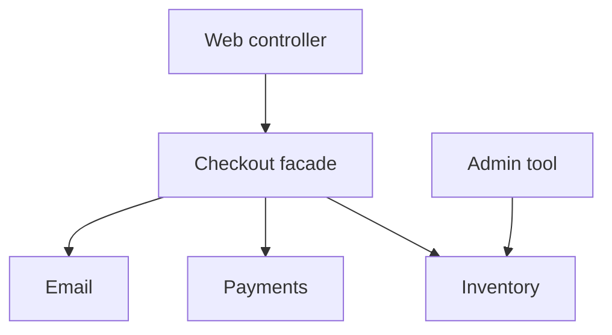

import { ConceptTemplate } from '@/features/kb/components/templates/ConceptTemplate'
import { Callout } from '@/features/kb/components/mdx/Callout'
import { ComparisonTable } from '@/features/kb/components/mdx/ComparisonTable'

export default function Layout({ children }) {
  return (
    <ConceptTemplate title="Facade">
      {children}
    </ConceptTemplate>
  )
}

**Facade** (GoF) is a coarse API in front of a cluster of classes. `checkout()` talks to inventory, payments, and email so the web controller does not. The subsystem remains available for the rare client that needs the knobs.

## 1. Deep Dive and Mechanics

**Simplify.** The facade chooses defaults, orders calls, and translates errors. It does not have to hide every class — it hides the typical conversation.

**Layering.** A package-level facade is the public API of a module in a modular monolith. Other modules import the facade, not internals.

**Not a god object.** If the facade grows every feature in the company, you have a new monolith front door. Split facades per use case or per subsystem.

**Versus Adapter.** Adapter changes an interface to another interface. Facade invents a simpler interface for many objects that already work together.

<Callout icon="info" title="Facades leak under pressure">
Power users will demand an escape hatch. Provide one deliberately (advanced API) rather than letting them import internals.
</Callout>

## 2. Mathematical / Theoretical Foundation

**Information hiding.** The facade is the set of assumptions outsiders may make (Parnas). Internals can be rewritten if the facade holds.

**Surface area.** Coupling is roughly proportional to the number of names a client imports. A facade reduces that count from dozens to a handful.

**Orchestration.** The facade is a small process manager. Keep transactions and failure policy explicit so it does not become an untestable script.

<ComparisonTable
  headers={['Pattern', 'Wraps', 'Goal']}
  rows={[
    ['Facade', 'A subsystem', 'Simpler typical API'],
    ['Adapter', 'One foreign type', 'Fit a target interface'],
    ['Mediator', 'Peer objects', 'Centralise interaction'],
    ['Gateway', 'An external system', 'Ports and test seams'],
  ]}
/>

## 3. Real-World Implementation

```python
class CheckoutFacade:
    def __init__(self, stock, payments, mail):
        self.stock, self.payments, self.mail = stock, payments, mail

    def checkout(self, cart, card):
        self.stock.reserve(cart)
        charge_id = self.payments.charge(cart.total(), card)
        self.mail.receipt(cart, charge_id)
        return charge_id
```

Controllers call `checkout`. Inventory tools still call `stock` directly.

## 4. Visualizations



## 5. Interview Prep

**Q: Facade versus Mediator?**
**A:** Facade is a one-way simplification for clients outside the subsystem. Mediator sits in the middle of peers so they do not point at each other.

**Q: Is an API gateway a facade?**
**A:** At system scale, yes-ish: one edge in front of many services. It should stay a dumb edge. A “facade service” that owns business orchestration is a BFF or process manager — name it honestly.

**Q: How do you test a facade?**
**A:** Treat collaborators as ports. The facade tests are about order, errors, and what gets called — not about SQL.

## 6. Production Use Cases

- **Module public APIs** in a modular monolith.
- **SDK umbrellas** (`aws.s3` hiding many low-level calls).
- **Legacy** wraps so new code does not learn the old ritual.

<Callout icon="tip" title="Keep the facade boring">
Happy-path orchestration plus error translation. New domain rules belong in the domain, or the facade becomes the application.
</Callout>
