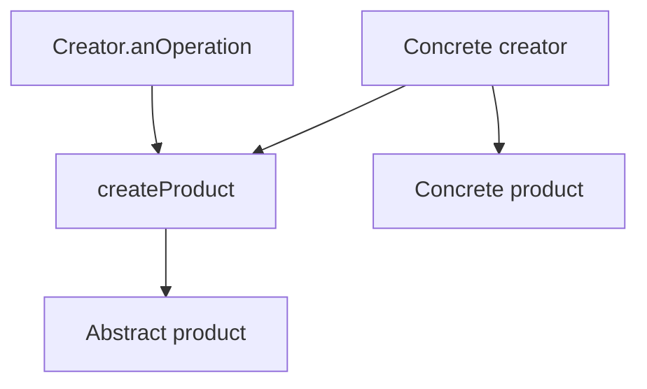

import { ConceptTemplate } from '@/features/kb/components/templates/ConceptTemplate'
import { Callout } from '@/features/kb/components/mdx/Callout'
import { ComparisonTable } from '@/features/kb/components/mdx/ComparisonTable'

export default function Layout({ children }) {
  return (
    <ConceptTemplate title="Factory Method">
      {children}
    </ConceptTemplate>
  )
}

**Factory Method** (GoF) replaces `new Concrete()` inside a reusable algorithm with a call to an overridable `createProduct()`. The parent class owns the workflow. Subclasses own the product type. Also called a virtual constructor.

## 1. Deep Dive and Mechanics

**Creator.** Abstract or concrete class with `createProduct` plus methods that use the product (`anOperation`). Those methods must not name the concrete product.

**Concrete creators.** `RoadLogistics.createTransport` returns a `Truck`. `SeaLogistics` returns a `Ship`. The delivery loop is written once.

**Parameterized factory.** A single method with a type key is a common variant. It can rot into a switch. Prefer new creators or a registry when the set grows.

**Versus Abstract Factory.** Factory Method: one product, inheritance. Abstract Factory: a family, usually a separate factory object. Versus a simple `static create`: no subclass hook, just a named constructor.

<Callout icon="info" title="new is not a smell by itself">
Use Factory Method when the algorithm is stable and the product type varies. A single `new` in a composition root is fine.
</Callout>

## 2. Mathematical / Theoretical Foundation

**Open-closed.** You add a product by adding a creator subclass, without editing the parent algorithm. That is the intended axis. If you must edit a giant switch, you chose the parameterized variant and outgrew it.

**Template Method pairing.** The parent’s `anOperation` is often a Template Method that calls the factory method as one step. The two patterns stack.

**Types.** The return type is the abstract product. Clients program to that type (Liskov).

<ComparisonTable
  headers={['Pattern', 'Who decides the class', 'Typical form']}
  rows={[
    ['Factory Method', 'A subclass', 'Overridable createX'],
    ['Abstract Factory', 'A factory object', 'Family of createX'],
    ['Simple factory', 'A function or switch', 'No inheritance'],
    ['DI binding', 'The composition root', 'Constructor inject'],
  ]}
/>

## 3. Real-World Implementation

```python
class Logistics:
    def create_transport(self):
        raise NotImplementedError

    def plan_delivery(self, dest):
        t = self.create_transport()
        return t.deliver(dest)

class RoadLogistics(Logistics):
    def create_transport(self):
        return Truck()
```

`plan_delivery` never mentions `Truck`.

## 4. Visualizations



## 5. Interview Prep

**Q: Factory Method versus Abstract Factory?**
**A:** One product via inheritance versus a family via a factory object. If you need matching button plus menu, you want Abstract Factory.

**Q: Is a static `User.create` a Factory Method?**
**A:** It is a named constructor / simple factory. GoF Factory Method implies a polymorphic creator. Interviews often accept the loose usage — draw the distinction.

**Q: How does this appear in frameworks?**
**A:** `Application.createWindow` in UI kits, `Parser.createDocument` in XML stacks, and test fixtures that let a subclass supply a fake.

## 6. Production Use Cases

- **Frameworks** that let apps plug in a product without rewriting the flow.
- **Multi-channel delivery** (road, sea, air) sharing one planner.
- **Tests** that subclass a creator to inject a fake product.

<Callout icon="tip" title="Return the abstraction">
If `create_transport` is annotated to return `Truck`, you lost. The whole point is the parent compiling against `Transport`.
</Callout>
