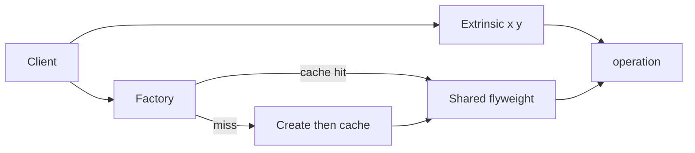

import { ConceptTemplate } from '@/features/kb/components/templates/ConceptTemplate'
import { Callout } from '@/features/kb/components/mdx/Callout'
import { ComparisonTable } from '@/features/kb/components/mdx/ComparisonTable'

export default function Layout({ children }) {
  return (
    <ConceptTemplate title="Flyweight">
      {children}
    </ConceptTemplate>
  )
}

**Flyweight** (GoF) splits object state into **intrinsic** (shared, immutable) and **extrinsic** (per-instance). A factory hands out one shared flyweight per intrinsic key. A million trees share one mesh; each tree keeps only position and health.

## 1. Deep Dive and Mechanics

**Intrinsic state.** Constant across instances of the same kind: glyph metrics, a 3D mesh, a tile bitmap. Stored once inside the flyweight.

**Extrinsic state.** Passed in at use time: canvas coordinates, current color override, remaining hit points. Must not live on the shared object or every client mutates everyone else.

**Factory.** `FlyweightFactory.get(key)` returns the cached instance or creates it. Clients never `new` the heavy object.

**Identity.** Flyweights are value-like. Equality is by key, not pointer. Mutation of intrinsic data is a bug.

<Callout icon="warning" title="Sharing implies immutability">
If two clients write the shared mesh, you have a data race, not a memory win. Extrinsic state stays outside.
</Callout>

## 2. Mathematical / Theoretical Foundation

**Space.** Without sharing: n copies of payload P plus per-object header. With sharing: unique keys u times P, plus n times the thin extrinsic record. Win when u is much smaller than n and P is large.

**Cache key.** The factory is a map from intrinsic tuple to instance. Collisions must be exact: two fonts that differ by one hint flag are different flyweights.

<ComparisonTable
  headers={['Pattern', 'What is shared', 'Risk']}
  rows={[
    ['Flyweight', 'Intrinsic immutable state', 'Accidental mutation'],
    ['Singleton', 'One instance of a type', 'Hidden global'],
    ['Object pool', 'Reusable mutable instances', 'Dirty reuse'],
    ['Interning', 'Equal values collapse', 'Lifetime of the pool'],
  ]}
/>

## 3. Real-World Implementation

```python
class TreeModel:
    def __init__(self, mesh, texture):
        self.mesh, self.texture = mesh, texture

class TreeFactory:
    def __init__(self):
        self._models = {}

    def model(self, kind):
        if kind not in self._models:
            self._models[kind] = TreeModel(load_mesh(kind), load_tex(kind))
        return self._models[kind]

class Tree:
    def __init__(self, x, y, kind, factory):
        self.x, self.y = x, y
        self.model = factory.model(kind)
```

`Tree` stores coordinates. The mesh lives once per `kind`.

## 4. Visualizations



## 5. Interview Prep

**Q: Flyweight versus Singleton?**
**A:** Singleton is one instance of a class. Flyweight is many logical objects sharing a small set of intrinsic instances. You can have dozens of flyweights.

**Q: Where does this show up in the JDK or browsers?**
**A:** Character/glyph caches in text layout, `Integer` interned values in a range, string intern tables, and GPU instancing of the same mesh.

**Q: When is Flyweight the wrong tool?**
**A:** When instances are few, when state is mostly unique, or when the factory’s map costs more than the payload you hoped to share.

## 6. Production Use Cases

- **Game worlds** with huge counts of repeated props (trees, bullets, tiles).
- **Text editors** sharing glyph metrics across millions of characters.
- **Maps and GIS** sharing style objects across features.

<Callout icon="tip" title="Measure the unique-key cardinality">
If every tree is a unique mesh, Flyweight buys nothing. Profile u versus n before you split state.
</Callout>
