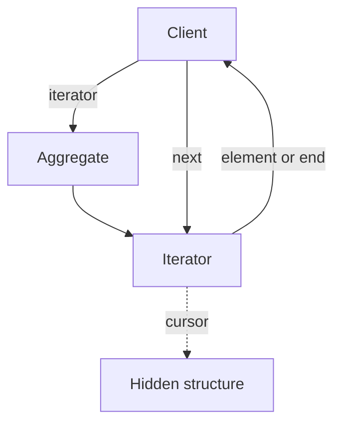

import { ConceptTemplate } from '@/features/kb/components/templates/ConceptTemplate'
import { Callout } from '@/features/kb/components/mdx/Callout'
import { ComparisonTable } from '@/features/kb/components/mdx/ComparisonTable'

export default function Layout({ children }) {
  return (
    <ConceptTemplate title="Iterator">
      {children}
    </ConceptTemplate>
  )
}

**Iterator** (GoF) gives a uniform way to traverse an aggregate. The client asks for `next` and `done`. It never sees the array, tree, or hash buckets underneath. Also the reason `for item in collection` works.

## 1. Deep Dive and Mechanics

**Aggregate.** The collection (`List`, `Tree`, graph). It exposes `iterator()` (or `__iter__`) rather than its guts.

**Iterator object.** Holds cursor state: current node, stack for DFS, index. Multiple iterators on one collection are independent.

**Internal versus external.** External: the client drives `next`. Internal: the collection calls a visitor/callback for each element (forEach). External composes better (zip, take, filter).

**Fail-fast.** Many libraries snapshot a version number. Mutation during iteration throws rather than yielding a half-updated view.

<Callout icon="info" title="Iterators are cursors, not copies">
A typical iterator does not clone the collection. It holds a position. That is why concurrent mutation is dangerous.
</Callout>

## 2. Mathematical / Theoretical Foundation

**Sequence abstraction.** An iterator is a delayed stream: a state machine with `next: State -> (Element, State) | End`. Lazy pipelines (map/filter) are function composition over that machine.

**Complexity.** Traversal cost is the cost of walking the structure: O of n for a list, O of n for a tree in-order if you pay stack, plus per-`next` work.

**External uniqueness.** Two iterators should not share mutable cursor state. That is why Python’s iterator is single-pass and exhausted.

<ComparisonTable
  headers={['Style', 'Who drives', 'Composes']}
  rows={[
    ['External iterator', 'Client', 'Yes — zip, take'],
    ['Internal iterator', 'Collection', 'Callbacks only'],
    ['Index loop', 'Client on array', 'Leaks representation'],
    ['Cursor API', 'Client on DB', 'Same idea, I/O'],
  ]}
/>

## 3. Real-World Implementation

```python
class Node:
    def __init__(self, value, left=None, right=None):
        self.value, self.left, self.right = value, left, right

    def __iter__(self):
        if self.left:
            yield from self.left
        yield self.value
        if self.right:
            yield from self.right
```

Clients write `for v in root` and never mention left or right.

## 4. Visualizations



## 5. Interview Prep

**Q: Why not just use indexes?**
**A:** Linked lists, trees, and streams have no cheap random access. Iterator is the common protocol. Even arrays benefit when you later swap the store.

**Q: What is the difference from a generator?**
**A:** A generator is a language feature that *implements* the iterator protocol with suspended stack frames. The pattern is older than `yield`.

**Q: How do you iterate a graph without blowing the stack?**
**A:** External iterator with an explicit stack or queue. Keep visited-set state on the iterator, not on the nodes, if nodes are shared.

## 6. Production Use Cases

- **Language for-each** loops and collection APIs.
- **Database cursors** and paginated result streams.
- **File and network readers** that yield records without loading the file.

<Callout icon="tip" title="Do not mutate while iterating">
If you must filter in place, iterate a snapshot or collect deletes, then apply. Fail-fast exists because the other path is silent corruption.
</Callout>
