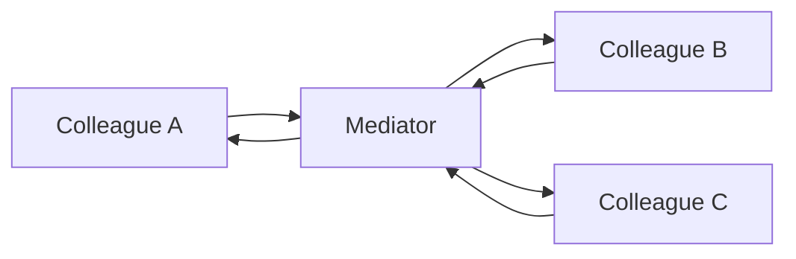

import { ConceptTemplate } from '@/features/kb/components/templates/ConceptTemplate'
import { Callout } from '@/features/kb/components/mdx/Callout'
import { ComparisonTable } from '@/features/kb/components/mdx/ComparisonTable'

export default function Layout({ children }) {
  return (
    <ConceptTemplate title="Mediator">
      {children}
    </ConceptTemplate>
  )
}

**Mediator** (GoF) replaces a mesh of colleague references with a hub. Buttons, lists, and dialogs talk to the dialog object, not to each other. Adding a widget means editing the mediator, not every peer.

## 1. Deep Dive and Mechanics

**Colleagues.** Components that used to call each other. After the refactor they only know the mediator (or a narrow port).

**Mediator.** Encodes “when A happens, update B and C.” It holds the workflow that used to be scattered.

**Smart versus dumb.** A fat mediator that knows every screen is a god object. Split by use case (checkout mediator, search mediator) when it grows.

**Versus Observer.** Observer is a one-to-many event bus: publishers do not name subscribers. Mediator names the choreography. Many UIs use both: events in, mediator decides who to poke.

<Callout icon="warning" title="Mediators rot into god objects">
If every new feature is another branch inside one class, you moved the spaghetti, you did not delete it. Split by bounded interaction.
</Callout>

## 2. Mathematical / Theoretical Foundation

**Graph degree.** Direct coupling is a complete graph: edges grow as n times n-minus-1. A mediator is a star: n edges. That is the complexity argument.

**Control locality.** The interaction protocol becomes one module, which is easier to test as a state machine: input event plus colleague states to outgoing commands.

<ComparisonTable
  headers={['Pattern', 'Who knows whom', 'Best for']}
  rows={[
    ['Mediator', 'Hub knows colleagues', 'Closed choreography'],
    ['Observer', 'Nobody names listeners', 'Open event fan-out'],
    ['Facade', 'Client knows one face', 'Simplify a subsystem'],
    ['Event bus', 'Topics, not types', 'Cross-bounded-context'],
  ]}
/>

## 3. Real-World Implementation

```python
class Dialog:
    def __init__(self, search, results, preview):
        self.search, self.results, self.preview = search, results, preview
        search.on_change = self._on_query

    def _on_query(self, text):
        rows = self.results.query(text)
        self.results.render(rows)
        self.preview.clear()
```

`search` never imports `preview`. The dialog owns the dance.

## 4. Visualizations



## 5. Interview Prep

**Q: Mediator versus Observer?**
**A:** Mediator encodes a specific conversation. Observer broadcasts “this happened” to unknown listeners. Use Observer when the set of reactions is open; Mediator when it is a closed script.

**Q: Is an air-traffic control tower a mediator?**
**A:** Yes — the textbook analogy. Planes do not negotiate pairwise headings.

**Q: How do you keep the mediator testable?**
**A:** Inject colleagues as ports. Drive it with fake widgets. Assert the sequence of calls after one user event.

## 6. Production Use Cases

- **Dialog and form coordinators** in desktop and mobile UI.
- **Chat-room or game-room servers** that relay player actions.
- **Workflow engines** that step services through a saga without a full mesh of HTTP clients.

<Callout icon="tip" title="Name the conversation">
`CheckoutMediator` is a design. `AppMediator` is a junk drawer. Split when two features do not share events.
</Callout>
