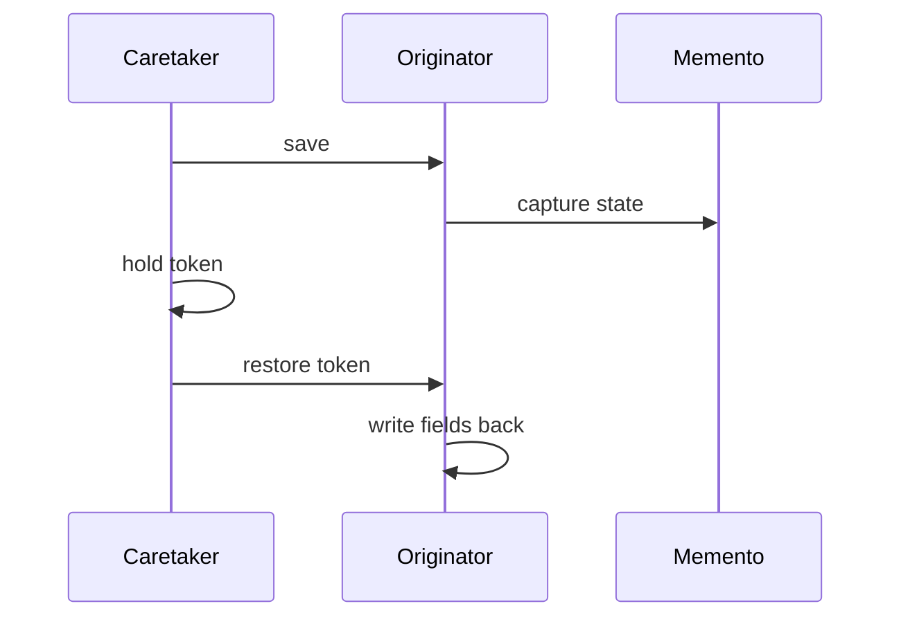

import { ConceptTemplate } from '@/features/kb/components/templates/ConceptTemplate'
import { Callout } from '@/features/kb/components/mdx/Callout'
import { ComparisonTable } from '@/features/kb/components/mdx/ComparisonTable'

export default function Layout({ children }) {
  return (
    <ConceptTemplate title="Memento">
      {children}
    </ConceptTemplate>
  )
}

**Memento** (GoF) lets an originator export a snapshot and later restore it. The caretaker stores snapshots but cannot read the fields. Undo, rollback, and “draft vs published” rest on this split.

## 1. Deep Dive and Mechanics

**Originator.** The object with private state (`Editor`). It implements `save()` -> memento and `restore(memento)`.

**Memento.** An opaque token. In languages with nested types, only the originator can read it. In Python/JS you fake opacity with a convention or a sealed class.

**Caretaker.** History stack, command log, or session store. It must not peek. If it peeks, you leaked encapsulation and the snapshot format becomes a public API.

**Incremental snapshots.** Full copies are simple and expensive. Production editors store diffs, command logs, or structural sharing (immutable trees) and *present* them as mementos.

<Callout icon="warning" title="A dict is not a memento if everyone reads it">
If the caretaker does `snap['cursor'] = 0` you have a public struct, not a memento. Keep the payload private to the originator.
</Callout>

## 2. Mathematical / Theoretical Foundation

**State restore.** A memento is a value `s` in the originator’s state space. `restore` is an inverse of `save` on that space: restore(save(o)) equals o at snapshot time, ignoring identity.

**Space versus time.** k undo steps times size of state. Command pattern stores operations (often smaller, replay needed). Memento stores states (replay-free, heavier).

**Encapsulation.** The information-hiding invariant: caretaker’s type does not include originator fields. Nested/friend types encode that in the type system.

<ComparisonTable
  headers={['Approach', 'What you store', 'Undo cost']}
  rows={[
    ['Memento', 'State snapshot', 'Restore, no replay'],
    ['Command', 'Do and undo ops', 'Replay inverse'],
    ['Event sourcing', 'Full event log', 'Rebuild projection'],
    ['DB transaction', 'WAL or snapshot', 'Rollback'],
  ]}
/>

## 3. Real-World Implementation

```python
class Editor:
    def __init__(self):
        self._text = ""
        self._cursor = 0

    def save(self):
        return (self._text, self._cursor)

    def restore(self, snap):
        self._text, self._cursor = snap

class History:
    def __init__(self):
        self._stack = []

    def push(self, editor):
        self._stack.append(editor.save())

    def undo(self, editor):
        if self._stack:
            editor.restore(self._stack.pop())
```

`History` never names `_text`.

## 4. Visualizations



## 5. Interview Prep

**Q: Memento versus Command for undo?**
**A:** Command stores the inverse operation (cheap if ops are small). Memento stores the whole state (simple, costly). Many editors use Command for typing and Memento for checkpoints.

**Q: How do you serialize mementos?**
**A:** Same as any snapshot: version the format, do not let the caretaker interpret fields. Treat it as bytes plus a schema id.

**Q: What breaks undo?**
**A:** External side effects (network, disk) that the memento did not capture. Undo in-memory state and compensate the outside world separately.

## 6. Production Use Cases

- **Editors** (text, image, CAD) with undo/redo stacks.
- **Transactional in-memory objects** that rollback on validation failure.
- **Game save slots** and replay checkpoints.

<Callout icon="tip" title="Snapshot at command boundaries">
Save after a completed user gesture, not after every key, unless you coalesce. History UX is part of the pattern.
</Callout>
