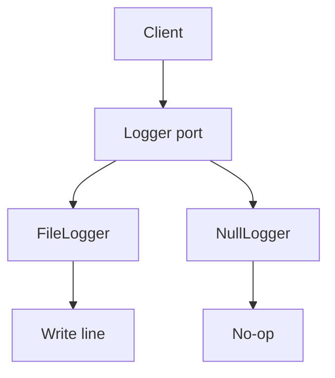

import { ConceptTemplate } from '@/features/kb/components/templates/ConceptTemplate'
import { Callout } from '@/features/kb/components/mdx/Callout'
import { ComparisonTable } from '@/features/kb/components/mdx/ComparisonTable'

export default function Layout({ children }) {
  return (
    <ConceptTemplate title="Null Object">
      {children}
    </ConceptTemplate>
  )
}

**Null Object** replaces `None` / `null` with an object that satisfies the interface and performs no-ops (or returns empty values). Clients call `logger.info(...)` whether logging is configured or not. The absence of a collaborator stops being a special case.

## 1. Deep Dive and Mechanics

**Same interface.** `NullLogger` implements `Logger`. `EmptyCart` implements `Cart`. Type checkers and runtime dispatch treat it as real.

**No-op versus empty.** A null logger ignores calls. A null collection returns empty iterators and zero size. Choose the algebra that keeps clients branch-free.

**Not a substitute for errors.** Do not swallow a missing payment gateway behind a null that “succeeds.” Use Null Object for optional *behavior*, not for hidden failure.

**Optional types.** `T | null` plus checks is the other school. Null Object wins when the empty case is common and the API is wide (many methods to guard).

<Callout icon="warning" title="Silent success is a footgun">
A null `PaymentService.charge` that returns OK will ship orders for free. If the missing case is an error, fail loud. Null Object is for *optional* collaborators.
</Callout>

## 2. Mathematical / Theoretical Foundation

**Identity element.** A null object is often a monoid identity: empty list, zero, no-op function. Composing it with a real object leaves the real object’s meaning unchanged.

**Liskov.** It must honor the interface contract. If `save` is specified to persist, a no-op `save` violates the contract unless the interface says “best effort / optional.”

**Branch elimination.** n call sites times a null check becomes zero checks plus one extra type. The win is linear in call-site count.

<ComparisonTable
  headers={['Approach', 'Call sites', 'Failure mode']}
  rows={[
    ['Null Object', 'No branches', 'Can hide real absence'],
    ['Optional / Maybe', 'Unwrap or map', 'Explicit empty'],
    ['null checks', 'Every site', 'Forgot one: crash'],
    ['Default stub in tests', 'Same as Null Object', 'Over-permissive fakes'],
  ]}
/>

## 3. Real-World Implementation

```python
class Logger:
    def info(self, msg):
        raise NotImplementedError

class FileLogger(Logger):
    def info(self, msg):
        print(msg)

class NullLogger(Logger):
    def info(self, msg):
        return

def handle(req, logger=None):
    log = logger or NullLogger()
    log.info("start")
```

`handle` never writes `if logger`.

## 4. Visualizations



## 5. Interview Prep

**Q: Null Object versus Optional?**
**A:** Optional forces the caller to decide. Null Object decides up front: “do nothing.” Prefer Optional when the empty case needs a different path (UI, errors). Prefer Null Object when the empty path is truly idle.

**Q: Is `EmptyList` a Null Object?**
**A:** Yes, if it implements the collection interface. The empty collection is the classic identity.

**Q: How do you test that the null path was taken?**
**A:** You usually do not. You test that the client works with both a recording logger and a null logger. If you must assert silence, use a recording null that counts calls.

## 6. Production Use Cases

- **Logging, metrics, and tracers** that can be disabled in tests or cheap environments.
- **Optional UI listeners** and no-op event handlers.
- **Feature-off implementations** of a port (discount engine that always returns zero).

<Callout icon="tip" title="Name it Null or NoOp, not Fake">
`FakeLogger` in tests often records. `NullLogger` must not. Keep the words honest so people do not assert on a sink that drops everything.
</Callout>
