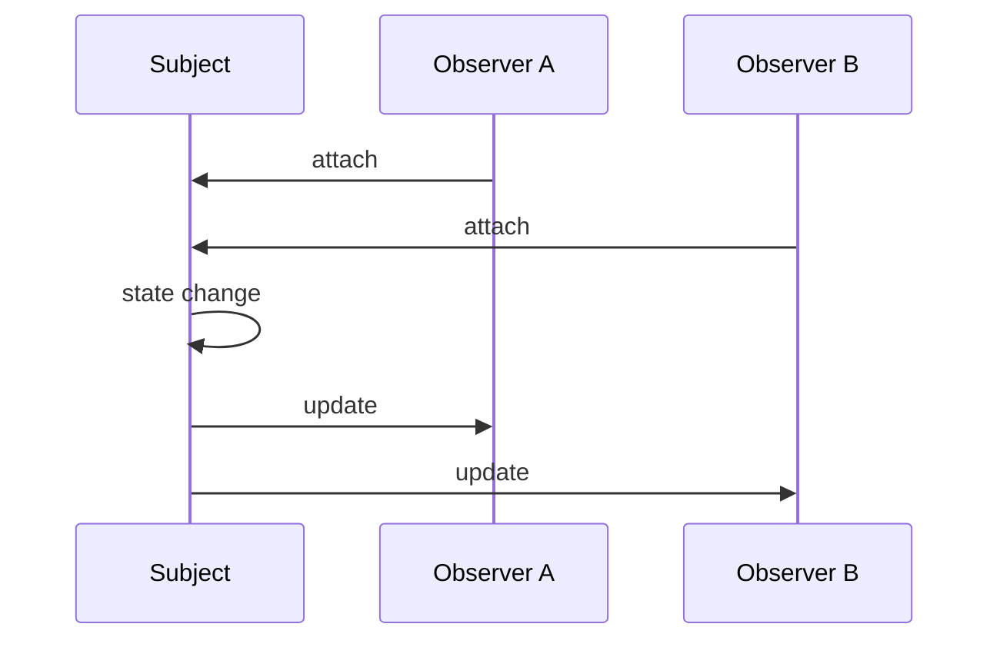

import { ConceptTemplate } from '@/features/kb/components/templates/ConceptTemplate'
import { Callout } from '@/features/kb/components/mdx/Callout'
import { ComparisonTable } from '@/features/kb/components/mdx/ComparisonTable'

export default function Layout({ children }) {
  return (
    <ConceptTemplate title="Observer">
      {children}
    </ConceptTemplate>
  )
}

**Observer** (GoF) lets objects subscribe to a subject. When the subject changes, it walks its list and calls `update`. Spreadsheets, UI toolkits, and most event buses are this pattern at some scale.

## 1. Deep Dive and Mechanics

**Subject.** Owns the observer list: `attach`, `detach`, `notify`. After a state change it notifies. It does not import concrete observers.

**Observer.** Implements `update(subject)` or receives an event payload. Push model: subject sends the delta. Pull model: observers query the subject.

**Order and reentrancy.** Notification order is usually unspecified. An observer that mutates the subject mid-notify can recurse or skip peers. Snapshot the list before walking.

**Lifetime.** Forgotten detach is a leak (and a crash if the observer is gone). Weak refs, scoped subscriptions, and RAII/`useEffect` cleanup exist for this.

<Callout icon="warning" title="Notify is not a transaction">
If observer two throws, three may never run. Decide: isolate errors, or fail the whole notify. Document it.
</Callout>

## 2. Mathematical / Theoretical Foundation

**Publish-subscribe.** Subject is a one-to-many relation. Adding an observer is O of 1 amortized; notify is O of k subscribers.

**Push versus pull.** Push couples observers to the event shape. Pull couples them to the subject’s query API. Hybrids send an event type plus a way to read more.

**Reactive streams.** Observer plus backpressure and cancellation is the reactive-streams contract. Same idea, extra laws.

<ComparisonTable
  headers={['Pattern', 'Coupling', 'Typical scale']}
  rows={[
    ['Observer', 'Subject knows list, not types', 'In-process UI'],
    ['Mediator', 'Hub names both sides', 'Closed dialog'],
    ['Message bus', 'Topics, process-wide', 'App services'],
    ['Event sourcing', 'Log is the source', 'Domain history'],
  ]}
/>

## 3. Real-World Implementation

```python
class Subject:
    def __init__(self):
        self._obs = []

    def attach(self, o):
        self._obs.append(o)

    def notify(self):
        for o in list(self._obs):
            o.update(self)

class Stock(Subject):
    def set_price(self, p):
        self.price = p
        self.notify()
```

`list(self._obs)` snapshots so detach during notify is safe.

## 4. Visualizations



## 5. Interview Prep

**Q: Observer versus pub/sub?**
**A:** Same shape. Observer is usually typed and in-process. Pub/sub often uses string topics, process or network boundaries, and persistence.

**Q: How do you avoid cascading updates?**
**A:** Batch notifications, dirty flags, or a run-loop that flushes once per frame (UI). Spreadsheets use a dependency graph plus topological notify.

**Q: Push or pull?**
**A:** Push when the delta is small and stable. Pull when observers need different slices of a large subject.

## 6. Production Use Cases

- **UI data binding** (model changes refresh views).
- **Domain events** inside an aggregate’s process boundary.
- **File watchers and config reloaders** that fan out to listeners.

<Callout icon="tip" title="Unsubscribe in the same scope you subscribe">
Component mount/unmount, connection open/close. Leaked observers are the number-one Observer bug in interviews and in prod.
</Callout>
