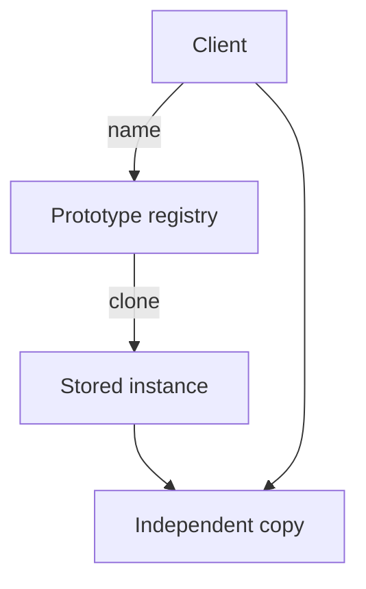

import { ConceptTemplate } from '@/features/kb/components/templates/ConceptTemplate'
import { Callout } from '@/features/kb/components/mdx/Callout'
import { ComparisonTable } from '@/features/kb/components/mdx/ComparisonTable'

export default function Layout({ children }) {
  return (
    <ConceptTemplate title="Prototype">
      {children}
    </ConceptTemplate>
  )
}

**Prototype** (GoF) creates objects by cloning a prototypical instance. When the catalog of kinds is built at runtime (user-defined weapons, document styles), you copy a registered sample instead of writing a class per kind.

## 1. Deep Dive and Mechanics

**Prototype interface.** `clone()` returns a new object of the same dynamic type. The client holds a `Prototype` reference and never names the concrete class.

**Registry.** A map from name to prototype. `create("orc")` clones the registered orc. Designers add kinds by inserting instances, not by shipping subclasses.

**Shallow versus deep.** Shallow copy shares nested objects — cheap, aliasing bugs. Deep copy duplicates the graph — safe, expensive, needs a cycle story. Most bugs are the wrong choice.

**Language support.** JavaScript objects delegate to a prototype object (different meaning). GoF Prototype is *copy*. JS `Object.create` is *delegation*. Do not conflate them in an interview.

<Callout icon="warning" title="clone is a contract, not a memcpy">
Identity fields, sockets, and file handles must not be blindly copied. Document what clone shares and what it mints new.
</Callout>

## 2. Mathematical / Theoretical Foundation

**Copy as constructor.** `clone` is an endomorphism on the object graph: same type, independent identity. Deep clone is a graph isomorphism onto fresh nodes.

**Open-closed.** New variants enter through data (registered instances), not new creator subclasses. That is the axis versus Factory Method.

**Cost.** Clone cost is the size of the copied subgraph. Factory Method cost is a constructor. Prototype wins when construction is heavy and copies are mostly shared structure (copy-on-write).

<ComparisonTable
  headers={['Pattern', 'How a variant appears', 'Copy']}
  rows={[
    ['Prototype', 'Register an instance', 'clone'],
    ['Factory Method', 'New creator subclass', 'new'],
    ['Builder', 'Stepwise setters', 'None'],
    ['JS prototype chain', 'Delegate missing keys', 'Not a copy'],
  ]}
/>

## 3. Real-World Implementation

```python
import copy

class Shape:
    def clone(self):
        return copy.deepcopy(self)

class Circle(Shape):
    def __init__(self, r, color):
        self.r, self.color = r, color

registry = {"red-dot": Circle(1, "red")}

def spawn(name):
    return registry[name].clone()
```

`spawn` never imports a concrete constructor beyond the registry setup.

## 4. Visualizations



## 5. Interview Prep

**Q: Prototype versus Factory Method?**
**A:** Factory Method uses inheritance to pick a class. Prototype uses an instance as the example. Use Prototype when kinds are data-driven or expensive to construct.

**Q: Shallow or deep?**
**A:** Default to deep unless you can prove shared children are immutable. Say that sentence in the interview.

**Q: How does this relate to `clone` in Java?**
**A:** `Object.clone` is a shallow, error-prone hook. Prefer copy constructors or explicit `copy` methods that state the contract.

## 6. Production Use Cases

- **Game entity catalogs** and spell/item templates.
- **Document and graphic editors** duplicating styles or shapes.
- **Test fixtures** that clone a golden object per case.

<Callout icon="tip" title="Register after fully initializing">
A half-built prototype cloned by an eager client is a Heisenbug. Freeze or seal prototypes once in the registry.
</Callout>
