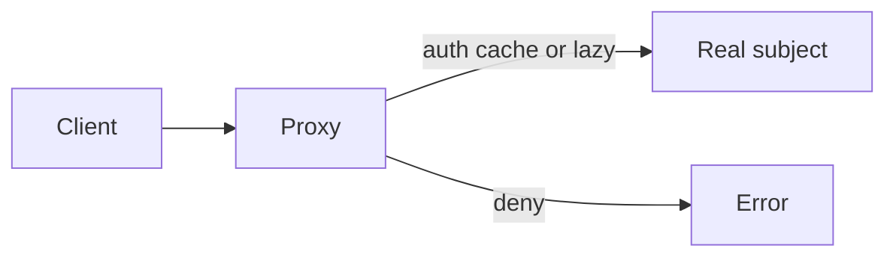

import { ConceptTemplate } from '@/features/kb/components/templates/ConceptTemplate'
import { Callout } from '@/features/kb/components/mdx/Callout'
import { ComparisonTable } from '@/features/kb/components/mdx/ComparisonTable'

export default function Layout({ children }) {
  return (
    <ConceptTemplate title="Proxy">
      {children}
    </ConceptTemplate>
  )
}

**Proxy** (GoF) implements the same interface as a real subject and forwards calls after doing something else: check ACL, lazy-load, cache, or marshal across the network. The client thinks it holds the subject.

## 1. Deep Dive and Mechanics

**Subject interface.** Both `RealImage` and `ImageProxy` implement `draw`. Clients depend on the interface.

**Virtual proxy.** Creates the expensive subject on first use (lazy image, lazy Hibernate association).

**Protection proxy.** Checks identity or permission before forward (access facade with teeth).

**Remote proxy.** Stub that serializes the call (RMI, gRPC stub). The “subject” lives in another process.

**Smart reference.** Ref-counting, write barriers, logging. AOP and HTTP middleware are cousins.

<Callout icon="info" title="Proxy versus Decorator">
Both wrap and implement the same interface. Decorator *adds* responsibilities and stacks. Proxy *controls access* to a specific instance and usually does not stack as a pipeline of equals.
</Callout>

## 2. Mathematical / Theoretical Foundation

**Indirection.** A proxy is an extra hop on the call graph. Correctness requires behavioral equivalence except for the added policy (liveness, security, latency).

**Cache proxy.** Memoization: `f(x)` stored after first call. Invalidation policy is the hard part, not the wrap.

**Remote.** The proxy plus stub plus skeleton is the RPC isomorphism: local call shape, distributed failure modes. Timeouts and partial failure are now in the contract.

<ComparisonTable
  headers={['Wrapper', 'Intent', 'Stacks']}
  rows={[
    ['Proxy', 'Control access or location', 'Rarely'],
    ['Decorator', 'Add behavior', 'Yes'],
    ['Adapter', 'Convert interface', 'No'],
    ['Facade', 'Simplify many types', 'N/A'],
  ]}
/>

## 3. Real-World Implementation

```python
class Image:
    def draw(self):
        raise NotImplementedError

class DiskImage(Image):
    def __init__(self, path):
        self.pixels = load(path)

    def draw(self):
        blit(self.pixels)

class ImageProxy(Image):
    def __init__(self, path):
        self.path, self._real = path, None

    def draw(self):
        if self._real is None:
            self._real = DiskImage(self.path)
        self._real.draw()
```

Construction of `ImageProxy` is cheap. `DiskImage` waits until `draw`.

## 4. Visualizations



## 5. Interview Prep

**Q: Proxy versus Decorator?**
**A:** Decorator is additive and composable (scrollbars on a window). Proxy is a stand-in (lazy, remote, secure). If you would wrap wrappers, you probably want Decorator.

**Q: Is a gRPC stub a proxy?**
**A:** Yes — remote proxy. Same interface idea, extra failure modes.

**Q: What is a protection proxy that should have been a Facade?**
**A:** If you are hiding a *subsystem* of many types, that is Facade. Proxy hides or guards *one* subject type.

## 6. Production Use Cases

- **ORM lazy associations** and virtual files.
- **API gateways and service meshes** as process-level proxies.
- **Capability checks** around a domain service.

<Callout icon="tip" title="Keep the interface honest">
If the proxy cannot honor a method (offline, denied), fail that method. Do not silently no-op unless the subject’s contract allows it.
</Callout>
