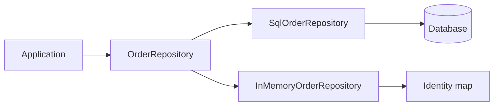

import { ConceptTemplate } from '@/features/kb/components/templates/ConceptTemplate'
import { Callout } from '@/features/kb/components/mdx/Callout'
import { ComparisonTable } from '@/features/kb/components/mdx/ComparisonTable'

export default function Layout({ children }) {
  return (
    <ConceptTemplate title="Repository">
      {children}
    </ConceptTemplate>
  )
}

**Repository** presents aggregates as a collection: `get`, `add`, `remove`, and domain-specific finders. The application layer does not write SQL. The infrastructure layer implements the port with an ORM, SQL, or an HTTP API.

## 1. Deep Dive and Mechanics

**Collection illusion.** `orders.get(id)` returns an aggregate or signals missing. `orders.add(order)` schedules persist. Callers think in objects, not rows.

**Aggregate boundary.** One repository per aggregate root, not per table. Child entities are loaded and saved *with* the root. A `LineItemRepository` is usually a design smell.

**Query methods.** `find_open_for(customer)` belongs on the repository (or a read-model port). Do not leak `Session` or `WHERE` into domain services.

**Unit of Work pairing.** The repository typically registers dirty aggregates on a unit of work. `save` at the end flushes once.

<Callout icon="warning" title="Generic repo of T is not DDD">
`Repo.get_by_id` for every table is a DAO. A repository speaks the ubiquitous language of one aggregate and its queries.
</Callout>

## 2. Mathematical / Theoretical Foundation

**Ports and adapters.** The domain depends on an interface. Infrastructure implements it. That is dependency inversion applied to persistence.

**Identity map.** Inside one unit of work, `get(id)` twice should return the same instance. Otherwise you alias-update and lose writes.

**Consistency.** Repositories do not span aggregates in one lock unless you accept that coupling. Cross-aggregate rules use eventual consistency or a domain service plus two repos.

<ComparisonTable
  headers={['Abstraction', 'Speaks', 'Scope']}
  rows={[
    ['Repository', 'Aggregates', 'One root type'],
    ['DAO', 'Tables or documents', 'Per table'],
    ['Active Record', 'The model itself', 'Row equals object'],
    ['CQRS read port', 'Query DTOs', 'Read side'],
  ]}
/>

## 3. Real-World Implementation

```python
class OrderRepository:
    def get(self, order_id):
        raise NotImplementedError

    def add(self, order):
        raise NotImplementedError

    def find_open_for(self, customer_id):
        raise NotImplementedError

class SqlOrderRepository(OrderRepository):
    def __init__(self, session):
        self.session = session

    def get(self, order_id):
        return self.session.get(Order, order_id)
```

Domain services depend on `OrderRepository`, never on `session`.

## 4. Visualizations



## 5. Interview Prep

**Q: Repository versus DAO?**
**A:** DAO is table-shaped. Repository is aggregate-shaped and uses domain words. If your repo has `join` and `select` in the name, it is a DAO.

**Q: Where do complex queries go?**
**A:** Named methods on the repository, a specification object, or a separate read model. Not in the UI controller.

**Q: Should `save` be on every entity?**
**A:** Active Record does that. Repository keeps persist on the collection port so the domain stays persistence-ignorant.

## 6. Production Use Cases

- **Hexagonal / clean architectures** isolating SQL from use cases.
- **Test doubles** that store aggregates in a dict.
- **Multi-store apps** (SQL write, search index) behind one interface per meaning.

<Callout icon="tip" title="Return domain types">
If `get` returns a row DTO, the domain will grow getters. Hydrate the aggregate or use a dedicated read port.
</Callout>
