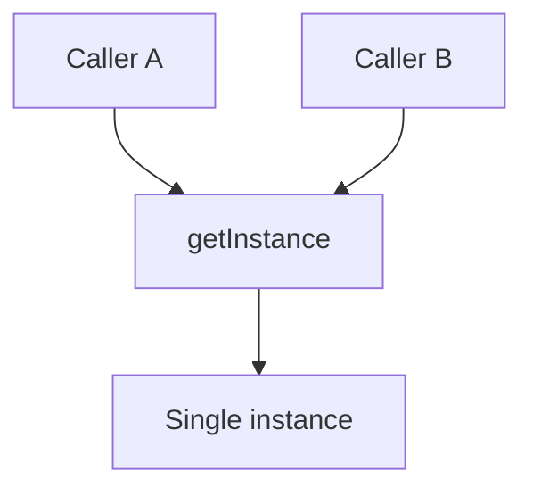

import { ConceptTemplate } from '@/features/kb/components/templates/ConceptTemplate'
import { Callout } from '@/features/kb/components/mdx/Callout'
import { ComparisonTable } from '@/features/kb/components/mdx/ComparisonTable'

export default function Layout({ children }) {
  return (
    <ConceptTemplate title="Singleton">
      {children}
    </ConceptTemplate>
  )
}

**Singleton** (GoF) restricts a class to one instance and hands it out via `getInstance` (or a module-level object). Config, a process-wide metric registry, or a hardware driver sometimes need this. Most “I need a singleton” cases need a composition root instead.

## 1. Deep Dive and Mechanics

**Construction gate.** Private constructor plus a static holder. First call creates; later calls return the same reference.

**Thread safety.** Naive lazy init races. Solutions: class-holder / module import (JVM, Python), `std::call_once`, double-checked locking with a memory barrier, or eager init at startup.

**Test pain.** Hidden global state. Tests leak config across cases unless you add `resetForTests` (which admits the design is a global).

**Subclasses.** GoF discusses a registry of singletons. In practice, inherit-a-singleton is a trap. Prefer interfaces plus one binding.

<Callout icon="error" title="Singleton is a global with a class name">
If you cannot inject it, you cannot fake it. Prefer passing the dependency. Use a true singleton only for process-lifetime infrastructure.
</Callout>

## 2. Mathematical / Theoretical Foundation

**Cardinality.** The type’s inhabitants in the running process are exactly one (plus maybe a test reset). That is a constraint on the object graph, not a reuse pattern.

**Initialization order.** Static/module init forms a DAG. Cycles become startup deadlocks or partial objects. Eager init at a composed `main` makes the DAG explicit.

**Versus ambient context.** Thread-locals and scoped containers are *per-scope* singletons. Same smell if overused, better than one process global for request data.

<ComparisonTable
  headers={['Approach', 'How many', 'Testable']}
  rows={[
    ['Singleton', 'One per process', 'Painful'],
    ['DI singleton scope', 'One per container', 'Swap the container'],
    ['Module object', 'One per interpreter', 'Same as Singleton'],
    ['Monostate', 'Many instances, shared data', 'Worse'],
  ]}
/>

## 3. Real-World Implementation

```python
class Metrics:
    _inst = None

    def __new__(cls):
        if cls._inst is None:
            cls._inst = super().__new__(cls)
            cls._inst._counters = {}
        return cls._inst

# Prefer this in new code:
# metrics = Metrics() created in main and passed in.
```

Python modules are already singletons; a class wrapper rarely adds value.

## 4. Visualizations



## 5. Interview Prep

**Q: Why is Singleton criticized?**
**A:** It hides dependencies, complicates tests, and encodes lifetime in the type. Interviews want you to know the pattern *and* to prefer injection.

**Q: Is a logger a singleton?**
**A:** Often in practice. Better: a factory or DI binding with a well-known default. The instance count is a deployment choice, not the class’s job.

**Q: Double-checked locking?**
**A:** Lazy init with a local snapshot plus a fence. Easy to get wrong. Prefer language-supported holders or start-up init.

## 6. Production Use Cases

- **Process-wide registries** (metrics, tracer) created once in `main`.
- **Hardware or connection owners** that cannot exist twice.
- **Legacy code** where you wrap an existing global behind a type.

<Callout icon="tip" title="Singleton lifetime, injected access">
Create it once. Pass it. You get the cardinality without the global lookup.
</Callout>
