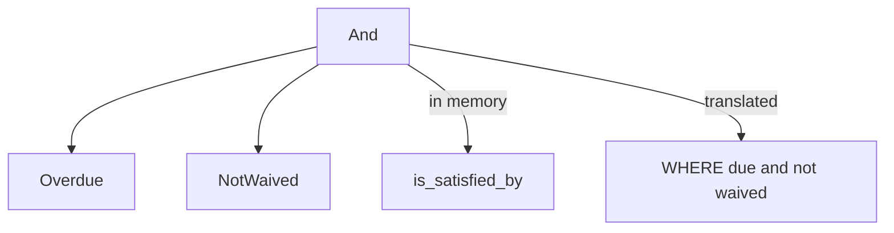

import { ConceptTemplate } from '@/features/kb/components/templates/ConceptTemplate'
import { Callout } from '@/features/kb/components/mdx/Callout'
import { ComparisonTable } from '@/features/kb/components/mdx/ComparisonTable'

export default function Layout({ children }) {
  return (
    <ConceptTemplate title="Specification pattern">
      {children}
    </ConceptTemplate>
  )
}

**Specification** (Evans / Fowler) models a rule as an object with `is_satisfied_by(candidate)`. Specs combine with and/or/not. The same rule can validate an aggregate in memory and, when translated, become a SQL `WHERE`.

## 1. Deep Dive and Mechanics

**Atomic specs.** `OverdueInvoice`, `PremiumCustomer`. Each encapsulates one predicate.

**Combinators.** `AndSpec`, `OrSpec`, `NotSpec`. Business code builds trees: overdue and not waived.

**Two interpreters.** In-memory: call `is_satisfied_by`. Persistence: a visitor or LINQ provider turns the tree into a query. If you cannot translate, you load too much and filter in process.

**Versus a bag of ifs.** The win is reuse and naming. A 40-clause report filter is a spec tree you can unit-test leaf by leaf.

<Callout icon="info" title="Not every boolean deserves a class">
A one-line `is_active` can stay a method. Extract a spec when the rule is reused, composed, or must run in two places (RAM and SQL).
</Callout>

## 2. Mathematical / Theoretical Foundation

**Boolean algebra.** Specs are predicates. Combinators are meet, join, and complement. Simplification (absorb, distribute) is optional optimization.

**Predicate pushdown.** Translating a spec to SQL is algebraic rewriting: keep the same truth function, change the interpreter. If a leaf cannot be pushed, the plan becomes a table scan plus a residual predicate.

**Open-closed.** New rules are new leaf types. Combinators stay closed.

<ComparisonTable
  headers={['Approach', 'Composable', 'Queryable']}
  rows={[
    ['Specification', 'and / or / not', 'If you translate'],
    ['If-else block', 'No', 'No'],
    ['Strategy', 'One algorithm swap', 'Rarely'],
    ['Query object', 'SQL-shaped', 'Yes, not domain-shaped'],
  ]}
/>

## 3. Real-World Implementation

```python
class Spec:
    def is_satisfied_by(self, x):
        raise NotImplementedError

    def __and__(self, other):
        return And(self, other)

class Overdue(Spec):
    def is_satisfied_by(self, inv):
        return inv.due < today() and not inv.paid

class NotWaived(Spec):
    def is_satisfied_by(self, inv):
        return not inv.waived

need_chase = Overdue() & NotWaived()
```

`need_chase.is_satisfied_by(inv)` is the in-memory interpreter.

## 4. Visualizations



## 5. Interview Prep

**Q: How is this different from Strategy?**
**A:** Strategy swaps one algorithm. Specification is a *predicate* that composes with other predicates. Use Strategy for “how to price”; Specification for “which orders qualify.”

**Q: Can you always generate SQL?**
**A:** No. Closures and arbitrary code cannot be parsed. Use an expression tree or a known leaf set if you need pushdown.

**Q: Where did this come from?**
**A:** Eric Evans’ DDD book and Fowler’s catalog. Interviewers treat it as DDD literacy, not GoF.

## 6. Production Use Cases

- **Search and reporting filters** assembled from UI chips.
- **Validation rules** shared by API and batch jobs.
- **Repository finders** that accept a spec instead of a pile of optional args.

<Callout icon="tip" title="Test leaves, then one composition">
Unit-test each atomic spec with a few candidates. Then test the tree your product actually builds. Do not explode the combinator matrix.
</Callout>
