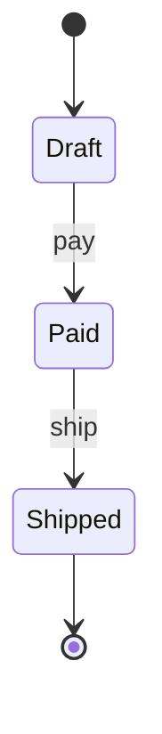

import { ConceptTemplate } from '@/features/kb/components/templates/ConceptTemplate'
import { Callout } from '@/features/kb/components/mdx/Callout'
import { ComparisonTable } from '@/features/kb/components/mdx/ComparisonTable'

export default function Layout({ children }) {
  return (
    <ConceptTemplate title="State">
      {children}
    </ConceptTemplate>
  )
}

**State** (GoF) puts each FSM state in its own class. The context delegates `handle(event)` to `current`. Transitions replace that object. Order/payment/TCP-style lifecycles stop being a 200-line switch.

## 1. Deep Dive and Mechanics

**Context.** Holds data plus a `State` reference. Public methods forward to the state. States may call `context.transition_to(...)`.

**State objects.** `Draft`, `Paid`, `Shipped`. Each implements the same event methods. Illegal events raise or no-op by policy.

**Who owns transitions.** State classes (local, easy to miss a path) or a table in the context (central, easier to audit). Pick one and document it.

**Data versus behavior.** If states only differ by a label, an enum plus a transition table is enough. Use the pattern when *behavior* diverges hard.

<Callout icon="info" title="State versus Strategy">
Both swap an object. Strategy is chosen by the client and does not typically self-replace. State is chosen by the machine and replaces itself as events arrive.
</Callout>

## 2. Mathematical / Theoretical Foundation

**Finite-state machine.** A tuple of states, events, and a transition function. The pattern is an object-oriented encoding of that function: each state object is a row of the table.

**Invariants.** Some fields are only meaningful in some states (tracking number only when shipped). Types or assertions should reflect that, or you get nulls that lie.

**Explosion.** n states times m events is the size of the table. Hierarchical / nested states (UML) factor common handlers. If you need that, look at a real statechart library.

<ComparisonTable
  headers={['Encoding', 'When it fits', 'Audit']}
  rows={[
    ['State objects', 'Rich per-state behavior', 'Scattered'],
    ['Enum plus switch', 'Small, stable FSM', 'One function'],
    ['Transition table', 'Many simple edges', 'One data file'],
    ['Statecharts', 'Hierarchy, history', 'Tooling'],
  ]}
/>

## 3. Real-World Implementation

```python
class Order:
    def __init__(self):
        self.state = Draft()

    def pay(self):
        self.state.pay(self)

class Draft:
    def pay(self, order):
        order.state = Paid()

class Paid:
    def pay(self, order):
        raise CannotPayTwice()
```

A second `pay` is a domain error, not a silent branch.

## 4. Visualizations



## 5. Interview Prep

**Q: State versus Strategy?**
**A:** Strategy: the context does not change strategy by itself. State: events change the state object. If the interviewer draws an FSM, they want State.

**Q: Where should transition rules live?**
**A:** For regulated workflows (orders, claims), a central table plus tests for every edge. For UI gestures, state objects are fine.

**Q: How do you persist this?**
**A:** Store a state name (or versioned enum). Rehydrate the state object on load. Do not serialize class paths if you can avoid it.

## 6. Production Use Cases

- **Order, ticket, and claim lifecycles**.
- **TCP-like protocol handlers** and connection objects.
- **Game AI** (idle, chase, attack) with distinct tick behavior.

<Callout icon="tip" title="Test illegal transitions">
Happy-path tests are cheap. The bugs are `pay` on `Shipped` and double `ship`. Make those tests first-class.
</Callout>
