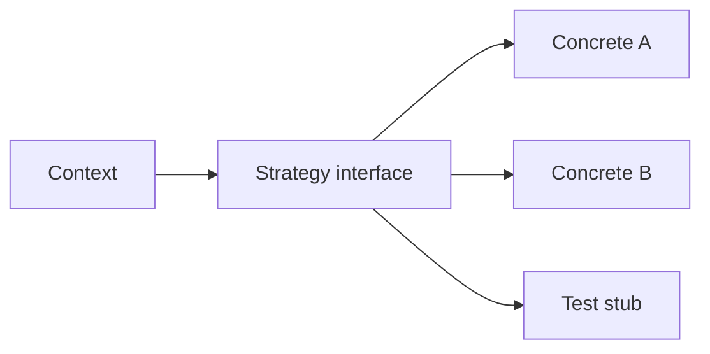

import { ConceptTemplate } from '@/features/kb/components/templates/ConceptTemplate'
import { Callout } from '@/features/kb/components/mdx/Callout'
import { ComparisonTable } from '@/features/kb/components/mdx/ComparisonTable'

export default function Layout({ children }) {
  return (
    <ConceptTemplate title="Strategy">
      {children}
    </ConceptTemplate>
  )
}

**Strategy** (GoF) turns a family of algorithms into interchangeable objects. The context calls `strategy.execute(...)` and does not know whether it is using FedEx rates, pickup, or a stub. Sorting comparators and payment processors are the usual examples.

## 1. Deep Dive and Mechanics

**Context.** Owns the workflow around the algorithm (collect cart, then `price`). It holds a `PricingStrategy` reference, often injected.

**Strategy interface.** One method or a small set. Keep it stable. If every strategy needs different inputs, the interface is wrong (or you wanted a richer policy object).

**Selection.** Composition root, user preference, or a simple factory keyed by type. Do not hide a giant switch *and* call it Strategy unless the switch only picks the object.

**Closures.** In languages with first-class functions, a function *is* a strategy. The pattern does not require a class hierarchy.

<Callout icon="tip" title="Inject, do not new, the strategy">
If the context constructs `FedExStrategy()` internally, you cannot test or swap. Pass it in.
</Callout>

## 2. Mathematical / Theoretical Foundation

**Higher-order behavior.** Strategy is a first-class function with a name. The context is parameterized by that function — the same idea as passing a comparator to sort.

**Open-closed.** New algorithms are new types (or new functions). The context file does not grow a branch per carrier.

**Versus Template Method.** Template Method uses inheritance and a fixed skeleton. Strategy uses composition and replaces the whole algorithm (or the whole hot part).

<ComparisonTable
  headers={['Pattern', 'Variation axis', 'Binding']}
  rows={[
    ['Strategy', 'Whole algorithm', 'Composition'],
    ['Template Method', 'Steps in a skeleton', 'Inheritance'],
    ['State', 'Behavior per FSM node', 'Self-replacing'],
    ['Command', 'An action to store/queue', 'Object as request'],
  ]}
/>

## 3. Real-World Implementation

```python
class Cart:
    def __init__(self, pricing):
        self.pricing = pricing
        self.lines = []

    def total(self):
        return self.pricing.quote(self.lines)

class FlatRate:
    def quote(self, lines):
        return 5.00

class FreeOver50:
    def quote(self, lines):
        goods = sum(l.price for l in lines)
        return 0.00 if goods >= 50 else 5.00
```

`Cart.total` never names a carrier.

## 4. Visualizations



## 5. Interview Prep

**Q: Strategy versus Template Method?**
**A:** Strategy composes algorithms. Template Method inherits and fills in steps. Prefer Strategy unless the skeleton is the product and subclasses are the plugin.

**Q: Is a lambda a Strategy?**
**A:** Yes. Interviews accept “function as strategy.” Classes help when the policy has state or several methods.

**Q: How do you pick the strategy at runtime?**
**A:** Map from a key (shipping method id) to an instance, or ask a factory. Keep the map in the composition root.

## 6. Production Use Cases

- **Payment, tax, and shipping** calculators.
- **Sort and compression** policies.
- **A/B experiment arms** as alternate strategies behind one port.

<Callout icon="info" title="One interface, many data needs">
If half the strategies ignore half the arguments, split the interface or pass a context object. Do not grow a god-signature.
</Callout>
