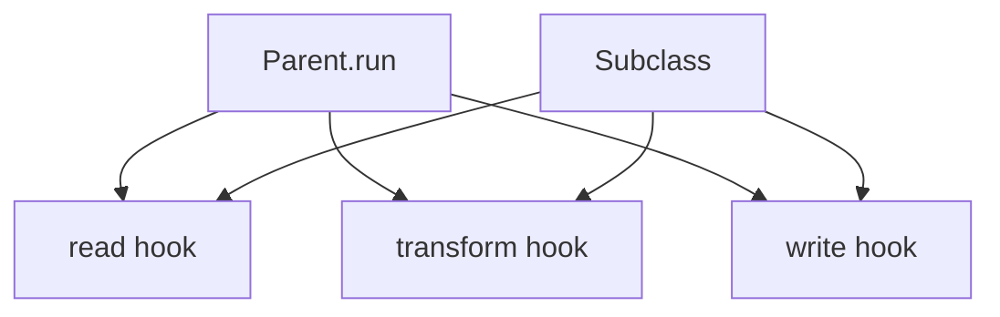

import { ConceptTemplate } from '@/features/kb/components/templates/ConceptTemplate'
import { Callout } from '@/features/kb/components/mdx/Callout'
import { ComparisonTable } from '@/features/kb/components/mdx/ComparisonTable'

export default function Layout({ children }) {
  return (
    <ConceptTemplate title="Template Method">
      {children}
    </ConceptTemplate>
  )
}

**Template Method** (GoF) puts the invariant sequence in a non-overridable method (`final process`) and calls overridable hooks (`read`, `transform`, `write`). Frameworks use this so your subclass cannot scramble the official order.

## 1. Deep Dive and Mechanics

**Skeleton.** Parent method calls steps in a fixed order. It is the product. Subclasses do not override it (language `final` or a convention).

**Hooks.** Abstract methods you must implement, or concrete no-ops you may override (optional steps). Hollywood principle: “don’t call us, we’ll call you.”

**Factory Method pairing.** One hook is often `createX`. The template runs; the factory hook supplies the type.

**Inheritance cost.** You get one axis of variation (the steps). A second axis wants Strategy or composition, not a deeper subclass tree.

<Callout icon="warning" title="Do not override the template itself">
If subclasses rewrite `process`, you no longer have a template. Lock it. Vary only the hooks.
</Callout>

## 2. Mathematical / Theoretical Foundation

**Fixed control flow.** The parent defines a total order on steps. Hooks are parameters of type “procedure.” That is the same idea as a higher-order function, encoded with inheritance.

**Open-closed.** New variants are new subclasses. The skeleton file stays closed. If you must edit the skeleton for every variant, the steps were not actually invariant.

**Versus Strategy.** Template Method: inherit, vary steps. Strategy: compose, vary the whole algorithm. Prefer Strategy when you do not own a framework hierarchy.

<ComparisonTable
  headers={['Pattern', 'What is fixed', 'How you vary']}
  rows={[
    ['Template Method', 'Step order', 'Override hooks'],
    ['Strategy', 'Context workflow', 'Swap object'],
    ['Factory Method', 'Product use', 'Override create'],
    ['Callback / lambda', 'Caller order', 'Pass functions'],
  ]}
/>

## 3. Real-World Implementation

```python
class DataJob:
    def run(self):
        rows = self.read()
        out = self.transform(rows)
        self.write(out)

    def read(self):
        raise NotImplementedError

    def transform(self, rows):
        return rows

    def write(self, rows):
        raise NotImplementedError

class CsvToJson(DataJob):
    def read(self):
        return load_csv(self.path)

    def write(self, rows):
        dump_json(self.out, rows)
```

`run` is the template. `transform` defaults to identity.

## 4. Visualizations



## 5. Interview Prep

**Q: Template Method versus Strategy?**
**A:** Inheritance and a locked skeleton versus composition and a swappable object. Framework authors love Template Method. Application authors usually want Strategy.

**Q: Why Hollywood principle?**
**A:** The parent calls you. You do not call the parent’s helpers in a custom order. That preserves invariants (transactions, logging, metrics around the steps).

**Q: How does this appear in the JDK / .NET?**
**A:** `InputStream` / reader loops, JUnit test life-cycle, Android `Activity` callbacks. The framework method is the template.

## 6. Production Use Cases

- **Batch and ETL jobs** with a shared run protocol.
- **UI framework life-cycles** (create, start, resume).
- **Build and compile pipelines** with customizable phases.

<Callout icon="tip" title="Keep the hook set small">
Five abstract methods means nobody can implement the subclass without a tutorial. Optional hooks with defaults scale better.
</Callout>
