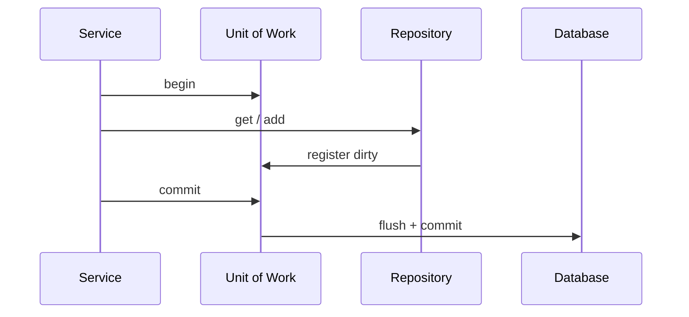

import { ConceptTemplate } from '@/features/kb/components/templates/ConceptTemplate'
import { Callout } from '@/features/kb/components/mdx/Callout'
import { ComparisonTable } from '@/features/kb/components/mdx/ComparisonTable'

export default function Layout({ children }) {
  return (
    <ConceptTemplate title="Unit of Work">
      {children}
    </ConceptTemplate>
  )
}

**Unit of Work** (Fowler) records new, dirty, and removed objects during a use case and writes them in one flush (usually one DB transaction). ORMs call this a session or change tracker. You stop issuing a write per setter.

## 1. Deep Dive and Mechanics

**Identity map.** `get(id)` returns the same instance inside the unit. Two loads cannot diverge.

**Change tracking.** Snapshots, dirty flags, or dirty-checking by comparison. At `commit`, the unit issues inserts, updates, deletes in a safe order (parents before children, or the inverse for deletes).

**Boundary.** Start the unit at the application-service edge. Commit on success, rollback on error. Do not open a unit per repository call.

**Nesting.** Inner “units” should join the outer transaction (ambient session). True nested transactions are rare and vendor-specific.

<Callout icon="warning" title="Long-lived units are memory leaks">
A request-scoped unit is the default. A unit that spans user think-time accumulates stale objects and locks. Use explicit versions for long conversations.
</Callout>

## 2. Mathematical / Theoretical Foundation

**Transaction = atomic set of writes.** The unit is the in-memory intention log. Commit is the interpretation of that log against storage. Isolation (read committed, repeatable read, serializable) is the database’s, not the pattern’s.

**Write-set.** Optimistic concurrency: compare versions on flush. If any row changed, abort. That is OCC on the unit’s write-set.

**Ordering.** Foreign keys impose a partial order on DML. The unit topologically sorts or defers constraints.

<ComparisonTable
  headers={['Approach', 'When writes happen', 'Identity map']}
  rows={[
    ['Unit of Work', 'Once at commit', 'Yes'],
    ['Active Record save', 'Per object', 'No'],
    ['Outbox + commit', 'Same transaction', 'With UoW'],
    ['Manual SQL', 'Whenever you say', 'You build it'],
  ]}
/>

## 3. Real-World Implementation

```python
class UnitOfWork:
    def __init__(self, session):
        self.session = session

    def commit(self):
        self.session.flush()
        self.session.commit()

    def rollback(self):
        self.session.rollback()

def place_order(uow, order):
    uow.session.add(order)
    uow.commit()
```

Repositories share `uow.session` so all writes ride one transaction.

## 4. Visualizations



## 5. Interview Prep

**Q: Unit of Work versus transaction?**
**A:** A DB transaction is the durability/isolation mechanism. The unit is the in-memory tracker that *uses* a transaction. You can have a transaction without a unit (raw SQL) but not a useful unit without a commit boundary.

**Q: How does this relate to Repository?**
**A:** Repository is the collection port. Unit of Work is the flush/identity scope. They almost always travel together.

**Q: What is detached vs attached?**
**A:** Attached objects are in the identity map and will be flushed. Detached objects need an explicit merge or they silently do not persist.

## 6. Production Use Cases

- **ORM sessions** (SQLAlchemy, Hibernate, EF DbContext).
- **Use-case services** that update several aggregates then commit once.
- **Test fakes** that record operations and commit to an in-memory map.

<Callout icon="tip" title="One unit per use case">
If you commit in a helper halfway through “place order,” you cannot roll back the rest. Keep commit at the edge.
</Callout>
