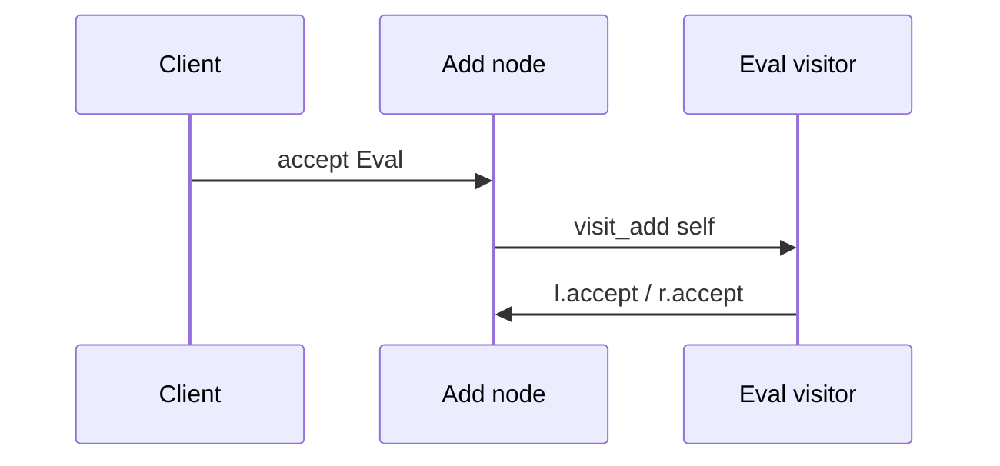

import { ConceptTemplate } from '@/features/kb/components/templates/ConceptTemplate'
import { Callout } from '@/features/kb/components/mdx/Callout'
import { ComparisonTable } from '@/features/kb/components/mdx/ComparisonTable'

export default function Layout({ children }) {
  return (
    <ConceptTemplate title="Visitor">
      {children}
    </ConceptTemplate>
  )
}

**Visitor** (GoF) externalizes an operation over a stable hierarchy. Each element implements `accept(visitor)` and calls `visitor.visit_concrete(self)`. You add exporters, type-checkers, and pretty-printers without touching every node class.

## 1. Deep Dive and Mechanics

**Double dispatch.** `accept` dispatches on the element type; `visit_X` dispatches on the visitor type. Together they pick `visit_X` for this pair.

**Stable elements, volatile ops.** Visitor wins when the node set is closed (AST kinds) and operations grow (compile, emit, lint). If node types grow weekly, Visitor hurts: every visitor needs a new method.

**Traversal.** The visitor or the nodes can walk children. Putting traversal in nodes keeps visitors small. Putting it in the visitor lets you skip subtrees.

**Return values.** Classic Visitor is `void` plus mutable accumulator. Modern variants return a value (`R visit(...)`) and look like a fold.

<Callout icon="warning" title="A new node type is a breaking change">
Every visitor implementor must add `visit_new_node`. If the hierarchy is not closed, prefer pattern matching in one module or a plain interface method on the node.
</Callout>

## 2. Mathematical / Theoretical Foundation

**Catamorphism.** A visitor over a recursive ADT is a fold: you replace each constructor with a function. Compilers are folds over ASTs.

**Expression problem.** OOP (methods on nodes) makes adding types easy and adding operations hard. Visitor flips it. Functional languages add operations easily (new function) and add types hard (edit every function). Same trade-off.

**Dispatch.** Single dispatch cannot pick a method on *two* runtime types. Visitor encodes the second dispatch by hand.

<ComparisonTable
  headers={['Style', 'Add a type', 'Add an operation']}
  rows={[
    ['Methods on nodes', 'Easy', 'Edit every class'],
    ['Visitor', 'Edit every visitor', 'Easy'],
    ['Pattern match in one file', 'Edit the match', 'Add a function'],
    ['Interpreter pattern', 'New node class', 'New interpret'],
  ]}
/>

## 3. Real-World Implementation

```python
class Expr:
    def accept(self, v):
        raise NotImplementedError

class Num(Expr):
    def __init__(self, n):
        self.n = n

    def accept(self, v):
        return v.visit_num(self)

class Add(Expr):
    def __init__(self, l, r):
        self.l, self.r = l, r

    def accept(self, v):
        return v.visit_add(self)

class Eval:
    def visit_num(self, node):
        return node.n

    def visit_add(self, node):
        return node.l.accept(self) + node.r.accept(self)
```

A `PrettyPrint` visitor adds an operation without editing `Num` or `Add`.

## 4. Visualizations



## 5. Interview Prep

**Q: Why double dispatch?**
**A:** `eval.visit(node)` would only dispatch on `eval`’s type if `visit` is one method. `node.accept(eval)` lets the node pick `visit_add` versus `visit_num`.

**Q: Visitor versus Interpreter?**
**A:** Interpreter puts `interpret` on each node (easy to add nodes). Visitor puts `visit` on the operation (easy to add ops). AST toolchains often use Visitor.

**Q: How do you handle a missing visit method?**
**A:** A default `visit_default` plus an error, or a compiler-enforced exhaustive interface. Silent no-op defaults hide incomplete visitors.

## 6. Production Use Cases

- **Compilers and linters** walking ASTs.
- **Document object models** (export PDF, HTML, markdown).
- **Serialization** of closed class hierarchies.

<Callout icon="tip" title="Close the element set">
Visitor is a bet that node kinds are rarer than operations. If both change, you chose the harder encoding of the expression problem.
</Callout>
