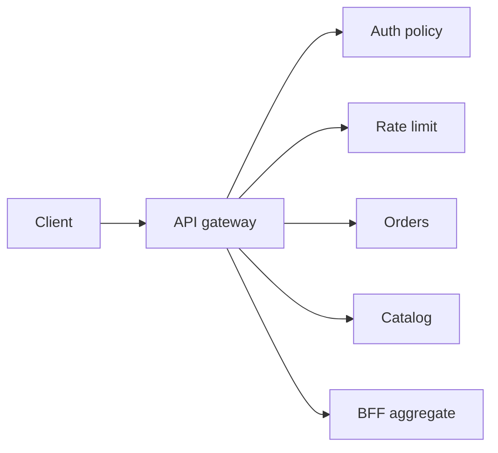

import { ConceptTemplate } from '@/features/kb/components/templates/ConceptTemplate'
import { Callout } from '@/features/kb/components/mdx/Callout'
import { ComparisonTable } from '@/features/kb/components/mdx/ComparisonTable'

export default function Layout({ children }) {
  return (
    <ConceptTemplate title="API gateways">
      {children}
    </ConceptTemplate>
  )
}

An **API gateway** is the front door for a fleet of services. Browsers and apps see one origin. Behind it, the gateway authenticates, applies quotas, rewrites paths, aggregates calls, and emits access logs. Internals stay off the public internet.

## 1. Deep Dive and Mechanics

**Reverse proxy core.** TLS terminate, HTTP route by path or host, upstream load balance. Timeouts and retries live here so clients do not invent them.

**Cross-cutting policy.** AuthN/AuthZ, rate limits, WAF, CORS, request size, IP allowlists. Doing this in every microservice duplicates bugs.

**BFF versus one gateway.** A Backend-for-Frontend is a gateway per client type (mobile, web). One mega-gateway that aggregates every screen becomes a deploy bottleneck.

**Data plane versus control plane.** Envoy / nginx handle packets. A control plane (Kong, Apigee, AWS API Gateway config) pushes routes and plugins. Know which one you are debugging.

<Callout icon="warning" title="The gateway is not your domain layer">
Orchestrating eight service calls to build a page is a BFF or a use-case service. If the gateway owns business rules, you built a distributed monolith with extra latency.
</Callout>

## 2. Mathematical / Theoretical Foundation

**Fan-out latency.** A naive aggregate of k sequential calls costs the sum of their tails. Parallelize independent calls; the cost becomes the max plus overhead. Gateways that stitch graphs must budget this.

**Capacity.** Each extra hop adds p99. Gateway CPU is often crypto and JSON, not routing. Horizontal scale plus connection pooling to upstreams is the usual model.

**Failure.** Retry storms: the gateway multiplying 502s into a thundering herd. Jittered backoff and a retry budget (max extra load) are required.

<ComparisonTable
  headers={['Edge', 'Owns', 'Risk']}
  rows={[
    ['API gateway', 'Policy + routing', 'God gateway'],
    ['BFF', 'One client shape', 'Many BFFs to run'],
    ['Service mesh', 'East-west policy', 'Does not replace public edge'],
    ['Direct client-to-service', 'Nothing shared', 'Auth and CORS everywhere'],
  ]}
/>

## 3. Real-World Implementation

```nginx
server {
  listen 443 ssl;
  location /orders/ {
    auth_request /_auth;
    proxy_pass http://orders-svc;
    limit_req zone=api burst=20;
  }
}
```

Auth and quota sit at the edge. The orders service sees an already-checked identity header.

## 4. Visualizations



## 5. Interview Prep

**Q: Gateway versus service mesh?**
**A:** Gateway is north-south (clients in). Mesh is east-west (service to service). You often want both. Do not make Envoy sidecar your public TLS story without an edge.

**Q: Should the gateway aggregate?**
**A:** Light aggregation is fine. Heavy graphs belong in a BFF or GraphQL layer you can deploy without touching every route.

**Q: What headers do you strip?**
**A:** Hop-by-hop headers, incoming internal trust headers (`X-User-Id` from the public), and anything that would let a client impersonate the gateway.

## 6. Production Use Cases

- **Public API products** with keys, plans, and quotas.
- **Microservices** hiding dozens of internals behind `/v1`.
- **Legacy wrap** where the gateway adapts old SOAP to REST for new clients.

<Callout icon="tip" title="Timeouts closer than the client">
Set gateway timeouts tighter than browser defaults. Fail a hung upstream before the user retries and doubles load.
</Callout>
