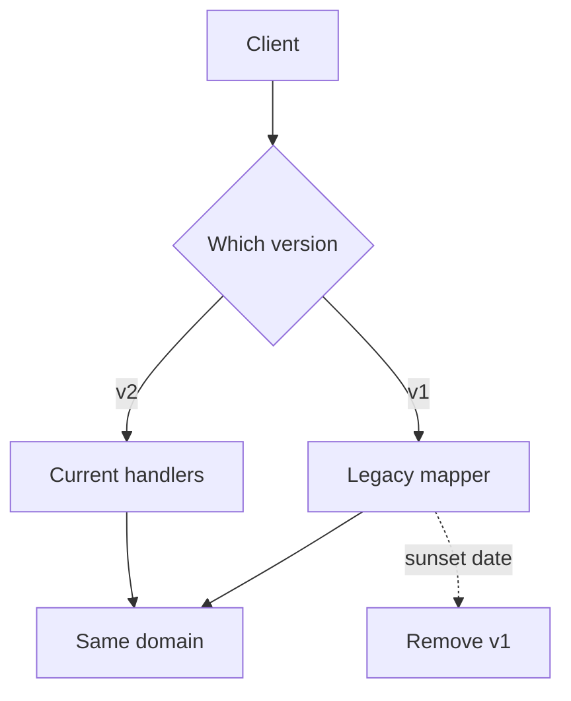

import { ConceptTemplate } from '@/features/kb/components/templates/ConceptTemplate'
import { Callout } from '@/features/kb/components/mdx/Callout'
import { ComparisonTable } from '@/features/kb/components/mdx/ComparisonTable'

export default function Layout({ children }) {
  return (
    <ConceptTemplate title="API versioning">
      {children}
    </ConceptTemplate>
  )
}

**API versioning** is the policy for incompatible change. Additive fields are usually safe. Renames, type changes, and removed endpoints are not. You pick a signal (path `/v2`, header, media type) and a sunset process so old clients can die on a schedule.

## 1. Deep Dive and Mechanics

**Compatible versus breaking.** Adding an optional field is compatible for JSON consumers that ignore unknowns. Changing a field’s type, making a field required, or reusing a name for a new meaning is breaking.

**URL version.** `/v1/orders` is explicit, cache-friendly, and ugly. Most public REST APIs do this.

**Header version.** `Accept: application/vnd.acme.order.v2+json` keeps the URL stable. Harder to try in a browser. Good when one resource has multiple representations.

**No version, only additive.** Stripe-style: evolve slowly, date-pin behavior when you must. Requires fierce discipline and a compatibility test suite.

<Callout icon="warning" title="v1 forever is still a version">
If you never ship v2, you still need a deprecation policy for fields. Versioning is a process, not a path prefix.
</Callout>

## 2. Mathematical / Theoretical Foundation

**Compatibility as a preorder.** Schema S2 is backward compatible with S1 if every S1-valid producer is acceptable to an S2 consumer (or the inverse, depending on producer/consumer variance). Adding optional fields: producers of S1 still work. Removing fields: they do not.

**Parallel run.** Cost is (almost) linear in the number of live major versions: test matrix, bug-fix backports, docs. The goal is to keep that number at one or two.

**Sunset.** A version is a lease. Publish a kill date. Metrics on User-Agent or API-Version tell you when the lease can end.

<ComparisonTable
  headers={['Style', 'How client opts in', 'Ops cost']}
  rows={[
    ['Path /vN', 'URL', 'Clear, duplicated routes'],
    ['Header / media type', 'Accept or custom header', 'One URL, trickier caches'],
    ['Query ?version=', 'Query string', 'Easy to forget, cache noise'],
    ['Additive only', 'Nothing', 'Needs hard discipline'],
  ]}
/>

## 3. Real-World Implementation

```http
GET /v2/orders/123 HTTP/1.1
Host: api.example.com
Accept: application/json

HTTP/1.1 200 OK
Sunset: Sat, 01 Nov 2026 00:00:00 GMT
Deprecation: true
```

The `Sunset` header (RFC 8594) tells old `/v1` clients when you will pull the plug.

## 4. Visualizations



## 5. Interview Prep

**Q: When do you bump a major version?**
**A:** When you cannot keep old clients working without a translation layer you refuse to run. Cosmetic path changes are not a reason.

**Q: Version resources or the whole API?**
**A:** Whole-API `/v2` is simpler operationally. Per-resource versions explode. Header versioning can be per-resource if you are careful.

**Q: How do you test compatibility?**
**A:** Contract tests: old recorded responses must still parse. Consumer-driven contracts plus a “must ignore unknown fields” rule on both sides.

## 6. Production Use Cases

- **Public partner APIs** with multi-year client lag.
- **Mobile apps** that cannot all upgrade in a week.
- **Webhooks** where subscriber code is outside your release train.

<Callout icon="tip" title="Translate, then delete">
A v2 handler plus an adapter for v1 is cheaper than two domains. Delete the adapter when traffic dies, not on launch day.
</Callout>
