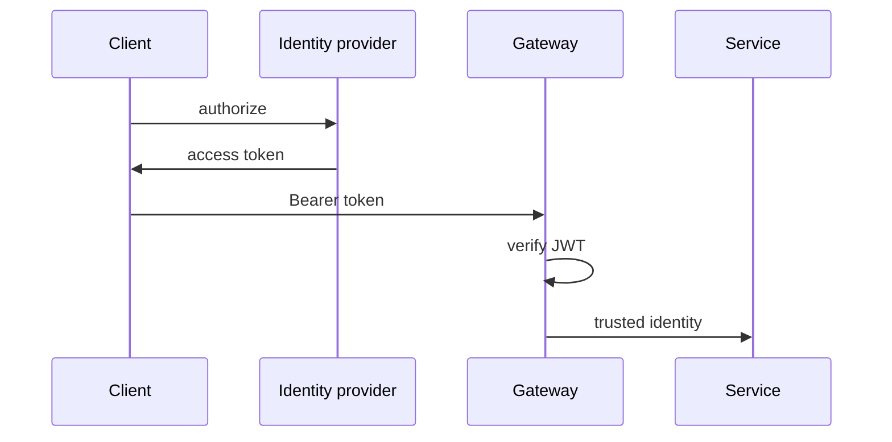

import { ConceptTemplate } from '@/features/kb/components/templates/ConceptTemplate'
import { Callout } from '@/features/kb/components/mdx/Callout'
import { ComparisonTable } from '@/features/kb/components/mdx/ComparisonTable'

export default function Layout({ children }) {
  return (
    <ConceptTemplate title="Authentication">
      {children}
    </ConceptTemplate>
  )
}

**Authentication** (AuthN) establishes identity. **Authorization** (AuthZ) uses that identity to allow or deny. APIs typically authenticate with bearer tokens (OAuth 2 access tokens, OIDC ID tokens), API keys, or mutual TLS. Sessions with cookies still dominate first-party browsers.

## 1. Deep Dive and Mechanics

**Credential versus token.** The user proves a password or WebAuthn assertion once. The API then sees a short-lived access token. Never send the password on every call.

**Bearer tokens.** Anyone who holds the token is the user. HTTPS is mandatory. Prefer sender-constrained tokens (DPoP, mTLS) when theft is likely.

**API keys.** Identify a *client* (partner app), not a human. Scope them, rotate them, and do not put them in mobile binaries you cannot rotate.

**Gateway check.** The edge validates JWT signature and expiry (or introspects opaque tokens), then forwards a trusted identity header to internals. Services must not accept that header from the public.

<Callout icon="error" title="AuthN is not AuthZ">
A valid token for user 9 does not allow `GET /orders/88` if 88 belongs to user 2. Check object-level authorization on every resource.
</Callout>

## 2. Mathematical / Theoretical Foundation

**Challenge-response.** Authentication is a protocol that binds a principal to a key. Security reduces to: unforgeable tokens, unguessable secrets, and clock/expiry so stolen tokens die.

**JWT claims.** A signed set of assertions. Validation is: known issuer, valid audience, unexpired, trusted signing key (JWKS). Skipping any check is a class of CVEs.

**Session vs token.** Server-side session: revocation is a delete. JWT access token: revocation needs a blocklist or short TTL plus refresh rotation.

<ComparisonTable
  headers={['Method', 'Identifies', 'Revoke']}
  rows={[
    ['Session cookie', 'User in a browser', 'Delete session'],
    ['Bearer JWT', 'User or client', 'Short TTL or blocklist'],
    ['API key', 'Calling app', 'Rotate key'],
    ['mTLS', 'Machine', 'Revoke cert'],
  ]}
/>

## 3. Real-World Implementation

```python
def require_user(req):
    token = bearer(req)
    claims = jwt.decode(token, key=jwks, audience="api", issuer="idp")
    return claims["sub"]
```

`audience` and `issuer` are not optional. A token minted for another API must fail here.

## 4. Visualizations



## 5. Interview Prep

**Q: Access token versus refresh token?**
**A:** Access token is sent to APIs and should be short-lived. Refresh token is sent only to the auth server to mint new access tokens; store it like a password.

**Q: Why not put API keys in a SPA?**
**A:** The browser is the user’s computer. Anything in JS is public. Use a confidential backend or a BFF to hold secrets.

**Q: Opaque token versus JWT?**
**A:** Opaque: gateway must introspect (central revoke). JWT: local verify, harder instant revoke. Pick based on revocation needs and scale.

## 6. Production Use Cases

- **User APIs** with OAuth 2 / OIDC.
- **Server-to-server** with client credentials or mTLS.
- **Partner integrations** with scoped API keys and rotation.

<Callout icon="tip" title="Log the principal, never the secret">
Access logs should carry subject and client id. If a token or password appears in logs, you have an incident.
</Callout>
